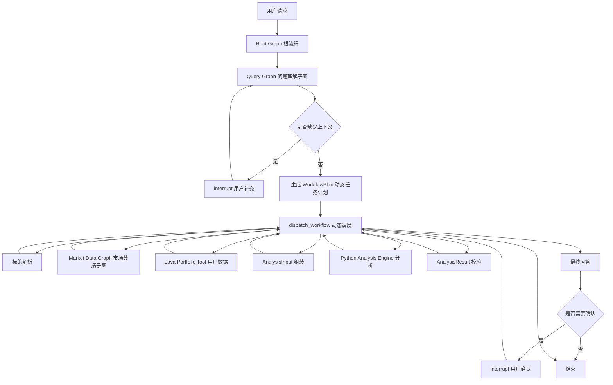

# BDLH Agent Runtime LangGraph 顶层流程设计

## 1. 当前实现目标

本阶段只建立可恢复、可追踪、可动态扩展的 Python LangGraph 流程框架，暂不接入真实 MCP、Java 用户数据 API 或 Node Skill。

第一版默认分析能力为 Python `Analysis Engine`，通过 `AnalysisCapabilityAdapter` 预留后续替换为独立 Skill 服务的边界。实现目录严格遵循开发 Prompt：Graph 位于 `src/bdlh_runtime/graph/`，运行期能力位于 `runtime/`，HTTP 层拆分为 `api/routes.py`、`api/schemas.py` 和 `api/sse.py`。



## 2. Graph 分层

| 层级 | Graph / Node | 执行形态 | 当前职责 |
|---|---|---|---|
| 外层 | `Root Graph` | `StateGraph` | 控制完整业务流程、预算、动态路由和结束条件 |
| 子图 | `Query Graph` | `StateGraph` 子图 | 问题理解、上下文检查、生成数据需求和任务计划 |
| 子图 | `Market Data Graph` | `StateGraph` 子图 | 模拟市场数据查询、Observation 标准化和数据完整性判断 |
| 节点 | `understand_request` | `CODE` | 第一版使用确定性解析，后续可替换结构化模型调用 |
| 节点 | `dispatch_workflow` | `CODE` | 从 `WorkflowPlan` 选择下一个可执行任务 |
| 节点 | `run_analysis` | `TOOL_ONLY / CODE` | 调用 Python Analysis Engine，不查询外部数据 |
| 节点 | `compose_response` | `STRUCTURED_LLM` 预留 | 当前使用确定性总结，后续接入总结模型 |
| 节点 | `interrupt_for_clarification` | `INTERRUPT` | 用户补充标的、范围等信息 |
| 节点 | `confirm_user` | `INTERRUPT` | 用户确认分析结果或知识入库动作 |

## 3. 动态任务计划

`WorkflowPlan` 存储在 LangGraph State 中，并随 Checkpointer 保存。计划不是固定顺序，任务通过 `depends_on` 表达依赖关系。

基础任务链：

```text
resolve_instrument
  → market_data
  → assemble_analysis
  → analysis
  → validate_analysis
  → compose_response
```

涉及用户持仓时，动态插入：

```text
market_data
  → portfolio_context
  → assemble_analysis
```

要求用户确认时，动态插入：

```text
compose_response
  → user_confirmation
  → finish
```

`dispatch_workflow` 只选择依赖已经完成的 `PENDING` 任务，不让模型直接跳转 Graph 节点。

## 4. State 与 Checkpointer

核心状态包括：

- `request`：用户原始请求；
- `intent`：分析类型、标的和持仓需求；
- `workflow_plan`：可恢复的动态计划；
- `data_requirements`：统一能力需求；
- `observations`：MCP、Java 和其他工具的标准化结果；
- `analysis_input` / `analysis_result`：分析契约；
- `events`：节点、工具和用户交互事件；
- `status`：`RUNNING`、`WAITING_USER`、`SUCCESS`、`PARTIAL`、`LIMITED`、`FAILED`。

当前默认使用 `InMemorySaver`（兼容旧版本的 `MemorySaver`）。生产环境替换为 Redis 或 PostgreSQL Checkpointer 时，不改变 Graph 节点和路由逻辑。

中断恢复必须使用同一 `thread_id`：

```python
graph.invoke(initial_state, config={"configurable": {"thread_id": thread_id}})
graph.invoke(Command(resume=user_value), config={"configurable": {"thread_id": thread_id}})
```

## 5. 当前边界

当前 Mock 实现用于验证流程，不代表真实数据结果：

- Market Data Graph 不调用真实 MCP；
- Java Portfolio Tool 仍是 Mock；
- Analysis Engine 只验证输入、状态和输出契约；
- 不允许旧 `stock-wrapper` 进入新流程（服务与仓库目录已退出；勿配置 `STOCK_WRAPPER_*`）；
- Node Skill 是否继续使用，待完整 Python 流程跑通后再评估。

下一阶段按顺序替换：

1. 用真实 MCP Adapter 替换 `execute_mock_market_tool`；
2. 用 Java Data Adapter 替换 Mock Portfolio Tool；
3. 增加 Observation Normalizer、数据质量和同源失败降级；
4. 将 `compose_response` 替换为结构化模型调用；
5. 根据分析能力评估结果决定是否接入独立 Skill。
