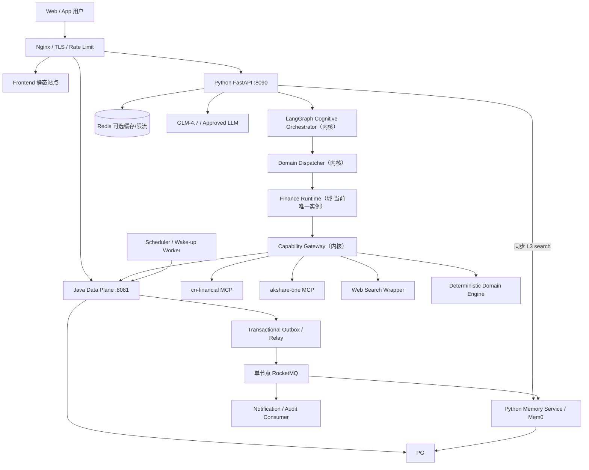
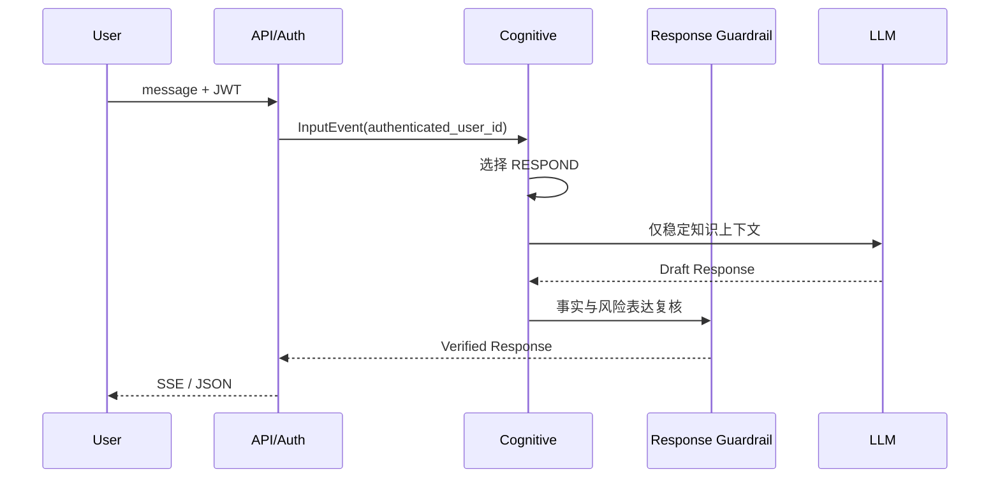
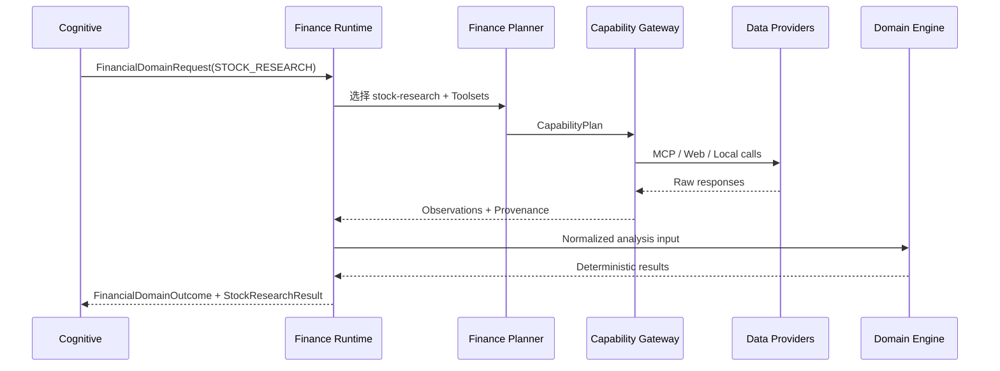

# BDLH Agent Runtime 统一生产架构

> **文档状态：生产架构唯一权威基线**  
> **生效日期：2026-08-17**
> **适用范围：`bdlh-runtime-orchestrator`、Java 用户数据服务、前端/API Gateway、外部数据服务及生产基础设施**  
> **当前实施状态：默认产品路径为 Cognitive Orchestrator（`cognitive_finance`）+ Finance Domain。Chat/Run/History/Task/Registry 经 Java Data Plane，Memory 为独立服务，RocketMQ 为异步投递基础设施。入口与 Registry 仍需按 01 号专项 Prompt 完成全量重写：物理删除 `analysis_type`，收敛数据库目录真源和 `eligible → allowed`。运行时行为一律按生产标准实现，不接受「开发宽松 / 生产严格」双轨产品路径；相对本文与 ADR 的缺口必须以状态表与实施 Prompt §5 显式登记，不得用短链路切片冒充完成。**
> **配套架构图：[00-BDLH-Agent-Runtime生产架构.drawio](./00-BDLH-Agent-Runtime生产架构.drawio)**

## 产品身份（定位声明，不编号）

BDLH Agent Runtime 的产品身份是**通用 Agent Runtime / 编排内核**：认知编排、领域调度、统一能力网关、观察标准化、四时点治理、确定性计算隔离和生产持久化都属于与业务领域无关的内核。

**金融是挂载在该内核上的第一个 Domain（业务领域）；股票客观研究、组合健康和 Suitability 等才是该领域内的 Skill，不是内核本身。** 后续可以挂载更多 Skill 或更多 Domain；多 Agent 是可选演进方向，不是当前身份。

因此阅读本文时必须区分两类内容：

| 类别 | 判定方法 | 变更影响 |
|---|---|---|
| 内核（Runtime） | 描述不含任何金融词汇也能成立 | 影响所有现有与未来 Skill，变更门槛最高 |
| 域（Domain / Skill） | 描述依赖金融语义、金融契约或金融数据源 | 只影响该 Domain，可独立演进 |

定位与命名规则见 [ADR-009](./ADR-009-Runtime-Domain-Skill定位与命名.md)。历史修改意见只用于追溯；当前实现顺序和完成标准以本文及当前专项 Prompt 为准。

## 0. 文档治理

### 0.1 本文档的权威性

本文是 BDLH Agent Runtime 面向开发、测试、部署和运维的统一生产架构文档。

发生架构、代码和历史文档冲突时，按以下优先级处理：

1. 安全、隐私、身份和只读金融边界；
2. 本文档；
3. 已批准的 ADR 或接口契约；
4. 当前代码与测试所证明的实现事实；
5. 生产开发实施 Prompt；
6. 已归档历史设计文档、评审记录和 Git 历史。

已归档历史设计文档中的有效经验已吸收到本文、ADR 或生产开发实施 Prompt，不再作为当前
开发依据：

- V3 历史档案保留 LangGraph、MCP、Observation、预算和确定性计算经验；
- 本文保留 Cognitive Kernel 的生产目标模型；
- 本文保留 Finance Runtime、Stock Research 和 Suitability 的生产领域模型；
- 本文统一处理三者之间的生产边界、部署方式和开发实施顺序。

### 0.2 文档中的状态标记

| 标记 | 含义 |
|---|---|
| `CURRENT` | 当前代码已进入默认运行路径并有测试覆盖 |
| `FOUNDATION` | 契约或骨架已存在，但尚未进入默认运行路径 |
| `TARGET` | 已冻结但尚未实现的目标 |
| `EXPERIMENTAL` | 不得进入生产关键路径 |
| `REWRITE_REQUIRED` | 当前实现与冻结需求冲突，必须直接全量修改 |

对于 Capability Registry、Domain Dispatcher、SkillManifest、Observation Normalizer 等
基础设施级组件，`CURRENT` 表示已完成应用装配、启动校验并有测试覆盖。`REWRITE_REQUIRED`
不得通过别名、双写或旧路径开关降级为 `CURRENT`。

任何设计说明都必须明确其状态，禁止把目标架构描述成已经落地。

## 1. 执行摘要

BDLH Agent Runtime 的生产架构采用以下唯一主线：

```text
Nginx / API Gateway                                  [内核]
  → Python FastAPI                                   [内核]
  → LangGraph Cognitive Orchestrator                 [内核]
  → Domain Dispatcher（DomainRegistry）              [内核]
  → Domain Runtime = Skill 宿主                      [域，当前唯一实例：Finance Runtime]
  → Skill                                            [域，当前：Financial Skill]
  → Toolset / Capability Gateway                     [内核]
  → MCP / Java Data API / Web Search / Local Domain Engine
  → Observation / Evidence                           [内核]
  → StockResearchResult / SuitabilityAssessment      [域输出契约]
  → Communication Plan / Response Verification       [内核]
  → SSE / JSON                                       [内核]
```

四时点 Guardrails（§11）是贯穿上述主线的横切治理，不是链上的某一层；任何新增 Skill 自动继承，不得自带私有 Guardrail。

生产决策如下：

1. **生产只使用 LangGraph Runtime**。Letta 仅允许在隔离实验环境中对比，不属于生产架构。
2. **Cognitive Kernel 是目标顶层编排器**，但它只选择行动，不直接访问原始工具。
3. **Finance Runtime 是金融领域边界**，负责金融任务、Skill、Toolset、证据和适配性。它同时是 Domain Dispatcher 之下的一个 Skill 宿主实例，只做校验、选 Skill、授权求交、调 Capability 和组装 Outcome。
4. **Stock Research 是金融 Skill，不是顶层系统**。
5. **Capability Registry 是唯一能力真源**；Toolset 只是派生视图，不能复制第二份能力清单。
6. **所有外部数据先转为 Observation**，任何模型不得直接消费原始供应商响应并生成最终结论。
7. **金融计算由确定性 Domain Engine 完成**，LLM 不执行指标、风险、估值或回测公式。
8. **客观研究与用户适配性分离**。`StockResearchResult` 不包含“适合当前用户”的结论。
9. **系统对外保持只读**。不下单、不调仓、不转账、不修改账户或持仓。
10. **生产环境禁止 mock 数据静默降级**。不可用必须返回 `PARTIAL / LIMITED / FAILED`。
11. **状态、会话、运行索引、历史和任务必须持久化**，生产实例不得依赖进程内存保存关键状态。
12. **单一产品编排路径**。默认流量只走 Cognitive + Finance；旧 Root Graph 与双路径回退已退役，不得恢复。
13. **内核与领域分离**。Cognitive Orchestrator 与 Domain Dispatcher 是领域无关内核，不得依赖任何具体领域的枚举、契约或计算模块；领域语义（如 `FinancialIntent`）只存在于对应 Domain 的私有契约中。新增 Skill 或 Domain 只允许注册，不允许复制 Capability Registry、Observation、Guardrail、预算或审计链。
14. **数据平面、消息和语义记忆分离**。结构化数据、运行状态、事务与 Outbox 由 Java Data Plane 管理；Mem0 由独立 Python Memory Service 管理；RocketMQ 只传播异步事件；当前 PostgreSQL 保持单实例并按 schema/Role 隔离；Orchestrator 不直连数据库。

## 2. 业务范围

本节按「内核范围」和「域范围」分别声明。域范围变化不需要改内核范围表；内核范围变化必须评估对全部已挂载 Skill 的影响。

### 2.1 内核能力范围（Runtime，与领域无关）

第一阶段内核提供以下与业务领域无关的能力：

- 认证身份绑定与用户隔离；
- `InputEvent` 归一化（用户消息、恢复、定时唤醒）；
- 认知编排与 `CognitiveAction` 选择；
- Domain 调度：按 `DomainRequest` 路由到已注册 Domain Runtime，并拒绝未注册域或未启用能力；
- Capability Registry 作为唯一能力真源，Toolset 为派生视图；
- 外部数据统一转为 Observation，携带来源、时间、质量和降级信息；
- 四时点 Guardrails；
- 预算、超时、重试、熔断与降级语义；
- Communication Plan 与 Response Verification；
- 多轮会话、流式输出、运行查询与中断恢复；
- 系统主动截断与用户 Pause 的可恢复暂停（checkpoint + `pending_*`），以及同 session 入口 Turn Router（`resume` / `new_turn` / `ask_which`，见 [ADR-014](./ADR-014-系统截断与用户截断Pause-Resume与会话入口路由.md)）；
- 按预算组装进模上下文（Context Service，见 [ADR-015](./ADR-015-Context组装服务与压缩策略.md)），与 ADR-011 Memory 分层正交；
- 状态、会话、运行索引、历史、审计与任务的持久化；
- 结构化日志、指标与 SLO。

以上能力不因更换或新增 Domain 而重写，这也是本系统可迁移到非金融场景的部分。

### 2.2 首个 Domain：金融（只读）

#### 2.2.1 当前生产范围

第一阶段生产系统提供只读金融助手能力：

- 稳定金融知识解释；
- 股票、ETF、基金和指数标的解析；
- 实时行情和历史行情查询；
- 技术面、基本面、估值、行业、资金流和新闻研究；
- 用户持仓、账户、交易历史和风险画像的只读分析；
- 股票客观研究；
- 组合影响分析；
- 用户适配性评估；
- 多轮会话、流式输出、运行查询和中断恢复；
- 数据缺失、冲突和限制披露。

#### 2.2.2 第二阶段范围

- 价格或估值观察任务；
- 组合风险扫描；
- Scheduler 唤醒；
- 受控主动通知；
- 周期性财务复盘；
- 财务目标和现金流能力扩展。

#### 2.2.3 后续 Skill / Domain 的挂载方式

新增能力只允许通过以下方式扩展，且不改变本节金融范围：

| 扩展物 | 挂载位置 | 允许新增 | 禁止 |
|---|---|---|---|
| 同域新 Skill | `finance` Domain Runtime 内 | Skill 声明与业务实现 | 新建第二份 Capability Registry |
| 新 Domain | 注册到 Domain Dispatcher | Domain 声明、Skill、自有确定性引擎 | 自建 Adapter 层、Observation 或审计链 |
| 检索增强（RAG，见 [ADR-013](./ADR-013-RAG作为可插拔KnowledgeSkill的边界.md)） | 某 Domain 下的检索类 Skill | 检索结果转 Observation 后作为 Evidence 候选 | 作为内核中心；Cognitive 直接检索；检索文本免除 §10.4 不可信输入处理 |
| 多角色 / 多 Agent | Cognitive 内部角色子图 | 角色声明与预算切分 | 新增部署单元、第二套 Tool 层、角色直连 Capability |

Skill 与 Domain 的自描述契约见 [ADR-010](./ADR-010-SkillManifest与DomainDispatcher契约.md)；多 Skill 与多 Agent 的演进阶梯、准入条件与禁止复制清单见 [ADR-012](./ADR-012-多Skill与多Agent演进门槛.md)。当前所处位置是「单 Domain 多 Skill」，多角色与多 Agent 不在第一、第二阶段范围内。

### 2.3 明确非目标

- 真实下单、撤单、改单、调仓或资金划转；
- 券商交易执行；
- 自动生成可直接提交的订单；
- 自动承诺收益；
- 冒充持牌投资顾问；
- LLM 直接访问数据库、MCP 原始工具或账户服务；
- 在运行时从磁盘、网络或用户输入动态加载未经审查的 Skill（一等 Skill 必须编译期注册，并在启动时对 Capability Registry 校验；此处禁止的是热加载与未审查来源，不是禁止扩展 Skill）；
- 在生产关键路径中运行 Letta；
- 用 Node `stock-analysis-skill` 承担生产编排或在线补数；
- 以 Mem0 替代用户档案、金融账本、任务库或审计历史。

## 3. 当前实现与目标架构

| 能力 | 状态 | 当前事实 | 生产目标 |
|---|---|---|---|
| FastAPI / SSE / Agent Run API | `CURRENT` | `/api/v1/chat/*`、`agent-runs*` 只走 Cognitive | 统一错误与事件契约 |
| JWT 身份绑定 | `CURRENT` | Python 验签，Java 提供用户数据 | 生产强制开启，禁止信任请求体 `user_id` |
| CognitiveAction | `CURRENT` | 已进入默认 Cognitive 执行路径 | 继续收敛行动集合与审计字段 |
| Cognitive Orchestrator | `CURRENT` | 唯一顶层业务编排入口（`cognitive_finance`） | 保持为唯一默认路径 |
| DomainRequest / Outcome | `CURRENT` | Cognitive ↔ Finance 跨层接口 | 继续作为唯一跨层契约 |
| Domain Dispatcher | `CURRENT` | `DomainRegistry` 已提供 domain→runtime 唯一映射、拒绝重复注册，并携带 `DomainDescriptor` 支持 intent 启用查询 | 继续作为路由与拒绝的唯一入口；新增 Domain 只需注册 |
| SkillManifest / DomainDescriptor | `CURRENT` | 仅从 Registry Snapshot 投影；无第二份 Capability/Operation/Toolset 清单；`accepted_intents` 不再路由 | 保持投影与种子一致 |
| 内核纯净度门禁 | `CURRENT` | `tests/architecture/test_kernel_purity.py` 静态断言内核不依赖领域实现 | 保持常绿，随内核目录变化同步更新 |
| Finance Runtime | `CURRENT` | 由 Cognitive Dispatcher 调用的唯一默认 Domain | 继续隔离金融业务逻辑；不恢复旧 Root Graph |
| StockResearchResult | `CURRENT` | Finance Runtime 客观研究输出契约已接线 | 继续强化字段来源与 provenance |
| Financial User Facts v2 | `CURRENT` | Java 鉴权确认入口、版本/幂等/审计与只读元数据；Python 按事实来源归一化；无 confirmation 不得抬升 LIVE/USER_CONFIRMED（G5） | 作为账户、持仓与风险事实的唯一权威来源 |
| PortfolioValuationBuilder | `CURRENT` | 确定性估值核心已实现；`portfolio-health` 默认启用并进入登录用户 `allowed`；PORTFOLIO_IMPACT / GOAL_PLANNING 经证据链产出（G8） | 保持权威持仓 × 受预算约束行情的可追溯估值 |
| SuitabilityEngine | `CURRENT` | v0 `DRAFT` 规则集已接线；缺输入 → `INSUFFICIENT_INFORMATION`；`DRAFT` 封顶无 `SUITABLE`；`APPROVED`+拟投入确认可达 `SUITABLE`（G4） | 阈值可 PR 调整；法定适当性另议 |
| Capability Registry | `CURRENT` | 最终八表；Java Snapshot；Python `eligible→allowed`；Manifest 投影同源 | 维持启动 fail-fast |
| Toolset Registry | `FOUNDATION` | 八表内 toolset 为唯一分组真源；快路径/预算/entitlement 已迁出 DB | 描述与关联只来自数据库，不维护第二份清单 |
| 运行时去环境双轨（G3） | `CURRENT` | Java/Web Adapter 无 mock 降级；非 `test` 强制 internal token + Java 可达；ready 同标准 | 保持产品路径与生产契约一致，禁止再引入 env 分叉 |
| Deep Research（G6） | `CURRENT` | Flag+百炼门禁；Finance 默认可执行 `research.deep_search`；超预算 ADR-014 Pause；禁止假 COMPLETE | 默认 Flag 关闭；打开前须配 Key 且 `/ready` 通过 |
| 入口 Goal / 资格菜单（G2） | `CURRENT` | LLM Understand→Goal；`requires_financial_snapshot` 替代 FinancialIntent 业务分流；Manifest 投影收敛 | 无 |
| 四时点 Guardrails | `CURRENT` | Default* 已接线；能力白名单、`guardrail.blocked` SSE、Data-quality freshness/provenance 已落地 | 继续补供应商冲突 / over-read 等 §11 余项 |
| Observation / Coverage | `CURRENT` | 已有标准化与覆盖判断 | 进入所有外部数据路径 |
| Java Data Plane | `CURRENT` | 认证、L4 用户事实、Run/Chat/History/Task/Registry/Outbox API；Orchestrator 经 `JAVA_API_BASE_URL` 远程访问 | 保持结构化数据唯一访问边界，并完成 Registry 最终契约 |
| Memory Service / Mem0 | `CURRENT` | remote 客户端 + Chat 召回/Writer；Java MemoryCandidate Outbox→Relay→MQ；失败 degraded 不污染 L4（G7） | 生产切 `BDLH_MEMORY_MODE=remote` 并打开 `ROCKETMQ_ENABLED` / `MEMORY_ROCKETMQ_ENABLED` |
| RocketMQ | `CURRENT` | Outbox Relay 在 `ROCKETMQ_ENABLED=true` 时投递（含 `bdlh.memory.commands`）；禁用时不静默宣称已发布 | 打开前完成 Broker/主题初始化 |
| Context 组装 | `CURRENT` / `TARGET` | Cognitive / Finance 路径组装上下文；旧 Root Graph `ContextBuilder` 已删除 | 对齐 ADR-015：purpose/budget、窗口主路径、dropped 可观测；不另起第二套组装语义 |
| 系统 ASK_USER + pending resume | `CURRENT` | Chat 写 `pending_*`；Turn Router；**L0 `checkpoint_id` + CognitiveCheckpoint 断点续跑已接线（G1）** | 保持书签与 Run State 一致 |
| 用户 Pause（Esc） | `CURRENT` | `POST .../pause` 返回非空 `checkpointId`；协作式停点 + L0 快照 | 与长调用中途停止增强对齐 |
| Turn Router | `CURRENT` | `resume` / `new_turn` / `ask_which` 已接线 `/chat/stream` | 持续校准强/弱信号词典 |
| Chat Session | `CURRENT` | 经 Java Data Plane 远程持久化（单元测试可显式注入内存替身） | 启动路径禁止无 Java 内存兜底 |
| Run Registry | `CURRENT` | 经 Java Data Plane 远程持久化；Python 内存实现仅允许测试显式注入 | 上线必须配置 Java 并保证 `/ready` 通过 |
| Analysis History | `CURRENT` | 经 Java Data Plane 远程持久化 | 保证幂等与保留期 |
| Task / Scheduler | `FOUNDATION` | 远程 Task/Outbox 客户端与 Worker 循环已有；默认 Worker 关闭 | 打开 `BDLH_FINANCIAL_TASK_WORKER_ENABLED` 前完成通知闭环验收 |
| Letta | `EXPERIMENTAL` | 无生产实现 | 仅隔离研究，不进入部署拓扑 |

## 4. 系统上下文与生产拓扑



> **拓扑说明：** Domain Dispatcher 为内核组件（§1 主线、ADR-009），当前路由到唯一实例 Finance Runtime。新增 Domain 只需向 Dispatcher 注册 descriptor，不新增内核节点、不新增第二套 Capability Gateway 或 Observation 链。数据平面、RocketMQ 与 Memory Service 的所有权以 ADR-017 为准；单实例 PostgreSQL 是当前物理部署，不等于共享表所有权。

### 4.1 公网边界

公网只暴露 Nginx 的 HTTPS 入口。Python、Java、Memory Service、RocketMQ、Web Search、数据库和 Redis 不直接监听公网地址。

推荐路由归属：

| 路径 | 归属 |
|---|---|
| `/`、`/agent`；`/workspace` → 301 `/agent` | Frontend |
| `/api/v1/chat/*` | Python Analysis |
| `/api/v1/conversations*` | Python Analysis |
| `/api/v1/agent-runs*` | Python Analysis |
| `/api/auth/*` | Java Backend |
| `/api/portfolio/*` | Java Backend，公网访问受 JWT 约束 |
| `/api/user/*` | Java Backend，公网访问受 JWT 约束 |
| `/actuator/*` | 仅运维网络或关闭公网访问 |

Python 调用 Java Data API 使用内网地址和服务凭证，不经过公网 Nginx。

### 4.2 生产单元

| 单元 | 是否关键 | 说明 |
|---|---|---|
| Nginx | 是 | TLS、路由、SSE、限流、请求大小和超时 |
| Python Analysis | 是 | 通用编排内核：认知编排 + 域调度 + 能力网关 + 治理；当前挂载 finance 域 |
| Java Data Plane | 是 | 单 JVM 模块化单体；认证、L4 用户事实、L1/Run/History/Task/Registry、事务、Outbox 与 RocketMQ 适配 |
| PostgreSQL | 是 | 当前单实例；按 `business/runtime/registry/checkpoint/memory` schema 与独立 Role 隔离，不做 HA 集群 |
| RocketMQ | 异步路径是 | 当前单 NameServer + 单 Broker/Proxy；承载通知、Memory 候选和审计等异步传播，不作业务真源 |
| Redis | 否 | 缓存、分布式限流或短期锁；不能作为唯一真相源 |
| MCP 服务 | 数据场景是 | 外部数据供应商（当前实例：金融行情 MCP），允许能力级降级 |
| Web Search | 否 | 公开资料补充，失败不阻断主路径 |
| LLM | 模型场景是 | 理解、规划和表达；确定性计算不依赖它 |
| Memory Service / Mem0 | 否 | 独立 Python 服务；L3 语义记忆增强，失败时无记忆继续；向量数据复用单实例 PostgreSQL 的 `memory` schema |
| Scheduler | 第二阶段是 | 只唤醒任务，不生成域结论；Task 真源在 PostgreSQL，RocketMQ 只投递 |

## 5. 逻辑分层

### 5.1 API 与身份层

职责：

- JWT 验证；
- 从 Token subject 构造可信 `authenticated_user_id`；
- 请求 Schema 校验；
- `run_id / thread_id / session_id` 创建与绑定；
- SSE/JSON 序列化；
- 对外错误码映射；
- 用户级限流和请求大小限制。

禁止：

- 直接拼装 Graph 内部任意 State；
- 使用请求体 `user_id` 作为生产身份；
- 将 Token 写入 State、Checkpoint、事件或日志。

### 5.2 Cognitive Orchestrator

职责：

- 将用户消息、恢复、定时唤醒等统一为 `InputEvent`；
- 构建最小 `CognitiveState`；
- 识别目标、约束和不确定性；
- 选择 `CognitiveAction`；
- 调用 `DomainRequest`；
- 吸收 `DomainOutcome`；
- 构建 Communication Plan；
- 决定回答、追问或受控任务动作。

第一阶段只启用：

```text
RESPOND
ASK_USER
INVOKE_DOMAIN
```

`CREATE_TASK / UPDATE_TASK / WAIT / NOTIFY / DO_NOTHING / RETRIEVE_MEMORY` 可以存在于契约，但未启用时必须返回 `ACTION_NOT_ENABLED`，不能假装已经执行。

### 5.3 Finance Runtime

职责：

- 验证 `FinancialDomainRequest`；
- 加载本轮最小 Financial Snapshot；
- 选择 Financial Skill；
- 建立 Skill 依赖计划；
- 选择 Toolset，并展开受控 Capability；
- 执行 Capability 并收集 Observation；
- 构建 Evidence、Finding 和 Conflict；
- 调用确定性 Domain Engine；
- 生成 `StockResearchResult`；
- 按需要执行 Suitability；
- 生成 `FinancialDomainOutcome`。

Finance Runtime 不直接生成最终聊天文案。

### 5.4 Financial Skill

生产第一阶段只实现并开放：

1. `stock-research`；
2. `portfolio-health`；
3. `suitability-evaluation`。

Skill 是 Python 运行时中的明确业务模块或子图，是编译期注册的一等对象，不是运行时动态加载的 Prompt 文件，也不是 Node Wrapper。

每个 Skill 必须声明以下内容，字段表以 [ADR-010](./ADR-010-SkillManifest与DomainDispatcher契约.md) 的 `SkillManifest` 为唯一真源，本节不再重复维护第二份清单：

- 身份：`skill_id`、`skill_version`、`domain`、`status`；
- 输入契约与可处理意图、输入约束；
- 输出契约与 `authority_field`（权威载荷字段）；
- 权限要求：精确 `DomainOperation`，禁止前缀授权；
- 所需 Toolset 与精确 Capability 名；
- 数据完成条件（含允许的 `data_mode`）；
- 预算（复用 `DomainBudget`，不新增第二套预算模型）；
- 降级规则；
- 幂等行为与副作用声明（第一阶段必须为空，即只读）。

`SkillManifest` 声明的 Capability、Toolset 与 `DomainOperation` 名必须在启动时逐项对 Capability Registry 校验，不一致时启动失败；Capability Registry 仍是「有哪些能力」的唯一真源。Domain 一侧的自描述（`DomainDescriptor`）与 Dispatcher 的拒绝行为同见 ADR-010。

### 5.5 Capability 与 Adapter

Capability 是 Agent/Planner 可理解的稳定业务能力，例如：

- `market.get_realtime_quote`；
- `market.get_historical_prices`；
- `portfolio.get_current_positions`；
- `research.web_search`；
- `analysis.run_analysis`。

Adapter 负责把 Capability 翻译为供应商或服务具体调用。上层不得看到 MCP 原始工具名、URL、传输协议和供应商参数。

### 5.6 Deterministic Domain Engine

负责：

- 指标；
- 风险；
- 估值；
- 回测；
- 组合暴露；
- Suitability 规则；
- 覆盖率、可信度和阈值判断。

依赖规则：

```text
Domain Engine 不 import LangGraph / LangChain / MCP / Mem0 / FastAPI
```

固定输入必须得到固定输出；涉及日期时必须显式注入交易日历和 `as_of`。

## 6. 核心运行流程

### 6.1 稳定知识直接回答



直接回答禁止处理实时价格、账户事实或依赖外部证据的结论。

### 6.2 股票客观研究



### 6.3 用户适配性分析

```text
StockResearchResult
  + FinancialSnapshot(LIVE / USER_CONFIRMED)
  + 用户目标和约束
  → SuitabilityEngine
  → SuitabilityAssessment
```

硬性规则：

- `MOCK / UNAVAILABLE` 快照不得产生真实个性化结论；
- 研究覆盖为 `LIMITED` 时不得输出 `SUITABLE`；
- 缺少风险画像、持仓或流动性关键字段时返回 `INSUFFICIENT_INFORMATION`；
- Suitability 输出理由、Rule ID、证据、条件和限制；
- Suitability 只做评估，不生成交易指令。

### 6.4 持续任务唤醒

第二阶段流程：

```text
Scheduler
  → SCHEDULED_WAKEUP InputEvent
  → Cognitive Kernel
  → Finance Runtime 重新取最新数据
  → 判断触发条件
  → NOTIFY 或 WAIT / DO_NOTHING
```

Scheduler 不缓存上次结论，不自行调用 LLM，不自行生成通知内容。

## 7. 代码组织与依赖规则

目标逻辑与当前目录映射：

| 逻辑层 | 当前/目标目录 | 规则 |
|---|---|---|
| API/Auth | `api/` | 只处理 HTTP、身份和序列化 |
| Application Wiring | `runtime/` | 配置、装配、持久化工厂、错误 |
| Cognitive | `cognitive/` + LangGraph graph | 不引用原始 Adapter；不依赖任何具体领域符号 |
| Domain Dispatcher | `domains/registry.py` | 领域无关内核；只按 domain 路由与拒绝，不含业务策略 |
| Finance Runtime | `domains/finance/` | 只通过 Capability Gateway 访问外部能力 |
| Cross-domain Contracts | `domains/contracts.py` | 严格 Pydantic，禁止任意 dict；不得引入领域枚举 |
| Capability/Toolset | `tools/` | Registry 是唯一能力真源 |
| Integration Adapters | `integrations/` 和 Adapter 实现 | 隔离供应商协议 |
| Observation | `observations/`、`contracts/observation.py` | 统一来源、质量、时间和错误 |
| Deterministic Engine | `domain/` | 纯计算，不依赖 Agent 框架 |
| Memory | `memory/` | 可选增强，不是事实源 |
| Persistence | Java Data Plane API 客户端；Memory 使用独立存储端口 | Orchestrator 不直连结构化数据库 |

禁止依赖：

- `domain/` → LangGraph、LLM、MCP、Mem0、FastAPI；
- `cognitive/` → MCP Client、Java HTTP Client、供应商 Tool；
- `domains/finance/` → 供应商原始 Schema；
- Graph Node → 环境变量；
- API → 供应商 Adapter；
- Model 输出 → 直接执行未经 Policy 校验的动作。

目录和依赖若与本表冲突，开发阶段直接一次性重构，并同步修改引用和测试；不得保留转发模块或旧导入别名。

## 8. 稳定契约

### 8.1 标识符

| 标识 | 语义 | 生命周期 |
|---|---|---|
| `user_id` | 服务端认证用户 | 用户级 |
| `session_id` | 前端会话目录 | 多轮会话 |
| `thread_id` | LangGraph Checkpoint 线程（公开值在 Chat 路径上等于 `session_id`；内部 key 含 `user_id` 前缀隔离） | 多轮状态 |
| `run_id` | 单次 API/Graph 执行 | 单次运行 |
| `pending_*` | 会话上可恢复书签：`pending_run_id` / `pending_thread_id` / `pending_checkpoint_id` | 从暂停到恢复/放弃 |
| `request_id` | 单次领域调用 | Domain Request |
| `task_id` | 持续任务 | 第二阶段 |
| `observation_id` | 一次标准化观察 | 单次数据调用 |
| `capability_execution_id` | 能力执行审计与幂等 | 单次能力调用 |

`run_id` 与 `thread_id` 不得混用。生产 Run Registry 必须持久化 `run_id → {thread_id, user_id, checkpoint_id, status}`。同 `session_id` 默认同时至多一个可恢复 pending run；同会话换方向不换 `session_id`，必须 abandon 旧 run 后开新 `run_id`（[ADR-014](./ADR-014-系统截断与用户截断Pause-Resume与会话入口路由.md)）。

### 8.2 跨层对象

唯一允许的主要跨层对象：

```text
InputEvent
CognitiveAction
DomainRequest / DomainOutcome
FinancialDomainRequest / FinancialDomainOutcome
FinancialSnapshot
Observation
StockResearchResult
SuitabilityAssessment
CommunicationPlan
PublicResponse
```

规则：

- 跨层对象使用严格 Schema，`extra=forbid`；
- Graph State 中如保存 dict，必须由已验证模型 `model_dump()` 产生；
- 不跨层传递原始 HTTP/MCP 响应；
- 不跨层传递隐藏思维链；
- 所有结论引用 Evidence ID 或 Calculation ID；
- 所有时间使用带时区 ISO-8601；
- 金额、比例和数量在正式计算契约中使用 Decimal 或明确舍入策略。

### 8.3 状态枚举

领域结果：

```text
COMPLETE / PARTIAL / LIMITED / FAILED / WAITING_USER
```

Run（执行态，与领域结果分离；见 [ADR-014](./ADR-014-系统截断与用户截断Pause-Resume与会话入口路由.md)）：

```text
RUNNING / WAITING_USER / PAUSED_BY_USER / COMPLETED / FAILED / CANCELLED / ABANDONED
```

- `WAITING_USER`：系统主动截断（如 `interrupt()`）；
- `PAUSED_BY_USER`：用户 Esc → Pause（可 resume）；仅前端 abort SSE 不得记为可恢复 Pause；
- `CANCELLED` / `ABANDONED`：不可再 resume，必须清理 `pending_*`。

Observation：

```text
SUCCESS / PARTIAL / UNAVAILABLE / FAILED
```

数据真实性：

```text
LIVE / USER_CONFIRMED / TEST_FIXTURE / MOCK / UNAVAILABLE
```

生产逻辑禁止把 `MOCK`、`TEST_FIXTURE` 或 `UNAVAILABLE` 提升为 `LIVE`。

## 9. State、Memory 与持久化

### 9.1 数据所有权

| 数据 | 权威存储 | 是否进入 Graph State |
|---|---|---|
| 用户身份、账户、持仓 | Java Data Plane / `business` schema | 仅最小只读快照或引用 |
| Cognitive State | Java Data Plane / `runtime` schema | 是，最小化；Orchestrator 通过内部 API 访问 |
| Finance Run State | Java Data Plane / `runtime` schema | 是，不复制完整账本 |
| Chat Session / Messages | Java Data Plane / `runtime` schema | State 仅保存必要上下文 |
| Run Registry | Java Data Plane / `runtime` schema | State 保存 `run_id` |
| Analysis / Decision History | Java Data Plane / `runtime` schema | State 保存引用 |
| Capability Execution Audit | Java Data Plane / `runtime` schema | State 保存摘要或引用 |
| Registry / Policy Catalog | Java Data Plane / `registry` schema | 启动加载验证后的只读快照，不复制代码兜底 |
| Semantic Memory（L3） | Python Memory Service / `memory` schema + pgvector | 只保存召回结果摘要 |
| Financial Task / Outbox / Inbox | Java Data Plane / `runtime` schema | State 保存 `task_id`；MQ 不是真源 |
| Cache / Rate Limit | Redis | 不作为业务真相源 |

Memory 的分层模型（L0 工作记忆 / L1 会话记录 / L2 检索知识 / L3 长期语义 / L4 业务真源）与「记忆不得自行晋升为业务真源」的边界见 [ADR-011](./ADR-011-Memory分层与晋升边界.md)。其中 L4 不属于记忆体系：账户、持仓、风险画像与审计历史永远从权威业务存储读取，记忆层的同名字段只是派生或提示。`MEMORY_CONFIRMED` 必须携带服务端 `confirmation_ref`，否则等同 `INFERRED`，不得驱动高影响规则。

**禁止**在文档或代码中并行维护与 ADR-011 冲突的另一套 L0–L4 编号。工程职责（Dialog / Run / Facts / Mem0 / 组装）到 ADR-011 层的唯一映射见 [ADR-015](./ADR-015-Context组装服务与压缩策略.md) §3。

### 9.2 运行状态隔离

- 运行状态 key 至少包含 `user_id + thread_id + namespace`；
- Cognitive 与 Finance 子图不得共享同一无区分 State；
- 多轮运行必须记录本轮 Observation 起始位置；
- 恢复时校验 `run_id`、`thread_id` 和认证用户一致；
- 运行状态不保存 Token、密钥或完整原始账户数据；
- 大型行情数据持久化到独立存储或摘要后再引用，避免状态膨胀。

### 9.3 生产持久化要求

以下任一项仍为进程内存实现时，不允许多副本生产发布：

- Run Registry；
- Analysis History；
- Chat Session；
- Task Store；
- 幂等记录。

上述结构化 Store 必须经 Java Data Plane 的用例级内部 API 访问；禁止把 Data Plane 实现成任意 SQL/CRUD 代理。每个数据集只允许一个读写真源，不实现影子读取或双写。

### 9.4 Context 组装与压缩

进模上下文由 **Context Service（组装器）** 按 `purpose` / `budget` 只读拼装，不是新的记忆存储层。规则真源：[ADR-015](./ADR-015-Context组装服务与压缩策略.md)。

硬约束：

1. **存储 ≠ 上下文**：L1 保存完整对话原文；进模只取窗口（+ 可选滚动摘要），禁止每轮全量加载会话再 LLM 压缩作为主路径；
2. **近因优先**：当前用户输入 > 本轮工具/证据摘要 > 近期对话窗口 > L4 事实短卡片 > L3 语义召回；
3. **`user_input` 不得被压缩丢弃**；超预算时 `dropped[]` 必须可观测；
4. **Mem0（L3）读点**仅在 Context 组装；**写点**仅在 Run 出口 Memory Writer，禁止对话全文同步进 Mem0；
5. L3 / L2 失败可降级为空召回；L0 / L1 / L4 属生产关键路径，不得静默降级为「假装有完整记忆」。

现有 `ContextBuilder` 七块组装是合法实现起点，须逐步对齐 bundle / budget / provenance，而不是另起第二套组装语义。

### 9.5 可恢复暂停与会话入口路由

系统主动截断与用户 Esc Pause 同构为可恢复暂停；同 session 下一条消息必须经 Turn Router，**禁止有 `pending` 就默认 `Command(resume)`**。规则真源：[ADR-014](./ADR-014-系统截断与用户截断Pause-Resume与会话入口路由.md)。

摘要：

```text
系统 interrupt / 用户 Pause
  → 安全点 checkpoint + pending_* + Run 状态（WAITING_USER | PAUSED_BY_USER）
  → 下一句：resume 同 run_id | abandon 后新 run_id | ask_which 仅确认
```

- 仅前端停止消费 SSE ≠ Pause；Pause 必须后端协作停止并返回 `resumable` 确认；
- 执行进度不得用 Mem0 替代 checkpoint；
- 主 UX 保持普通打字，不引入侧边栏式暂停控制台作为主路径。

## 10. Capability、Toolset 与供应商

### 10.1 唯一能力真源

PostgreSQL `registry` schema 是 Capability / Operation / Toolset / Skill 目录的唯一真源。Java Data Plane 提供只读 Snapshot API；Orchestrator 只加载和校验快照。Capability 记录：

- 稳定名称；
- 描述；
- 领域；
- Adapter 类型；
- 是否只读；
- 是否要求认证用户；
- 必需参数与 `depends_on`；
- 超时；
- 所属 Toolset。

Skill 与 Capability、Operation 的关系通过 Registry 关联表表达。`analysis_type` 已从目录契约删除，不得用别名恢复同一语义。Toolset 描述和关联也只存数据库，不维护第二套代码清单。

### 10.2 finance 域 Toolset 实例（首个 Domain）

> 以下六个名为 finance 域当前实例，冻结不回改（ADR-009 §3.2）。它们是内核 Toolset 派生规则的 finance 投影，不是通用规范。

```text
market_read
fundamental_read
news_read
portfolio_read
financial_profile_read
planning_compute
```

模型先看到 Toolset，再只看到被选 Toolset 内、满足当前 Skill 适用范围和权限的 Capability。

### 10.3 供应商路由

- MCP Adapter 隐藏 cn-financial 和 akshare-one 的传输差异；
- Java Adapter 隐藏用户数据 HTTP 路径；
- Web Search Adapter 隐藏搜索供应商和凭证；
- Local Adapter 调用确定性 Domain Engine；
- 路由策略由确定性代码管理，模型不能选择供应商地址或原始 Tool。

### 10.4 外部内容安全

新闻、网页、公告和供应商文本均是不可信输入：

- 不得覆盖系统指令；
- 不得改变工具白名单；
- 不得触发新的 Capability；
- HTML/Markdown 必须清洗；
- 引用时保留来源；
- 超长内容先截断和结构化，不直接注入全部上下文（进模预算与压缩阶梯见 [ADR-015](./ADR-015-Context组装服务与压缩策略.md)）。

## 11. 四时点 Guardrails

四类 Guardrail 必须独立实现并进入新生产路径：

### 11.1 Plan Guardrail

检查：

- 目标是否在金融只读范围；
- Skill 和 Capability 是否已注册；
- 是否读取了超出目标所需的用户数据；
- 预算是否合理；
- 是否重复执行已成功且幂等的步骤。

### 11.2 Action Guardrail

检查：

- 行动类型是否启用；
- Capability 是否在本轮候选白名单；
- 参数 Schema；
- 用户权限；
- 只读边界；
- 调用次数和预算；
- 内部服务凭证是否由 Runtime 注入。

### 11.3 Data-quality Guardrail

检查：

- Observation 状态；
- 数据时效；
- Provenance；
- 覆盖率；
- 供应商冲突；
- `is_mock / data_mode`；
- 是否存在关键字段缺失；
- 外部文本注入风险。

### 11.4 Response Guardrail

检查：

- 结论是否能追溯到 Evidence；
- 是否披露数据时间和限制；
- 是否把客观研究误写成个性化适配；
- 是否产生交易执行语义或收益承诺；
- 是否泄露其他用户或完整账户数据；
- `PARTIAL / LIMITED` 是否被包装成确定结论。

`BLOCK / MODIFY / ASK_USER` 必须记录稳定 Audit Code、Rule ID 和公开理由。

## 12. API 与事件契约

### 12.1 对外 API

生产保留：

```text
POST   /api/v1/chat/stream
GET    /api/v1/conversations
GET    /api/v1/conversations/{session_id}
DELETE /api/v1/conversations/{session_id}
POST   /api/v1/agent-runs
GET    /api/v1/agent-runs/{run_id}
POST   /api/v1/agent-runs/{run_id}/pause
POST   /api/v1/agent-runs/{run_id}/resume
POST   /api/v1/agent-runs/{run_id}/cancel
GET    /api/v1/agent-runs/{run_id}/events
GET    /api/v1/health
```

`/chat/stream` 在存在 `pending_*` 时必须先经 Turn Router（[ADR-014](./ADR-014-系统截断与用户截断Pause-Resume与会话入口路由.md)），再决定 resume、abandon+新 run 或会话层确认；`ask_which` 不得调用主分析图。`/pause` 是截断控制面，不是日常对话面；前端对话请求仍只稳定传 `sessionId` + `message`，身份走 JWT。

未来新增内部接口时使用 `/internal/v1`，必须通过内网和服务身份保护。

### 12.2 SSE 事件

建议稳定事件集合：

```text
run.created
run.started
run.progress
cognition.action.selected
domain.requested
domain.completed
capability.started
capability.completed
guardrail.blocked
run.interrupted
run.paused
run.resumed
response.completed
run.failed
```

`run.interrupted` 对应系统主动截断；`run.paused` 对应用户 Pause。等待/暂停态必须以可结束本轮流的 `done`（或等价终态事件）收尾，避免前端空转。
事件至少包含：

- `event_id`；
- `event_type`；
- `occurred_at`；
- `run_id`；
- `thread_id`；
- `request_id`（适用时）；
- `public_payload`；
- `schema_version`。

事件不得包含 Token、内部 Prompt、隐藏思维链和完整敏感账户数据。

### 12.3 错误模型

统一错误字段：

```json
{
  "code": "CAPABILITY_UNAVAILABLE",
  "message": "行情数据当前不可用",
  "retryable": true,
  "run_id": "...",
  "details": {}
}
```

对外错误信息不得泄露供应商密钥、内网 URL、SQL、堆栈或完整原始响应。

## 13. 可靠性、预算与降级

### 13.1 依赖等级

| 等级 | 依赖 | 失败行为 |
|---|---|---|
| 启动关键 | JWT 配置、Java Data Plane、Registry Snapshot | 启动失败，禁止降级内存或内置目录 |
| 请求关键 | LLM（模型任务）、目标 Capability | 返回结构化失败或有限结果 |
| 场景关键 | Java Data API（个性化）、MCP（行情研究） | 降级为非个性化或 `LIMITED` |
| 异步关键 | RocketMQ | 同步业务事务不回滚；事件留在 Outbox 等待恢复，异步能力显示 backlog/degraded |
| 增强项 | Memory Service / Mem0、Web Search | 跳过并记录，不拖垮主链路 |

### 13.2 超时与预算

预算由 `DomainBudget` 下发并由 Runtime 统一计数：

- HTTP 建连、读取和总超时分别配置；
- 每个 Capability 有独立超时；
- 每个 Run 有总截止时间；
- 每个模型调用有 token 和时间预算；
- 超出预算停止新调用并生成 `LIMITED`；
- SSE 心跳不延长业务截止时间。

预算的具体目标值由各 Domain 的 `DomainDescriptor` 声明。以下为当前唯一实例 finance 的初始目标值（首个 Domain，非内核规范）：

> **finance 域预算实例**

| 场景 | 总预算 |
|---|---|
| 稳定知识回答 | 15 秒 |
| 单能力查询 | 30 秒 |
| 技术/基本面/估值 | 90 秒 |
| 综合研究 | 240 秒 |
| 个性化 Suitability | 120 秒 |

第二个 Domain 接入时，其预算值在该 Domain 的 `DomainDescriptor` 中声明，本表不扩大。

### 13.3 重试与熔断

- 只对明确的网络瞬态错误和 429/5xx 重试；
- 参数错误、认证错误和策略拒绝不重试；
- 指数退避并加入抖动；
- 同一供应商每次能力调用最多重试一次；
- 主备切换最多一次；
- Provider 级熔断器防止级联故障；
- 熔断状态进入指标，不写入长期用户记忆。

### 13.4 幂等与回退

幂等键至少覆盖：

- `run_id`；
- `request_id`；
- `capability_execution_id`；
- `history_id`；
- `task_id + wakeup_at`；
- Notification Outbox ID。

旧 Root Graph 与 cognitive→legacy 自动回退已删除。Cognitive 执行失败时返回结构化错误，不得再切换到第二套编排路径重跑。

## 14. 安全与隐私

### 14.1 身份

- 生产必须 `BDLH_RUNTIME_AUTH_REQUIRED=true`；
- Python 验证 Java 签发 JWT；
- `sub` 是唯一用户身份来源；
- Python 调 Java 使用内部服务凭证并显式传递已认证 user_id；
- 内部凭证至少支持轮换，长期建议升级为短期服务 JWT 或 mTLS；
- 用户请求体中的 `user_id` 仅可用于本地无鉴权测试。

### 14.2 最小权限

- Capability 默认拒绝；
- 第一阶段只注册只读能力；
- 读取账户数据前必须确认当前目标确实需要；
- LLM 上下文只包含完成目标所需的最小账户字段；
- 管理与运维接口使用独立身份和网络策略。

### 14.3 数据保护

- TLS 保护公网流量；
- 数据库连接使用独立最小权限账号；
- Secret 通过部署系统注入，不写入仓库；
- 日志对账户、Token、邮箱、手机号等脱敏；
- 备份加密并定期验证恢复；
- 用户删除会话时同步处理消息、索引和可重建派生数据；
- 长期记忆写入必须有明确策略和可删除性。

## 15. 可观测性与 SLO

### 15.1 结构化日志

每条日志包含：

- `timestamp`；
- `level`；
- `service`；
- `environment`；
- `run_id`；
- `thread_id`；
- `request_id`；
- `capability`；
- `audit_code`；
- `latency_ms`；
- `status`。

禁止记录模型隐藏思维链、Secret 和完整原始账户数据。

### 15.2 指标

至少采集：

- HTTP 请求量、延迟和错误率；
- SSE 活跃连接与断连；
- Run 完成、失败、有限和中断数量；
- 模型延迟、token 和错误；
- Capability 延迟、成功率、重试和熔断；
- MCP/Java/Web 分供应商可用率；
- Observation 覆盖率和数据时效；
- Guardrail 决策数量；
- Checkpoint、History 和 Task 写入失败；
- PostgreSQL 连接池和慢查询；
- 队列/任务积压。

### 15.3 初始 SLO

**内核 SLO**（与领域无关）：

| 指标 | 初始目标 |
|---|---|
| API 月可用性 | 99.5% |
| 健康检查 p95 | < 100 ms |
| SSE 首事件 p95 | < 2 s |
| 直接回答完成 p95 | < 15 s |
| 单能力查询完成 p95 | < 30 s |
| 跨用户数据泄露 | 0 |
| 未披露的 mock/fixture 数据 | 0 |
| 非只读外部副作用操作 | 0 |

> **finance 域实例约束：** 上述「非只读外部副作用操作 = 0」在 finance 域的具体体现是「非只读外部金融操作 = 0」（§2.3 只读约束）。finance 域复杂研究受外部供应商影响，以预算内完成率和 `PARTIAL/LIMITED` 透明度衡量，不使用单一低延迟 SLO 掩盖数据质量。第二个 Domain 接入时，其只读/副作用约束在该 Domain 的 `DomainDescriptor` 中声明。

## 16. 部署与扩缩容

### 16.1 生产部署原则

- Python 和 Java 分别构建不可变镜像；
- 容器以非 root 用户运行；
- 只读根文件系统，临时目录单独挂载；
- 健康检查区分 liveness 和 readiness；
- 配置通过环境变量或 Secret Manager 注入；
- 根目录 `db/` 的全量建库与种子脚本由开发或部署人员显式执行，应用启动不得执行 DDL 或 seed；
- Nginx 对 SSE 关闭代理缓冲并设置合理长连接超时；
- 生产禁止使用 `latest` 镜像标签；
- MCP 和外部 LLM 版本、模型名进入发布清单。
- 当前 PostgreSQL 只部署单实例，不引入主从、Patroni 或 etcd；以持久卷、异机备份、恢复演练和磁盘监控补偿；
- RocketMQ 当前部署一个 NameServer 与一个 Broker+Proxy（Local Mode 优先），Store/日志挂载持久卷，仅内网访问；
- Java Data Plane 当前保持一个 JVM 的模块化单体，禁止为了模块边界立即复制第二个 Java 服务进程；
- Memory Service 独立部署但非请求启动关键，必须支持超时、熔断和 NoOp/空召回降级。

### 16.2 多副本条件

Orchestrator 横向扩容前必须完成：

- Java Data Plane 中的 Chat Session、Run Registry、Analysis History 和运行状态持久化；
- 分布式幂等控制；
- 分布式限流或边缘限流；
- SSE 重连可按 `run_id` 恢复；
- 无进程本地关键状态。

### 16.3 健康检查

`liveness` 只证明进程可服务 HTTP；`readiness` 必须检查：

- 配置合法；
- Java Data Plane 可用；
- Registry Snapshot 已加载并通过校验；
- Chat/Run/History/Run State 内部 API 可用；
- 必需的内部服务凭证存在。

RocketMQ readiness 影响异步发布/消费但不否定已提交的同步数据库事务；积压必须由 Outbox 指标暴露。MCP、Web Search、Memory Service/Mem0 和外部 LLM 的短时不可用不应让 Orchestrator 反复重启，但必须让相关能力显示 degraded。

## 17. 生产配置基线

运行时配置一律按生产契约校验；**不设「开发环境可 mock 成功」的产品分支**。本地联调应通过隧道或真实依赖满足下列变量，而不是降低行为标准。

至少要求：

```text
BDLH_RUNTIME_ENV=production
BDLH_RUNTIME_AUTH_REQUIRED=true
JWT_SECRET=...
JAVA_API_BASE_URL=http://127.0.0.1:8081
JAVA_DATA_INTERNAL_TOKEN=...
PG_URL=jdbc:postgresql://127.0.0.1:5432/bdlhRuntime
PG_USER=...
PG_PASSWORD=...
MEMORY_SERVICE_BASE_URL=http://127.0.0.1:8091
MEMORY_SERVICE_INTERNAL_TOKEN=...
ROCKETMQ_ENDPOINTS=127.0.0.1:8080
ROCKETMQ_NAMESPACE=bdlh
LLM_API_KEY=...
LLM_BASE_URL=https://open.bigmodel.cn/api/paas/v4
LLM_MODEL=glm-4.7
AKSHARE_ONE_MCP_ENDPOINT=http://127.0.0.1:8083/mcp
CN_FINANCIAL_MCP_ENDPOINT=http://127.0.0.1:8000/sse
WEB_SEARCH_BASE_URL=http://127.0.0.1:3002
WEB_SEARCH_AGENT_ID=bdlh_runtime
WEB_SEARCH_TOKEN=...
```

要求：

- 启动时校验必需配置；缺 Java Data Plane / Registry / 身份凭证则拒启或 `/ready` 失败；
- 禁止使用仓库中的开发默认 JWT Secret 冒充已认证生产身份；
- 禁止自动创建 mock Java/Web 数据并当作 SUCCESS Observation；
- 配置变更记录到发布审计；
- Secret 不出现在日志、异常或 `/health` 响应中；
- Feature Flag（如 Deep Research）只控制能力是否进入菜单，不得用于掩盖基础设施缺失。

## 18. 开发实施顺序

当前项目按目标态直接实现，不维护旧方案到新方案的运行时切换，也**不维护测试/生产双轨产品行为**。以下编号表示依赖顺序，不是「可分批上线的不完整切片」：

1. **架构边界收敛**：保持 Cognitive → Domain Dispatcher → Finance 唯一产品路径；删除旧图、旧导入和旧装配。
2. **入口与菜单全量重写**：按 01 号专项 Prompt 删除 `analysis_type`，实现 Goal、数据库 Registry 和 `eligible → allowed`。
3. **Java Data Plane 完整化**：Chat、Run、History、Task、Registry、Outbox、Inbox 和运行状态只经用例级内部 API 访问。
4. **数据库全量脚本**：根目录 `db/` 从空库创建最终 schema 和 seed；服务启动不执行任何 DDL 或 seed。
5. **运行时去双轨（G3 CLOSED）**：装配与 Adapter 禁止 development mock 降级；缺依赖拒启或 ready 失败（见实施 Prompt §2.1）。
6. **ADR-014 真恢复**：Cognitive 安全点 checkpoint + `pending_*` + Resume 断点续跑（缺口 G1）；Turn Router 常绿。
7. **RocketMQ 闭环**：单节点 NameServer + Broker/Proxy，Transactional Outbox、Relay、Consumer Inbox、Retry/DLQ 可测试。
8. **Memory Service 闭环**：独立服务只访问 `memory` schema，经事件消费写入 Mem0，失败不得污染业务真源。
9. **业务能力闭环**：Stock Research、Suitability（含用户事实确认）和持续任务分别满足确定性、证据、权限和幂等要求。
10. **发布验证**：在代码结构与 §3/实施 Prompt §5 缺口关闭后，再执行真实基础设施、备份恢复、性能、安全与运维验证。

每项修改必须同步更新生产代码、测试、全量 SQL 和当前文档。删除的字段、表和路径在完成后必须全仓搜索为零；历史归档中的文字不构成例外。缺口关闭必须回写 §3 状态表与 [实施 Prompt §5](../prompts/00-BDLH-Agent-Runtime生产开发实施Prompt.md)。

## 19. 测试与发布门禁

### 19.1 测试层次

- 契约测试：所有跨层 Pydantic Schema；
- 架构边界测试：内核纯净度（认知层、领域调度、治理层、观察层不依赖领域实现，见 ADR-009 §3.3）以及 `SkillManifest / DomainDescriptor` 启动校验（`tests/architecture/test_manifest_validation.py`）；
- Domain 单元测试：指标、风险、Suitability 和覆盖率；
- Policy 测试：身份、权限、四时点 Guardrails；
- Adapter 契约测试：MCP、Java、Web；
- Graph 测试：路由、中断、恢复和预算；
- API 测试：JWT、用户隔离、SSE 和错误模型；
- 持久化测试：重启恢复、多副本和幂等；
- 故障注入：超时、429、5xx、数据库瞬断和供应商冲突；
- Registry 契约测试：全量 schema、Java Snapshot、Python 模型和菜单算法一致；
- 安全测试：跨用户访问、Prompt Injection、敏感日志；
- 负载测试：SSE 并发、连接池、外部依赖限额。

### 19.2 必须阻断发布的条件

- 生产仍使用内存 Run State、Run Registry、History 或 Chat Store；
- `auth_required=false`；
- mock 数据能进入真实个性化结论；
- 四时点 Guardrails 未接入但新 Cognitive 路径被设为默认；
- Nginx 未将 Python Agent API 路由到 Python 服务；
- 外部失败被包装为成功；
- 运行状态恢复存在跨用户访问；
- 空库全量建库脚本与当前代码契约不一致；
- 关键 Secret 使用默认值；
- 关键写入发生后仍存在第二写源或自动切换到另一执行路径。

## 20. 当前开发缺口

当前代码仍有以下结构与冻结需求不一致，必须直接修改：

| 缺口 | 完成标准 |
|---|---|
| `analysis_type` 仍存在于契约、路由、Planner 或测试 | 生产源码、当前测试、SQL 和 Prompt 搜索为零 |
| Registry 仍含单行配置表、快路径表、topic 映射和无消费字段 | 收敛为八张目录表；配置和快路径数据各自只有一份 |
| Python Registry 仍含 ToolWindow 或旧 DTO | 只保留远程快照模型、校验、`eligible → allowed` 和依赖闭包 |
| Manifest/Authorization 仍维护能力映射 | 改为数据库 Registry 投影，不保留第二清单 |
| 当前文档仍引用历史阶段或旧文件路径 | 当前架构与 Prompt 只描述最终目标；历史报告不参与执行 |
| 真实基础设施验证尚未执行 | 代码结构完成后单独进行 PostgreSQL、RocketMQ、Memory 和恢复验证 |

这些缺口是待实现项，不是保留旧结构的理由。

## 21. 生产完成定义

第一阶段统一生产架构完成必须同时满足：

1. 用户请求首先进入 Cognitive Graph；
2. Cognitive Graph 只启用经过 Policy 允许的行动；
3. Finance Runtime 是金融能力唯一入口；
4. 股票研究产生结构化 `StockResearchResult`；
5. Suitability 使用真实或明确缺失的用户状态；
6. 四时点 Guardrails 全量生效；
7. Capability Registry 是唯一能力真源；
8. 所有外部数据经过 Observation Normalizer；
9. 所有金融计算可复现；
10. 最终回答引用证据并披露限制；
11. 身份、用户隔离和只读边界通过安全测试；
12. Checkpoint、会话、运行索引和历史全部持久化；
13. 故障注入、停止/恢复演练与生产证据完成；
14. API/SSE 契约与当前前端调用一致；
15. SLO、日志、指标和告警已上线；
16. 旧 Root Graph 已删除且默认流量只走 Cognitive；
17. Letta 和 Node Stock Skill 不在生产关键路径；
18. 运维手册、全量建库、备份恢复步骤和 owner 已记录。

## 22. 历史文档处置

| 文件 | 新定位 |
|---|---|
| [`docs/archive/`](../archive/README.md) | 历史档案归档（5 个历史架构版本、7 个旧 Java 链路时期图、3 个旧提案）；只用于追溯，不指导开发 |
| [`00-BDLH-Agent-Runtime生产开发实施Prompt.md`](../prompts/00-BDLH-Agent-Runtime生产开发实施Prompt.md) | 当前全局开发执行 Prompt，不能覆盖本文架构决策 |
| [`04-Runtime定位升级修改意见.md`](../reviews/04-Runtime定位升级修改意见.md) | 定位升级的修改意见与待执行清单，不是权威架构；已批准结论以 ADR 形式生效，冲突时以本文为准 |
| [`01-BDLH-Agent-Runtime定位与Skill扩展说明.md`](./01-BDLH-Agent-Runtime定位与Skill扩展说明.md) | 定位与扩展面说明，用于对外表述与新人理解；不是生产决策来源，不得覆盖本文分层与开发顺序 |
| `README.md`（仓库根） | 入口导航与技术栈概览，2026-08-11 已按本文定位重写；只做索引，不承载决策 |
| [`00-BDLH-Agent-Runtime仓库文件管理树.md`](../00-BDLH-Agent-Runtime仓库文件管理树.md) | 文件归属与落盘规则的唯一索引；只管文件位置，不产生架构决策，冲突时以本文为准 |
| [`00-BDLH-Agent-Runtime统一生产架构-变更记录.md`](./00-BDLH-Agent-Runtime统一生产架构-变更记录.md) | 本文档的版本变更历史；只用于追溯，不参与开发执行 |

历史档案和实施 Prompt 不得再以“唯一有效生产架构”指导开发。新增生产架构决策应更新本文或新增 ADR，并在本文登记。

## 23. ADR 登记

### 23.1 已批准 ADR

| ADR | 主题 | 状态 |
|---|---|---|
| [ADR-009](./ADR-009-Runtime-Domain-Skill定位与命名.md) | Runtime / Domain / Skill 三层定位与命名 | `APPROVED` |
| [ADR-010](./ADR-010-SkillManifest与DomainDispatcher契约.md) | Registry 驱动的 Skill 描述与 Domain Dispatcher 契约 | `APPROVED`（数据库目录唯一真源） |
| [ADR-011](./ADR-011-Memory分层与晋升边界.md) | Memory 五层分层与记忆晋升边界 | `APPROVED` |
| [ADR-012](./ADR-012-多Skill与多Agent演进门槛.md) | 多 Skill 与多 Agent 演进门槛 | `APPROVED` |
| [ADR-013](./ADR-013-RAG作为可插拔KnowledgeSkill的边界.md) | RAG 作为可插拔 Knowledge Skill 的边界 | `APPROVED`（边界生效，实施未排期） |
| [ADR-014](./ADR-014-系统截断与用户截断Pause-Resume与会话入口路由.md) | 系统/用户截断 Pause·Resume 与 Turn Router | `APPROVED`（契约生效；Turn Router / Pause API 已接线；**真实 checkpoint 续跑仍为未关闭缺口**） |
| [ADR-015](./ADR-015-Context组装服务与压缩策略.md) | Context 组装服务与压缩策略（挂靠 ADR-011） | `APPROVED`（禁止第二套 L 编号；ContextBuilder 为合法起点） |
| [ADR-017](./ADR-017-DataPlane-RocketMQ与MemoryService部署边界.md) | Java Data Plane、单实例 PostgreSQL、单节点 RocketMQ 与独立 Memory Service | `APPROVED`（开发阶段按最终边界全量实现） |

### 23.2 已起草未批准 ADR

| ADR | 主题 | 状态 |
|---|---|---|
| [ADR-004](./ADR-004-Suitability-v0规则阈值与校准.md) | Suitability v0 规则阈值与校准 | `DRAFT_IN_RUNTIME`：工程草案阈值已装配；**未业务批准前不得产出 `SUITABLE`**；批准后带 `approval_ref` 且确认拟投入才可 `SUITABLE` |

### 23.3 待补 ADR

以下决策需要在对应实现阶段补充独立 ADR，但不得阻塞本文作为总体生产基线：

1. ADR-003：Capability Execution 幂等键；
2. ADR-006：服务间认证从共享 Token 升级到短期 JWT 或 mTLS；
3. ADR-007：多副本 SSE 恢复与事件存储。
