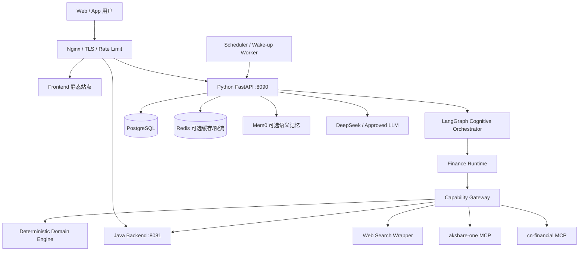
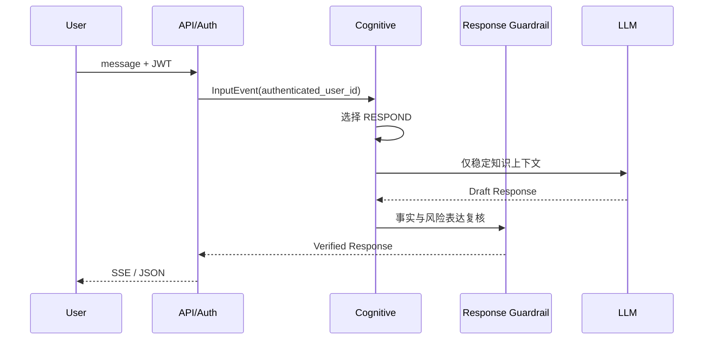
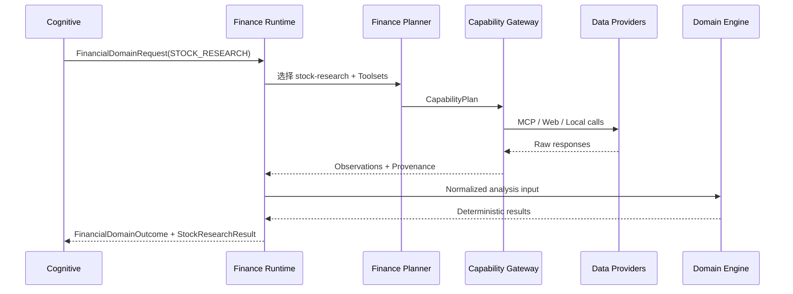

# StockWise 统一生产架构

> **文档状态：生产架构唯一权威基线**  
> **架构版本：v1.0**  
> **生效日期：2026-08-10**  
> **适用范围：`stockwise-analysis`、Java 用户数据服务、前端/API Gateway、外部数据服务及生产基础设施**  
> **当前实施状态：目标架构已冻结；M1 已完成独立开发，M0 门禁未关闭，尚未进入生产路径切换**  
> **配套架构图：[00-StockWise生产架构.drawio](./00-StockWise生产架构.drawio)**

## 0. 文档治理

### 0.1 本文档的权威性

本文是 StockWise 面向开发、测试、部署和运维的统一生产架构文档。

发生架构、代码和历史文档冲突时，按以下优先级处理：

1. 安全、隐私、身份和只读金融边界；
2. 本文档；
3. 已批准的 ADR 或接口契约；
4. 当前代码与测试所证明的实现事实；
5. 31 号分阶段实施 Prompt；
6. 21、28、29 号设计文档；
7. 历史版本档案和评审记录。

21、28、29 号原始文件的有效内容已归档到历史版本档案和本文，不再保留重复正文：

- V3 历史档案保留 LangGraph、MCP、Observation、预算和确定性计算经验；
- 本文保留 Cognitive Kernel 的生产目标模型；
- 本文保留 Finance Runtime、Stock Research 和 Suitability 的生产领域模型；
- 本文统一处理三者之间的生产边界、部署方式和迁移顺序。

### 0.2 文档中的状态标记

| 标记 | 含义 |
|---|---|
| `CURRENT` | 当前代码已进入默认运行路径并有测试覆盖 |
| `FOUNDATION` | 契约或骨架已存在，但尚未进入默认运行路径 |
| `TARGET` | 已冻结的生产目标，需要按迁移计划实现 |
| `EXPERIMENTAL` | 不得进入生产关键路径 |
| `RETIRED` | 不得新增依赖，按计划退出 |

任何设计说明都必须明确其状态，禁止把目标架构描述成已经落地。

## 1. 执行摘要

StockWise 的生产架构采用以下唯一主线：

```text
Nginx / API Gateway
  → Python FastAPI
  → LangGraph Cognitive Orchestrator
  → Finance Runtime
  → Financial Skill
  → Toolset / Capability Gateway
  → MCP / Java Data API / Web Search / Local Domain Engine
  → Observation / Evidence
  → StockResearchResult / SuitabilityAssessment
  → Communication Plan / Response Verification
  → SSE / JSON
```

生产决策如下：

1. **生产只使用 LangGraph Runtime**。Letta 仅允许在隔离实验环境中对比，不属于生产架构。
2. **Cognitive Kernel 是目标顶层编排器**，但它只选择行动，不直接访问原始工具。
3. **Finance Runtime 是金融领域边界**，负责金融任务、Skill、Toolset、证据和适配性。
4. **Stock Research 是金融 Skill，不是顶层系统**。
5. **Capability Registry 是唯一能力真源**；Toolset 只是派生视图，不能复制第二份能力清单。
6. **所有外部数据先转为 Observation**，任何模型不得直接消费原始供应商响应并生成最终结论。
7. **金融计算由确定性 Domain Engine 完成**，LLM 不执行指标、风险、估值或回测公式。
8. **客观研究与用户适配性分离**。`StockResearchResult` 不包含“适合当前用户”的结论。
9. **系统对外保持只读**。不下单、不调仓、不转账、不修改账户或持仓。
10. **生产环境禁止 mock 数据静默降级**。不可用必须返回 `PARTIAL / LIMITED / FAILED`。
11. **状态、会话、运行索引、历史和任务必须持久化**，生产实例不得依赖进程内存保存关键状态。
12. **新旧路径渐进切换**。新路径未通过安全、故障注入和灰度门禁前，旧路径继续保留。

## 2. 业务范围

### 2.1 当前生产范围

第一阶段生产系统提供只读金融助手能力：

- 稳定金融知识解释；
- 股票、ETF、基金和指数标的解析；
- 实时行情和历史行情查询；
- 技术面、基本面、估值、行业、资金流和新闻研究；
- 用户持仓、账户、交易历史和风险画像的只读分析；
- 股票客观研究；
- 组合影响分析；
- 用户适配性评估；
- 多轮会话、流式输出、运行查询和中断恢复；
- 数据缺失、冲突和限制披露。

### 2.2 第二阶段范围

- 价格或估值观察任务；
- 组合风险扫描；
- Scheduler 唤醒；
- 受控主动通知；
- 周期性财务复盘；
- 财务目标和现金流能力扩展。

### 2.3 明确非目标

- 真实下单、撤单、改单、调仓或资金划转；
- 券商交易执行；
- 自动生成可直接提交的订单；
- 自动承诺收益；
- 冒充持牌投资顾问；
- LLM 直接访问数据库、MCP 原始工具或账户服务；
- 任意动态加载第三方 Skill；
- 在生产关键路径中运行 Letta；
- 用 Node `stock-analysis-skill` 承担生产编排或在线补数；
- 以 Mem0 替代用户档案、金融账本、任务库或审计历史。

## 3. 当前实现与目标架构

| 能力 | 状态 | 当前事实 | 生产目标 |
|---|---|---|---|
| FastAPI / SSE / Agent Run API | `CURRENT` | 已有 `/api/v1` 路由 | 保持兼容并统一错误与事件契约 |
| JWT 身份绑定 | `CURRENT` | Python 验签，Java 提供用户数据 | 生产强制开启，禁止信任请求体 `user_id` |
| 旧 Root Graph | `CURRENT` | 默认执行路径 | 迁移期保留，最终由 Cognitive Graph 替代 |
| CognitiveAction | `FOUNDATION` | 九种行动契约已存在 | 第一阶段启用 RESPOND、ASK_USER、INVOKE_DOMAIN |
| Cognitive Graph | `TARGET` | 尚未进入运行路径 | 成为唯一顶层业务编排入口 |
| DomainRequest / Outcome | `FOUNDATION` | 严格契约已存在 | 作为 Cognitive 与 Finance 的唯一跨层接口 |
| Finance Runtime | `TRANSITION` | M1 薄运行时已独立装配，未接默认流量且无 Checkpointer | 领域子图/应用服务，隔离金融业务逻辑 |
| StockResearchResult | `FOUNDATION` | Schema 已存在，构建器未实现 | 客观股票研究唯一输出契约 |
| SuitabilityEngine | `TARGET` | Schema 已存在，规则未实现 | 确定性个性化适配评估 |
| Capability Registry | `CURRENT` | 14 个统一只读能力 | 继续作为唯一能力真源 |
| Toolset Registry | `TRANSITION` | 六个派生分组已存在并接入 M1 Finance Planner | 继续分层暴露能力并服务后续 Research/Suitability |
| 四时点 Guardrails | `FOUNDATION` | 只有契约和 Protocol | 切换前必须全部实现并接线 |
| Observation / Coverage | `CURRENT` | 已有标准化与覆盖判断 | 进入所有外部数据路径 |
| Mem0 | `CURRENT` | 可用时增强、失败降级 NoOp | 保持非关键路径，不存权威业务事实 |
| Checkpointer | `CURRENT` | 生产可使用 PostgreSQL | 必须持久化并隔离命名空间 |
| Chat Session | `CURRENT` | 生产已有 PostgreSQL Store | 继续持久化和用户隔离 |
| Run Registry | `FOUNDATION` | 当前只有内存实现 | 上线前迁移 PostgreSQL |
| Analysis History | `FOUNDATION` | 当前只有内存实现 | 上线前迁移 PostgreSQL并保证幂等 |
| Task / Scheduler | `TARGET` | 尚未实现 | 第二阶段只落地一个观察任务垂直切片 |
| Letta | `EXPERIMENTAL` | 无生产实现 | 仅隔离研究，不进入部署拓扑 |
| Node Stock Skill / Wrapper | `RETIRED` | 遗留 Java 链路仍可能使用 | Python 新路径禁止依赖，逐步退出 |

## 4. 系统上下文与生产拓扑



### 4.1 公网边界

公网只暴露 Nginx 的 HTTPS 入口。Python、Java、Web Search、数据库和 Redis 不直接监听公网地址。

推荐路由归属：

| 路径 | 归属 |
|---|---|
| `/`、`/workspace`、`/agent` | Frontend |
| `/api/v1/chat/*` | Python Analysis |
| `/api/v1/conversations*` | Python Analysis |
| `/api/v1/agent-runs*` | Python Analysis |
| `/api/auth/*` | Java Backend |
| `/api/portfolio/*` | Java Backend，公网访问受 JWT 约束 |
| `/api/user/*` | Java Backend，公网访问受 JWT 约束 |
| `/actuator/*` | 仅运维网络或关闭公网访问 |

Python 调用 Java Data API 使用内网地址和服务凭证，不经过公网 Nginx。

### 4.2 生产单元

| 单元 | 是否关键 | 说明 |
|---|---|---|
| Nginx | 是 | TLS、路由、SSE、限流、请求大小和超时 |
| Python Analysis | 是 | 唯一 Agent/认知/金融编排服务 |
| Java Backend | 个性化场景是 | 认证、用户、持仓、账户、风险画像 |
| PostgreSQL | 是 | Checkpoint、会话、运行索引、历史、任务和审计 |
| Redis | 否 | 缓存、分布式限流或短期锁；不能作为唯一真相源 |
| MCP 服务 | 数据场景是 | 市场数据供应商，允许能力级降级 |
| Web Search | 否 | 公开资料补充，失败不阻断纯行情分析 |
| LLM | 模型场景是 | 理解、规划和表达；确定性计算不依赖它 |
| Mem0 | 否 | 语义记忆增强，失败时无记忆继续 |
| Scheduler | 第二阶段是 | 只唤醒任务，不生成金融结论 |

## 5. 逻辑分层

### 5.1 API 与身份层

职责：

- JWT 验证；
- 从 Token subject 构造可信 `authenticated_user_id`；
- 请求 Schema 校验；
- `run_id / thread_id / session_id` 创建与绑定；
- SSE/JSON 序列化；
- 对外错误码映射；
- 用户级限流和请求大小限制。

禁止：

- 直接拼装 Graph 内部任意 State；
- 使用请求体 `user_id` 作为生产身份；
- 将 Token 写入 State、Checkpoint、事件或日志。

### 5.2 Cognitive Orchestrator

职责：

- 将用户消息、恢复、定时唤醒等统一为 `InputEvent`；
- 构建最小 `CognitiveState`；
- 识别目标、约束和不确定性；
- 选择 `CognitiveAction`；
- 调用 `DomainRequest`；
- 吸收 `DomainOutcome`；
- 构建 Communication Plan；
- 决定回答、追问或受控任务动作。

第一阶段只启用：

```text
RESPOND
ASK_USER
INVOKE_DOMAIN
```

`CREATE_TASK / UPDATE_TASK / WAIT / NOTIFY / DO_NOTHING / RETRIEVE_MEMORY` 可以存在于契约，但未启用时必须返回 `ACTION_NOT_ENABLED`，不能假装已经执行。

### 5.3 Finance Runtime

职责：

- 验证 `FinancialDomainRequest`；
- 加载本轮最小 Financial Snapshot；
- 选择 Financial Skill；
- 建立 Skill 依赖计划；
- 选择 Toolset，并展开受控 Capability；
- 执行 Capability 并收集 Observation；
- 构建 Evidence、Finding 和 Conflict；
- 调用确定性 Domain Engine；
- 生成 `StockResearchResult`；
- 按需要执行 Suitability；
- 生成 `FinancialDomainOutcome`。

Finance Runtime 不直接生成最终聊天文案。

### 5.4 Financial Skill

生产第一阶段只实现并开放：

1. `stock-research`；
2. `portfolio-health`；
3. `suitability-evaluation`。

Skill 是 Python 运行时中的明确业务模块或子图，不是任意动态加载的 Prompt 文件，也不是 Node Wrapper。

每个 Skill 必须声明：

- 输入契约；
- 输出契约；
- 所需 Toolset；
- 权限要求；
- 数据完成条件；
- 预算；
- 降级规则；
- 幂等行为。

### 5.5 Capability 与 Adapter

Capability 是 Agent/Planner 可理解的稳定业务能力，例如：

- `market.get_realtime_quote`；
- `market.get_historical_prices`；
- `portfolio.get_current_positions`；
- `research.web_search`；
- `analysis.run_analysis`。

Adapter 负责把 Capability 翻译为供应商或服务具体调用。上层不得看到 MCP 原始工具名、URL、传输协议和供应商参数。

### 5.6 Deterministic Domain Engine

负责：

- 指标；
- 风险；
- 估值；
- 回测；
- 组合暴露；
- Suitability 规则；
- 覆盖率、可信度和阈值判断。

依赖规则：

```text
Domain Engine 不 import LangGraph / LangChain / MCP / Mem0 / FastAPI
```

固定输入必须得到固定输出；涉及日期时必须显式注入交易日历和 `as_of`。

## 6. 核心运行流程

### 6.1 稳定知识直接回答



直接回答禁止处理实时价格、账户事实或依赖外部证据的结论。

### 6.2 股票客观研究



### 6.3 用户适配性分析

```text
StockResearchResult
  + FinancialSnapshot(LIVE / USER_CONFIRMED)
  + 用户目标和约束
  → SuitabilityEngine
  → SuitabilityAssessment
```

硬性规则：

- `MOCK / UNAVAILABLE` 快照不得产生真实个性化结论；
- 研究覆盖为 `LIMITED` 时不得输出 `SUITABLE`；
- 缺少风险画像、持仓或流动性关键字段时返回 `INSUFFICIENT_INFORMATION`；
- Suitability 输出理由、Rule ID、证据、条件和限制；
- Suitability 只做评估，不生成交易指令。

### 6.4 持续任务唤醒

第二阶段流程：

```text
Scheduler
  → SCHEDULED_WAKEUP InputEvent
  → Cognitive Kernel
  → Finance Runtime 重新取最新数据
  → 判断触发条件
  → NOTIFY 或 WAIT / DO_NOTHING
```

Scheduler 不缓存上次结论，不自行调用 LLM，不自行生成通知内容。

## 7. 代码组织与依赖规则

目标逻辑与当前目录映射：

| 逻辑层 | 当前/目标目录 | 规则 |
|---|---|---|
| API/Auth | `api/` | 只处理 HTTP、身份和序列化 |
| Application Wiring | `runtime/` | 配置、装配、持久化工厂、错误 |
| Cognitive | `cognitive/` + LangGraph graph | 不引用原始 Adapter |
| Finance Runtime | `domains/finance/` | 只通过 Capability Gateway 访问外部能力 |
| Cross-domain Contracts | `domains/contracts.py` | 严格 Pydantic，禁止任意 dict |
| Capability/Toolset | `tools/` | Registry 是唯一能力真源 |
| Integration Adapters | `integrations/` 和 Adapter 实现 | 隔离供应商协议 |
| Observation | `observations/`、`contracts/observation.py` | 统一来源、质量、时间和错误 |
| Deterministic Engine | `domain/` | 纯计算，不依赖 Agent 框架 |
| Memory | `memory/` | 可选增强，不是事实源 |
| Persistence | `runtime/*store`，后续收敛到 `persistence/` | 生产必须持久化 |

禁止依赖：

- `domain/` → LangGraph、LLM、MCP、Mem0、FastAPI；
- `cognitive/` → MCP Client、Java HTTP Client、供应商 Tool；
- `domains/finance/` → 供应商原始 Schema；
- Graph Node → 环境变量；
- API → 供应商 Adapter；
- Model 输出 → 直接执行未经 Policy 校验的动作。

为降低迁移风险，本阶段不强制重命名现有 `domain/` 与 `domains/`；新代码必须遵守上述逻辑边界，待运行路径稳定后再单独执行目录重构。

## 8. 稳定契约

### 8.1 标识符

| 标识 | 语义 | 生命周期 |
|---|---|---|
| `user_id` | 服务端认证用户 | 用户级 |
| `session_id` | 前端会话目录 | 多轮会话 |
| `thread_id` | LangGraph Checkpoint 线程 | 多轮状态 |
| `run_id` | 单次 API/Graph 执行 | 单次运行 |
| `request_id` | 单次领域调用 | Domain Request |
| `task_id` | 持续任务 | 第二阶段 |
| `observation_id` | 一次标准化观察 | 单次数据调用 |
| `capability_execution_id` | 能力执行审计与幂等 | 单次能力调用 |

`run_id` 与 `thread_id` 不得混用。生产 Run Registry 必须持久化两者映射。

### 8.2 跨层对象

唯一允许的主要跨层对象：

```text
InputEvent
CognitiveAction
DomainRequest / DomainOutcome
FinancialDomainRequest / FinancialDomainOutcome
FinancialSnapshot
Observation
StockResearchResult
SuitabilityAssessment
CommunicationPlan
PublicResponse
```

规则：

- 跨层对象使用严格 Schema，`extra=forbid`；
- Graph State 中如保存 dict，必须由已验证模型 `model_dump()` 产生；
- 不跨层传递原始 HTTP/MCP 响应；
- 不跨层传递隐藏思维链；
- 所有结论引用 Evidence ID 或 Calculation ID；
- 所有时间使用带时区 ISO-8601；
- 金额、比例和数量在正式计算契约中使用 Decimal 或明确舍入策略。

### 8.3 状态枚举

领域结果：

```text
COMPLETE / PARTIAL / LIMITED / FAILED / WAITING_USER
```

Observation：

```text
SUCCESS / PARTIAL / UNAVAILABLE / FAILED
```

数据真实性：

```text
LIVE / USER_CONFIRMED / TEST_FIXTURE / MOCK / UNAVAILABLE
```

生产逻辑禁止把 `MOCK`、`TEST_FIXTURE` 或 `UNAVAILABLE` 提升为 `LIVE`。

## 9. State、Memory 与持久化

### 9.1 数据所有权

| 数据 | 权威存储 | 是否进入 Graph State |
|---|---|---|
| 用户身份、账户、持仓 | Java/业务数据库 | 仅最小只读快照或引用 |
| Cognitive State | LangGraph PostgreSQL Checkpointer | 是，最小化 |
| Finance Run State | 独立 Checkpoint namespace 或同步子图 | 是，不复制完整账本 |
| Chat Session / Messages | PostgreSQL | State 仅保存必要上下文 |
| Run Registry | PostgreSQL | State 保存 `run_id` |
| Analysis / Decision History | PostgreSQL | State 保存引用 |
| Capability Execution Audit | PostgreSQL | State 保存摘要或引用 |
| Semantic Memory | Mem0 / 向量存储 | 只保存召回结果摘要 |
| Financial Task | PostgreSQL | State 保存 `task_id` |
| Cache / Rate Limit | Redis | 不作为业务真相源 |

### 9.2 Checkpoint 隔离

- Checkpoint key 至少包含 `user_id + thread_id + namespace`；
- Cognitive 与 Finance 子图不得共享同一无区分 State；
- 多轮运行必须记录本轮 Observation 起始位置；
- 恢复时校验 `run_id`、`thread_id` 和认证用户一致；
- Checkpoint 不保存 Token、密钥或完整原始账户数据；
- 大型行情数据持久化到独立存储或摘要后再引用，避免 Checkpoint 膨胀。

### 9.3 生产持久化要求

以下任一项仍为进程内存实现时，不允许多副本生产发布：

- Run Registry；
- Analysis History；
- Chat Session；
- Checkpointer；
- Task Store；
- 幂等记录。

## 10. Capability、Toolset 与供应商

### 10.1 唯一能力真源

`CapabilityRegistry` 是唯一真源，记录：

- 稳定名称；
- 描述；
- 领域；
- Adapter 类型；
- 输入 Schema；
- 输出 Schema；
- 是否只读；
- 超时；
- 成本；
- 支持的分析类型；
- 所属 Toolset。

Toolset 由 Capability Registry 动态派生，不维护第二套清单。

### 10.2 第一阶段 Toolset

```text
market_read
fundamental_read
news_read
portfolio_read
financial_profile_read
planning_compute
```

模型先看到 Toolset，再只看到被选 Toolset 内、满足当前分析类型和权限的 Capability。

### 10.3 供应商路由

- MCP Adapter 隐藏 cn-financial 和 akshare-one 的传输差异；
- Java Adapter 隐藏用户数据 HTTP 路径；
- Web Search Adapter 隐藏搜索供应商和凭证；
- Local Adapter 调用确定性 Domain Engine；
- 路由策略由确定性代码管理，模型不能选择供应商地址或原始 Tool。

### 10.4 外部内容安全

新闻、网页、公告和供应商文本均是不可信输入：

- 不得覆盖系统指令；
- 不得改变工具白名单；
- 不得触发新的 Capability；
- HTML/Markdown 必须清洗；
- 引用时保留来源；
- 超长内容先截断和结构化，不直接注入全部上下文。

## 11. 四时点 Guardrails

四类 Guardrail 必须独立实现并进入新生产路径：

### 11.1 Plan Guardrail

检查：

- 目标是否在金融只读范围；
- Skill 和 Capability 是否已注册；
- 是否读取了超出目标所需的用户数据；
- 预算是否合理；
- 是否重复执行已成功且幂等的步骤。

### 11.2 Action Guardrail

检查：

- 行动类型是否启用；
- Capability 是否在本轮候选白名单；
- 参数 Schema；
- 用户权限；
- 只读边界；
- 调用次数和预算；
- 内部服务凭证是否由 Runtime 注入。

### 11.3 Data-quality Guardrail

检查：

- Observation 状态；
- 数据时效；
- Provenance；
- 覆盖率；
- 供应商冲突；
- `is_mock / data_mode`；
- 是否存在关键字段缺失；
- 外部文本注入风险。

### 11.4 Response Guardrail

检查：

- 结论是否能追溯到 Evidence；
- 是否披露数据时间和限制；
- 是否把客观研究误写成个性化适配；
- 是否产生交易执行语义或收益承诺；
- 是否泄露其他用户或完整账户数据；
- `PARTIAL / LIMITED` 是否被包装成确定结论。

`BLOCK / MODIFY / ASK_USER` 必须记录稳定 Audit Code、Rule ID 和公开理由。

## 12. API 与事件契约

### 12.1 对外 API

生产保留：

```text
POST   /api/v1/chat/stream
GET    /api/v1/conversations
GET    /api/v1/conversations/{session_id}
DELETE /api/v1/conversations/{session_id}
POST   /api/v1/agent-runs
GET    /api/v1/agent-runs/{run_id}
POST   /api/v1/agent-runs/{run_id}/resume
GET    /api/v1/agent-runs/{run_id}/events
GET    /api/v1/health
```

未来新增内部接口时使用 `/internal/v1`，必须通过内网和服务身份保护。

### 12.2 SSE 事件

建议稳定事件集合：

```text
run.created
run.started
run.progress
cognition.action.selected
domain.requested
domain.completed
capability.started
capability.completed
guardrail.blocked
run.interrupted
run.resumed
response.completed
run.failed
```

事件至少包含：

- `event_id`；
- `event_type`；
- `occurred_at`；
- `run_id`；
- `thread_id`；
- `request_id`（适用时）；
- `public_payload`；
- `schema_version`。

事件不得包含 Token、内部 Prompt、隐藏思维链和完整敏感账户数据。

### 12.3 错误模型

统一错误字段：

```json
{
  "code": "CAPABILITY_UNAVAILABLE",
  "message": "行情数据当前不可用",
  "retryable": true,
  "run_id": "...",
  "details": {}
}
```

对外错误信息不得泄露供应商密钥、内网 URL、SQL、堆栈或完整原始响应。

## 13. 可靠性、预算与降级

### 13.1 依赖等级

| 等级 | 依赖 | 失败行为 |
|---|---|---|
| 启动关键 | JWT 配置、生产 Checkpointer、Chat Store | 启动失败，禁止降级内存 |
| 请求关键 | LLM（模型任务）、目标 Capability | 返回结构化失败或有限结果 |
| 场景关键 | Java Data API（个性化）、MCP（行情研究） | 降级为非个性化或 `LIMITED` |
| 增强项 | Mem0、Web Search | 跳过并记录，不拖垮主链路 |

### 13.2 超时与预算

预算由 `DomainBudget` 下发并由 Runtime 统一计数：

- HTTP 建连、读取和总超时分别配置；
- 每个 Capability 有独立超时；
- 每个 Run 有总截止时间；
- 每个模型调用有 token 和时间预算；
- 超出预算停止新调用并生成 `LIMITED`；
- SSE 心跳不延长业务截止时间。

初始目标值：

| 场景 | 总预算 |
|---|---|
| 稳定知识回答 | 15 秒 |
| 单能力查询 | 30 秒 |
| 技术/基本面/估值 | 90 秒 |
| 综合研究 | 240 秒 |
| 个性化 Suitability | 120 秒 |

### 13.3 重试与熔断

- 只对明确的网络瞬态错误和 429/5xx 重试；
- 参数错误、认证错误和策略拒绝不重试；
- 指数退避并加入抖动；
- 同一供应商每次能力调用最多重试一次；
- 主备切换最多一次；
- Provider 级熔断器防止级联故障；
- 熔断状态进入指标，不写入长期用户记忆。

### 13.4 幂等与回退

幂等键至少覆盖：

- `run_id`；
- `request_id`；
- `capability_execution_id`；
- `history_id`；
- `task_id + wakeup_at`；
- Notification Outbox ID。

新 Cognitive 路径只允许在以下条件全部满足时回退旧 Root Graph：

1. 尚未执行任何 Domain Request；
2. 尚未调用外部 Capability；
3. 尚未写入 Checkpoint、History、Task 或 Notification；
4. 已记录 fallback 审计事件。

发生内部写入或外部调用后禁止自动重跑旧路径，必须结构化失败并通过原路径恢复。

## 14. 安全与隐私

### 14.1 身份

- 生产必须 `STOCKWISE_AUTH_REQUIRED=true`；
- Python 验证 Java 签发 JWT；
- `sub` 是唯一用户身份来源；
- Python 调 Java 使用内部服务凭证并显式传递已认证 user_id；
- 内部凭证至少支持轮换，长期建议升级为短期服务 JWT 或 mTLS；
- 用户请求体中的 `user_id` 仅可用于本地无鉴权测试。

### 14.2 最小权限

- Capability 默认拒绝；
- 第一阶段只注册只读能力；
- 读取账户数据前必须确认当前目标确实需要；
- LLM 上下文只包含完成目标所需的最小账户字段；
- 管理与运维接口使用独立身份和网络策略。

### 14.3 数据保护

- TLS 保护公网流量；
- 数据库连接使用独立最小权限账号；
- Secret 通过部署系统注入，不写入仓库；
- 日志对账户、Token、邮箱、手机号等脱敏；
- 备份加密并定期验证恢复；
- 用户删除会话时同步处理消息、索引和可重建派生数据；
- 长期记忆写入必须有明确策略和可删除性。

## 15. 可观测性与 SLO

### 15.1 结构化日志

每条日志包含：

- `timestamp`；
- `level`；
- `service`；
- `environment`；
- `run_id`；
- `thread_id`；
- `request_id`；
- `capability`；
- `audit_code`；
- `latency_ms`；
- `status`。

禁止记录模型隐藏思维链、Secret 和完整原始账户数据。

### 15.2 指标

至少采集：

- HTTP 请求量、延迟和错误率；
- SSE 活跃连接与断连；
- Run 完成、失败、有限和中断数量；
- 模型延迟、token 和错误；
- Capability 延迟、成功率、重试和熔断；
- MCP/Java/Web 分供应商可用率；
- Observation 覆盖率和数据时效；
- Guardrail 决策数量；
- Checkpoint、History 和 Task 写入失败；
- PostgreSQL 连接池和慢查询；
- 队列/任务积压。

### 15.3 初始 SLO

| 指标 | 初始目标 |
|---|---|
| API 月可用性 | 99.5% |
| 健康检查 p95 | < 100 ms |
| SSE 首事件 p95 | < 2 s |
| 直接回答完成 p95 | < 15 s |
| 单能力查询完成 p95 | < 30 s |
| 跨用户数据泄露 | 0 |
| 未披露的 mock/fixture 数据 | 0 |
| 非只读外部金融操作 | 0 |

复杂研究受外部供应商影响，以预算内完成率和 `PARTIAL/LIMITED` 透明度衡量，不使用单一低延迟 SLO 掩盖数据质量。

## 16. 部署与扩缩容

### 16.1 生产部署原则

- Python 和 Java 分别构建不可变镜像；
- 容器以非 root 用户运行；
- 只读根文件系统，临时目录单独挂载；
- 健康检查区分 liveness 和 readiness；
- 配置通过环境变量或 Secret Manager 注入；
- 数据库迁移作为显式发布步骤；
- Nginx 对 SSE 关闭代理缓冲并设置合理长连接超时；
- 生产禁止使用 `latest` 镜像标签；
- MCP 和外部 LLM 版本、模型名进入发布清单。

### 16.2 多副本条件

Python Analysis 横向扩容前必须完成：

- PostgreSQL Checkpointer；
- PostgreSQL Chat Session Store；
- PostgreSQL Run Registry；
- PostgreSQL Analysis History；
- 分布式幂等控制；
- 分布式限流或边缘限流；
- SSE 重连可按 `run_id` 恢复；
- 无进程本地关键状态。

### 16.3 健康检查

`liveness` 只证明进程可服务 HTTP；`readiness` 必须检查：

- 配置合法；
- PostgreSQL 可用；
- Checkpointer 已初始化；
- Chat/Run/History Store 已初始化；
- 必需的内部服务凭证存在。

MCP、Web Search、Mem0 和外部 LLM 的短时不可用不应让进程反复重启，但必须让相关能力显示 degraded。

## 17. 生产配置基线

生产至少要求：

```text
STOCKWISE_ENV=production
STOCKWISE_AUTH_REQUIRED=true
STOCKWISE_CHECKPOINTER_BACKEND=postgres
POSTGRES_DSN=...
JWT_SECRET=...
JAVA_API_BASE_URL=http://127.0.0.1:8081
JAVA_DATA_INTERNAL_TOKEN=...
DEEPSEEK_API_KEY=...
AKSHARE_ONE_MCP_ENDPOINT=https://akshare-mcp.bdlhxny.com/mcp
CN_FINANCIAL_MCP_ENDPOINT=https://cn-financial-mcp.bdlhxny.com/sse
WEB_SEARCH_BASE_URL=http://127.0.0.1:3002
WEB_SEARCH_AGENT_ID=stockwise
WEB_SEARCH_TOKEN=...
```

要求：

- 生产启动时校验必需配置；
- 禁止使用仓库中的开发默认 JWT Secret；
- 禁止在生产自动创建 mock Java/Web 数据；
- 配置变更记录到发布审计；
- Secret 不出现在日志、异常或 `/health` 响应中。

## 18. 迁移计划

每个阶段独立开发、测试、发布和回滚。除纯契约阶段外，不合并跨阶段实施。

### M0：生产基线修复

目标：先让当前路径具备可生产运行的基础。

- 持久化 Run Registry；
- 持久化 Analysis History；
- 统一 Nginx Python 路由；
- 完成 readiness；
- 明确生产禁用 mock；
- 补充结构化日志和关键指标；
- 修复部署文件中 Python 新链路与遗留 Wrapper 的冲突。

退出门槛：单副本重启后 run、thread、conversation 和 history 均可恢复。

### M1：领域边界接线

- 将现有 `DomainRequest / Outcome` 和金融契约接入 Application；
- 实现 Finance Runtime 薄适配层；
- 抽取旧 Root Graph 中可复用的纯核心逻辑；
- 使用“核心函数 + 旧节点包装 + 新领域包装”，禁止复制两套业务逻辑；
- 隔离 Cognitive 与 Finance Checkpoint namespace。

退出门槛：新 Finance Runtime 能在不改变旧默认路径的情况下完成一次兼容股票分析。

### M2：股票研究下沉

- 实现 `StockResearchResult` 构建器；
- 建立字段来源映射；
- 将证据、冲突、覆盖率和可信度纳入输出；
- 禁止股票子图直接生成聊天文案；
- 完成旧 AnalysisResult 与新 StockResearchResult 对照测试。

退出门槛：相同 fixture 下结果字段可追溯、计算一致、限制不减少。

### M3：Suitability v0

- 建立最小 Financial Snapshot；
- 实现确定性 Suitability 规则；
- 输出 Rule ID 和证据；
- 区分 LIVE、USER_CONFIRMED、TEST_FIXTURE、MOCK 和 UNAVAILABLE；
- 跑通“股票是否适合当前用户”的垂直场景。

退出门槛：缺关键用户数据时稳定返回 `INSUFFICIENT_INFORMATION`，不存在伪个性化结论。

### M4：Cognitive Graph 与 Communication

- 实现最小 Cognitive State；
- 接入 RESPOND、ASK_USER、INVOKE_DOMAIN；
- 实现四时点 Guardrails；
- 实现 Communication Plan 和 Response Verification；
- 与旧 Root Graph 进行影子流量和同输入对照。

退出门槛：安全覆盖矩阵无 P0/P1 缺口，故障注入和回退边界通过。

### M5：灰度切换

- 按内部用户、小比例、全量逐步灰度；
- 观察错误率、LIMITED 比例、数据覆盖、响应时间和 Guardrail 命中；
- 保留一键停止新流量能力；
- 稳定期内不删除旧路径。

退出门槛：达到 SLO，完成回滚演练，owner 批准默认路径切换。

### M6：持续任务

- 只实现一种真实观察任务；
- 建立 Task Store、Scheduler 和 Notification Outbox；
- 支持查看、取消、过期和审计；
- 唤醒后重新取数和判断；
- 通知发送具备幂等性。

## 19. 测试与发布门禁

### 19.1 测试层次

- 契约测试：所有跨层 Pydantic Schema；
- Domain 单元测试：指标、风险、Suitability 和覆盖率；
- Policy 测试：身份、权限、四时点 Guardrails；
- Adapter 契约测试：MCP、Java、Web；
- Graph 测试：路由、中断、恢复和预算；
- API 测试：JWT、用户隔离、SSE 和错误模型；
- 持久化测试：重启恢复、多副本和幂等；
- 故障注入：超时、429、5xx、数据库瞬断和供应商冲突；
- 对照测试：旧路径 vs 新路径；
- 安全测试：跨用户访问、Prompt Injection、敏感日志；
- 负载测试：SSE 并发、连接池、外部依赖限额。

### 19.2 必须阻断发布的条件

- 生产仍使用内存 Checkpointer、Run Registry、History 或 Chat Store；
- `auth_required=false`；
- mock 数据能进入真实个性化结论；
- 四时点 Guardrails 未接入但新 Cognitive 路径被设为默认；
- Nginx 未将 Python Agent API 路由到 Python 服务；
- 外部失败被包装为成功；
- Checkpoint 恢复存在跨用户访问；
- 数据库迁移不可回滚或未验证；
- 关键 Secret 使用默认值；
- 新路径发生写入后仍可能自动回退并重复执行。

## 20. 当前生产阻塞项

根据 2026-08-10 代码审计，以下问题必须在生产架构切换前解决：

| 阻塞项 | 当前状态 | 目标阶段 |
|---|---|---|
| Run Registry 仍为内存 | 未完成 | M0 |
| Analysis History 仍为内存 | 未完成 | M0 |
| Nginx 未统一代理全部 Python Agent Run 路径 | 需核对/修复 | M0 |
| 本地 Compose 仍以 Java + stock-wrapper 为主 | 与目标不一致 | M0 |
| Cognitive Graph 未实现 | 未完成 | M4 |
| Finance Runtime 尚未进入默认流量 | M1 独立开发完成；受 M0 发布门禁阻塞 | M5 |
| StockResearchResult 构建器未实现 | 未完成 | M2 |
| SuitabilityEngine 未实现 | 未完成 | M3 |
| 四时点 Guardrail 只有接口骨架 | 未完成 | M4 |
| Toolset 尚未覆盖正式 Research/Suitability Planner | M1 Finance Planner 已接入 | M2/M3 |
| Task/Scheduler 未实现 | 未完成 | M6 |
| 生产多副本幂等与 SSE 恢复未验证 | 未完成 | M0/M5 |

这些阻塞项不影响现有代码作为开发和迁移基线，但在完成前不得宣称最新目标架构已经生产落地。

## 21. 生产完成定义

第一阶段统一生产架构完成必须同时满足：

1. 用户请求首先进入 Cognitive Graph；
2. Cognitive Graph 只启用经过 Policy 允许的行动；
3. Finance Runtime 是金融能力唯一入口；
4. 股票研究产生结构化 `StockResearchResult`；
5. Suitability 使用真实或明确缺失的用户状态；
6. 四时点 Guardrails 全量生效；
7. Capability Registry 是唯一能力真源；
8. 所有外部数据经过 Observation Normalizer；
9. 所有金融计算可复现；
10. 最终回答引用证据并披露限制；
11. 身份、用户隔离和只读边界通过安全测试；
12. Checkpoint、会话、运行索引和历史全部持久化；
13. 新旧路径对照、故障注入、灰度和回滚演练完成；
14. API/SSE 保持兼容；
15. SLO、日志、指标和告警已上线；
16. 旧 Root Graph 尚未删除，但已不再承接默认流量；
17. Letta 和 Node Stock Skill 不在生产关键路径；
18. 运维手册、数据迁移、回滚步骤和 owner 已记录。

## 22. 历史文档处置

| 文件 | 新定位 |
|---|---|
| `历史版本-*.md` | 版本演进档案 |
| [`00-StockWise生产开发实施Prompt.md`](../prompts/00-StockWise生产开发实施Prompt.md) | 唯一生产开发执行 Prompt，不能覆盖本文生产决策 |

历史档案和实施 Prompt 不得再以“唯一有效生产架构”指导开发。新增生产架构决策应更新本文或新增 ADR，并在本文登记。

## 23. 待补 ADR

以下决策需要在对应实现阶段补充独立 ADR，但不得阻塞本文作为总体生产基线：

1. ADR-001：PostgreSQL Run Registry 与 Analysis History 表结构；
2. ADR-002：Cognitive/Finance Checkpoint namespace；
3. ADR-003：Capability Execution 幂等键；
4. ADR-004：Suitability v0 规则阈值与校准流程；
5. ADR-005：Scheduler、Task Store 与 Notification Outbox；
6. ADR-006：服务间认证从共享 Token 升级到短期 JWT 或 mTLS；
7. ADR-007：多副本 SSE 恢复与事件存储；
8. ADR-008：旧 Root Graph 退役门槛和删除计划。
