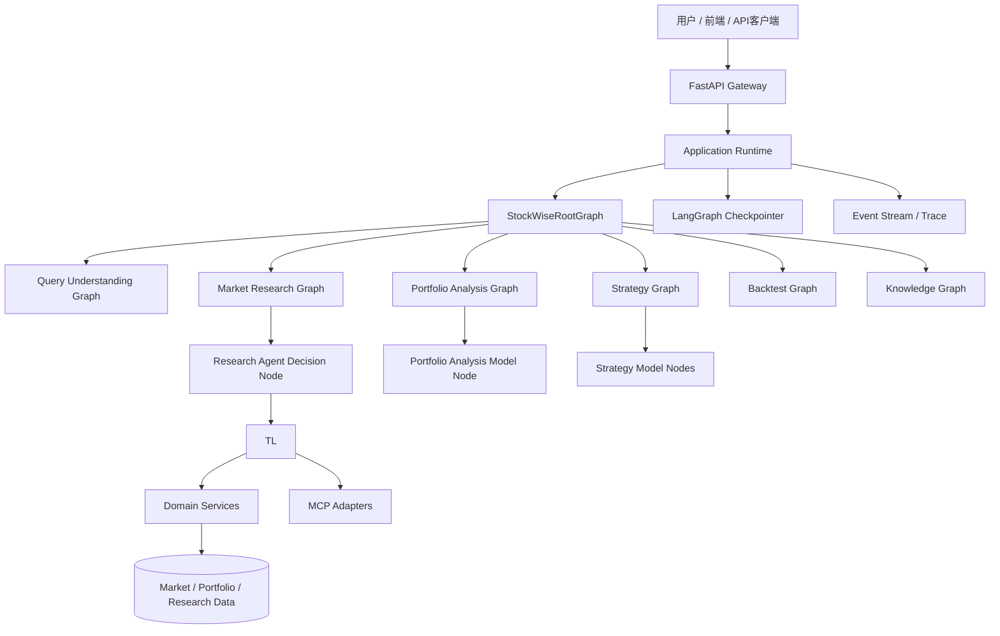

# StockWise 全新股票分析系统 Agent 需求与开发设计

> 文档版本：v1.1
>
> 文档定位：从零设计一套只做股票研究、组合分析、策略设计和回测的 Python Agent 系统。
>
> 明确范围：本系统不执行真实交易，不连接券商下单接口，不生成可直接提交的订单，不设计 Trade Execution、Broker Adapter 或交易审批流程。
>
> 复核用途：本文档用于交给其他 AI、架构师和开发人员进行独立复核。复核时应重点检查流程边界、状态流转、Agent 使用方式、条件边和确定性计算职责。
>
> v1.1 修订：根据两份独立复核意见，统一采用“单步 ReAct + 外层 Graph 执行 Tool/Observation/预算”的执行模型；Root Graph 改为基于 `WorkflowPlan` 的多子图依赖编排；合并 Root 与 Query 的重复理解职责；补充全链路 Observation、Strategy→Backtest、Portfolio 流程和运行期设计。

---

## 1. 系统定位

### 1.1 系统目标

StockWise 是一个由 LangGraph 编排、由局部 Agent 动态分析、由确定性 Domain Service 提供数据和计算能力的股票分析系统。

系统支持：

- 自然语言股票问题理解；
- 行情和市场状态分析；
- 个股、ETF、基金和板块研究；
- 新闻、公告和研究资料检索；
- 用户持仓和组合风险分析；
- 模拟调仓建议；
- 投资策略设计；
- 历史回测和风险指标计算；
- 研究结论、用户偏好和知识沉淀；
- 流式输出、运行状态查看和可恢复执行。

### 1.2 非目标

本阶段明确不实现：

- 真实下单；
- 撤单、改单和券商回执处理；
- Broker MCP；
- 交易执行 Worker；
- 订单状态机；
- 付费模型门禁；
- 复杂人工交易审批；
- 让一个大 Agent 自由访问全部系统能力；
- 通过 Skill 取代 Domain Service；
- 让大模型执行指标、风险和回测计算。

### 1.3 核心判断

本系统不是“写一个 Agent 调用几个股票接口”，而是设计一个完整的分析系统：

```text
用户请求
  → 应用入口
  → Root StateGraph
  → 领域子图
  → Model Node / Agent Node / Tool Node
  → Domain Service
  → 结构化分析结果
```

Agent 只负责适合大模型的工作：理解、拆解、规划、工具选择、动态取证、比较和解释。

确定性服务继续负责：数据获取、指标计算、风险计算、回测、格式校验、数据时效校验和状态管理。

---

## 2. 总体架构原则

### 2.1 LangGraph 是业务流程编排层

LangGraph 负责：

- Root Graph 和子图的状态流转；
- 条件边和循环；
- 子图调用；
- 动态执行路径；
- Checkpoint；
- `interrupt()` 和恢复；
- 流式事件；
- 运行结束、失败和有限结果状态。

LangGraph 的图结构在代码中定义，但运行路径不固定。运行时可以根据请求、Observation、Agent 决策和条件函数走不同分支。

### 2.2 LangChain 是模型和 Agent 能力层

LangChain 负责：

- 模型适配；
- 结构化输出；
- Tool 定义；
- Agent 循环；
- Middleware；
- 模型调用重试和降级；
- MCP Tool 适配。

推荐使用 LangChain 的结构化输出处理意图、研究计划和分析结果；使用局部 Agent 处理需要动态调用工具的分析任务。

### 2.3 Application Runtime 是应用承载层

Application Runtime 不是另一套 Agent 编排框架，也不替代 LangGraph。它只是一个较薄的应用层，负责把外部请求交给 Root Graph，并处理应用级运行事项：

- 创建 `run_id`；
- 创建或恢复 `thread_id`；
- 调用 `root_graph.ainvoke()` 或 `root_graph.astream()`；
- 将图事件转换为 SSE 或 JSON；
- 连接数据库、Redis 和 Checkpointer；
- 处理请求取消、超时、日志和指标；
- 处理 `interrupt` 后的恢复。

关系如下：

```text
FastAPI
  ↓
Application Runtime / Workflow Runner
  ↓
LangGraph Root StateGraph
  ↓
领域子图
  ↓
LangChain Model Node / Agent Node / Tool Node
  ↓
Domain Service
```

不再设计一个比 LangGraph 更大的自定义 Agent Runtime。

### 2.4 动态流程不是完全自由流程

系统采用“固定边界、动态路径”的方式：

```text
固定：
  节点类型、状态结构、允许的终态、资源上限、工具来源

动态：
  子图选择、下一步工具、是否继续取证、是否重新规划、输出哪些分析维度
```

Agent 可以决定“下一步怎么分析”，但不能修改图状态结构、无限循环或跳过必须执行的确定性计算。

### 2.5 不采用复杂业务门禁

本系统不设计交易安全门禁、付费模型门禁和人工下单审批。

只保留普通工程约束：

- 输入输出 Schema 校验；
- Tool 参数校验；
- 最大运行时间；
- 最大 Agent 轮数和工具调用次数；
- 模型调用错误处理；
- Checkpoint；
- 结果来源和时间记录；
- 防止无限循环。

这些属于运行控制，不属于业务决策门禁。

---

## 3. Agent 使用模式定义

所有节点必须在设计时明确使用哪一种模式。

### 3.1 `CODE`

确定性代码节点，不调用大模型。

适用：

- 参数规范化；
- 状态转换；
- Schema 校验；
- 风险指标计算；
- 技术指标计算；
- 回测；
- 结果合并；
- 条件边判断。

### 3.2 `DIRECT_LLM`

单次直接调用大模型，不调用 Tool，不进入 Agent Loop。

适用：

- 用户意图提取；
- 已有信息的摘要；
- 将结构化指标转换为自然语言说明；
- 生成研究计划草稿；
- 解释回测结果；
- 生成最终回答。

要求：

- 明确输入上下文；
- 明确输出 Schema；
- 不允许模型自行补造缺失数据；
- 不允许模型通过文本生成替代确定性计算。

### 3.3 `STRUCTURED_LLM`

这是 `DIRECT_LLM` 的结构化版本。模型只生成 Pydantic 或 JSON Schema 定义的对象。

适用：

- `NormalizedRequest`；
- `IntentResult`；
- `ResearchPlan`；
- `StrategySpec`；
- `AnalysisSummary`；
- `RecommendationResult`。

推荐优先使用结构化输出，不要让后续节点解析自然语言文本。

### 3.4 `BOUNDED_REACT_AGENT`

局部 Agent 动态选择 Tool，并根据 Observation 决定下一步。

标准循环：

```text
Agent 生成下一动作
  ↓
调用一个只读 Tool
  ↓
标准化 Observation
  ↓
更新子图 State
  ↓
Agent 再决定继续、换工具、验证、询问或结束
```

适用：

- 市场研究；
- 个股多来源研究；
- 新闻、公告和行情交叉分析；
- 需要根据前一步结果改变研究方向的问题。

限制：

- 只能访问当前子图允许的只读工具；
- 不能修改账户或系统数据；
- 不能执行交易；
- 必须设置最大时间、轮数、工具调用数和单工具重试次数；
- Agent 的完成判断需要经过子图条件函数确认。

### 3.5 `AGENT_AS_SUBGRAPH`

当一个 Agent 自己包含多个节点、状态、循环和中断时，不把它伪装成一个普通节点，而是将它实现成独立子图。

例如，未来某个确实需要独立内部状态的复杂 Agent 可以这样实现；当前 Market Research 采用单步决策，不使用这种隐藏循环：

```text
ComplexAnalysisGraph
  → ComplexAgentSubgraph
      → plan
      → choose_action
      → tool_call
      → normalize_observation
      → decide_continue
```

这比在一个 Python 函数中隐藏几十轮 Agent 循环更容易调试、审计和复核。

### 3.6 `TOOL_ONLY`

节点只调用一个 Tool，不调用模型。

适用：

- 获取市场快照；
- 获取用户持仓；
- 获取历史价格；
- 获取基本面数据；
- 获取交易日历。

### 3.7 `INTERRUPT`

仅用于：

- 缺少关键分析范围；
- 缺少标的或时间范围；
- 用户需要选择研究目标；
- 用户需要补充风险偏好。

不用于交易确认，因为本系统不执行真实交易。

---

## 4. 总体组件架构



### 4.1 组件职责表

| 组件 | 主要职责 | 是否调用大模型 |
|---|---|---:|
| FastAPI Gateway | HTTP、SSE、请求入口 | 否 |
| Application Runtime | 启动和承载 Graph | 否 |
| Root StateGraph | 全局流程路由 | 某些 Model Node 会调用 |
| Domain Subgraph | 领域流程和状态 | 视节点而定 |
| Agent Node / Agent Subgraph | 局部动态研究或规划 | 是 |
| Tool Layer | 结构化能力入口 | 否 |
| Domain Service | 数据和确定性计算 | 否 |
| MCP Adapter | 将 MCP 能力适配为 Tool | 否 |
| Checkpointer | 保存 Graph State | 否 |
| Event / Trace | 记录运行过程 | 否 |

---

## 5. 全局 Root StateGraph

### 5.1 Root Graph 的职责

Root Graph 只负责全局任务生命周期和子图编排，不负责完成具体研究内容，也不重复执行 Query Graph 已完成的意图理解和实体解析。

它负责：

- 加载请求和会话上下文；
- 调用 Query Understanding Graph 生成 `WorkflowPlan`；
- 根据任务依赖选择可执行子图；
- 并行执行无依赖子图；
- 等待依赖完成后继续执行后续子图；
- 合并多个子图结果；
- 生成最终回答；
- 处理澄清、失败、有限结果和结束。

### 5.2 Root Graph 流程

```text
START
  ↓
load_request
  ↓
load_session_context
  ↓
query_understanding_graph
  ↓
check_plan_ready
  ├── 缺少关键信息 → interrupt_clarification
  ├── 无法形成计划 → return_unresolved
  └── 计划可执行 → dispatch_ready_tasks
                         ↓
                 invoke_ready_subgraphs
                         ↓
                 merge_child_results
                         ↓
                 update_workflow_plan
                  ├── 仍有可执行任务 → dispatch_ready_tasks
                  ├── 子图需要用户信息 → interrupt_clarification
                  ├── 所有任务完成 → compose_response
                  └── 任务失败 → compose_response
                         ↓
                        END
```

`WorkflowPlan` 可以表达单个任务，也可以表达多个有依赖关系的任务。Phase 0 可以只实现单任务和串行依赖，但数据结构从第一版就支持多任务计划。

### 5.3 Root Graph 节点定义

| 节点 | 类型 | Agent | 模式 | ReAct | 职责 | 输出 |
|---|---|---:|---|---:|---|---|
| `load_request` | Code Node | 否 | `CODE` | 否 | 加载请求、用户上下文和请求 ID | `request` |
| `load_session_context` | Code Node | 否 | `CODE` | 否 | 加载会话摘要和最近结果 | `session_context` |
| `query_understanding_graph` | Subgraph Node | 视节点而定 | 普通子图 | 否 | 一次性完成意图、实体、时间范围和任务计划 | `workflow_plan` |
| `check_plan_ready` | Code Node | 否 | `CODE` | 否 | 检查计划是否完整、是否需要用户补充 | `plan_status` |
| `dispatch_ready_tasks` | Code Node | 否 | `CODE` | 否 | 找出依赖已满足的任务并形成执行批次 | `ready_task_ids` |
| `invoke_ready_subgraphs` | Subgraph Node | 视子图而定 | 普通子图或 `AGENT_AS_SUBGRAPH` | 视子图而定 | 并行或串行执行当前批次 | `child_results` |
| `merge_child_results` | Code Node | 否 | `CODE` | 否 | 按任务 ID 合并多个结构化结果 | `analysis_context` |
| `update_workflow_plan` | Code Node | 否 | `CODE` | 否 | 更新任务状态、依赖和下一批次 | `workflow_plan` |
| `compose_response` | Model Node | 是 | `DIRECT_LLM` | 否 | 只基于结构化结果和 Observation 组织回答 | `response` |
| `handle_interrupt` | Interrupt Node | 否 | `INTERRUPT` | 否 | 请求用户补充分析条件 | `resume_payload` |
| `finish` | End Node | 否 | `CODE` | 否 | 返回最终结果 | `final_response` |

### 5.4 WorkflowPlan

```json
{
  "planId": "plan_xxx",
  "tasks": [
    {
      "taskId": "market_1",
      "type": "market_research",
      "dependsOn": [],
      "inputRefs": [],
      "status": "READY"
    },
    {
      "taskId": "portfolio_1",
      "type": "portfolio_analysis",
      "dependsOn": ["market_1"],
      "inputRefs": ["market_1.result"],
      "status": "WAITING"
    }
  ],
  "executionMode": "dependency_ordered"
}
```

任务状态：

```text
WAITING       依赖未完成
READY         可以执行
RUNNING       执行中
SUCCEEDED     执行成功
LIMITED       返回有限结果
NEED_USER     等待用户信息
FAILED        执行失败
```

### 5.5 Root Graph 条件边

#### Query Graph → `check_plan_ready`

```text
缺少关键标的、时间范围或分析目标 → interrupt_clarification
实体无法解析 → return_unresolved
WorkflowPlan 合法 → dispatch_ready_tasks
```

#### `update_workflow_plan → dispatch_ready_tasks`

```text
存在 status=READY 的任务 → dispatch_ready_tasks
所有任务为 SUCCEEDED 或 LIMITED → compose_response
存在 NEED_USER → interrupt_clarification
存在 FAILED 且无可继续任务 → compose_response
```

条件边由代码函数读取 State 判断，不由大模型直接修改下一节点名称。

---

## 6. RootState 设计

```python
class RootState(TypedDict, total=False):
    thread_id: str
    run_id: str
    user_id: str

    request: dict
    session_context: dict
    workflow_plan: dict
    ready_task_ids: list[str]
    completed_task_ids: list[str]
    running_task_ids: list[str]

    child_results: dict
    observations: list[dict]
    response: dict
    errors: list[dict]

    status: str
    interrupt_payload: dict
```

状态设计原则：

- RootState 只保存跨子图共享的数据；
- 子图临时观察结果放在 ChildState；
- 大型原始数据保存到数据库或对象存储，State 只保存引用；
- 最终输出必须是结构化对象；
- 不把模型隐藏思维链保存到 State 或审计库；
- `thread_id` 是 Graph 恢复游标，不等同于业务对象 ID。

---

## 7. Query Understanding Graph

### 7.1 职责

Query Understanding Graph 是 Root Graph 的唯一请求理解入口，负责一次性完成：

- 意图提取；
- 标的、账户和组合实体解析；
- 时间范围规范化；
- 分析目标拆解；
- 任务依赖识别；
- `WorkflowPlan` 生成；
- 缺失信息检测。

Root Graph 不再重复执行 `normalize_request`、`classify_workflow` 或 `resolve_entities`。

### 7.2 子流程

```text
START
  ↓
extract_request_understanding
  ↓
resolve_entities
  ↓
normalize_time_scope
  ↓
build_workflow_plan
  ↓
detect_missing_information
  ├── 信息完整 → return_workflow_plan
  ├── 缺少关键条件 → interrupt_clarification
  └── 实体无法解析 → return_unresolved
  ↓
END
```

### 7.3 节点说明

| 节点 | 类型 | Agent | 模式 | ReAct | 说明 |
|---|---|---:|---|---:|---|
| `extract_request_understanding` | Model Node | 是 | `STRUCTURED_LLM` | 否 | 一次提取意图、分析目标、资产类型、时间范围和可能的任务集合 |
| `resolve_entities` | Tool + Code | 否 | `TOOL_ONLY` + `CODE` | 否 | 调用标的检索工具，代码校验唯一性和实体类型 |
| `normalize_time_scope` | Code Node | 否 | `CODE` | 否 | 将“最近一段时间”等表达转换为时间范围 |
| `build_workflow_plan` | Code Node | 否 | `CODE` | 否 | 根据结构化理解结果生成任务列表和依赖关系 |
| `detect_missing_information` | Code Node | 否 | `CODE` | 否 | 检查计划能否执行，不猜测关键条件 |
| `interrupt_clarification` | Interrupt Node | 否 | `INTERRUPT` | 否 | 让用户补充标的、时间范围、持仓或分析目标 |
| `return_workflow_plan` | Code Node | 否 | `CODE` | 否 | 输出可执行 `WorkflowPlan` |
| `return_unresolved` | Code Node | 否 | `CODE` | 否 | 返回无法解析的实体、任务和建议 |

### 7.4 输出结构

```json
{
  "requestUnderstanding": {
    "entities": [
      {
        "symbol": "600519",
        "assetType": "stock",
        "resolved": true
      }
    ],
    "timeScope": {
      "type": "recent",
      "start": null,
      "end": null
    },
    "analysisGoal": "分析当前走势和主要风险"
  },
  "workflowPlan": {
    "tasks": [
      {
        "taskId": "market_1",
        "type": "market_research",
        "dependsOn": [],
        "status": "READY"
      }
    ],
    "executionMode": "dependency_ordered"
  },
  "missingInformation": []
}
```

普通事实查询的路由：

```text
明确市场事实 → 直接 Tool 查询或 Market Graph 快照路径
历史研究、用户偏好和已沉淀结论 → Knowledge Graph
```

Knowledge Graph 不负责回答实时市场事实。

---

## 8. Market Research Graph

### 8.1 职责

根据研究目标动态收集市场事实，调用行情、历史价格、新闻、公告、基本面和板块数据，最终生成带来源和限制说明的研究结论。

### 8.2 动态子流程

```text
START
  ↓
build_research_goal
  ↓
research_agent_decide
  ├── CALL_TOOL → execute_research_tool
  │                 ↓
  │          normalize_research_observation
  │                 ↓
  │          update_research_budget
  │                 ↓
  │          evaluate_research_state
  ├── FINAL_CANDIDATE → evaluate_research_state
  ├── ASK_USER → interrupt_clarification
  └── STOP_LIMITED → build_limited_result

evaluate_research_state
  ├── 目标已满足 → synthesize_research_result
  ├── 需要继续取证 → research_agent_decide
  ├── 信息冲突 → research_agent_decide，并优先选择验证工具
  ├── 缺少用户信息 → interrupt_clarification
  └── 达到运行预算 → build_limited_result
  ↓
END
```

本图采用“单步 ReAct”执行模型：`research_agent_decide` 每次只生成一个动作；Tool 执行、Observation 标准化、预算扣减和条件判断全部由外层 Market Research Graph 完成。不存在一个隐藏多轮循环的 Agent 子图。

### 8.3 节点说明

| 节点 | 类型 | Agent | 模式 | ReAct | 说明 |
|---|---|---:|---|---:|---|
| `build_research_goal` | Model Node | 否 | `STRUCTURED_LLM` | 否 | 根据意图生成研究目标、必需数据类别和初始提示 |
| `research_agent_decide` | Model Node | 是 | `STRUCTURED_LLM` | 是（单步） | 根据当前 Observation 只生成一个结构化动作，不执行 Tool |
| `execute_research_tool` | Tool Node | 否 | `TOOL_ONLY` | 否 | 执行 Agent 选择的只读 Tool |
| `normalize_research_observation` | Code Node | 否 | `CODE` | 否 | 统一来源、时间、事实、限制和数据质量字段 |
| `update_research_budget` | Code Node | 否 | `CODE` | 否 | 增加轮数和 Tool 调用数，检查时间、次数和成本上限 |
| `evaluate_research_state` | Code Node | 否 | `CODE` | 否 | 判断是否缺数据、冲突或已达到目标 |
| `synthesize_research_result` | Model Node | 是 | `STRUCTURED_LLM` | 否 | 只基于标准化 Observation 生成研究结果 |
| `interrupt_clarification` | Interrupt Node | 否 | `INTERRUPT` | 否 | 用户需要选择研究范围时暂停 |
| `build_limited_result` | Code + Model | 是 | `STRUCTURED_LLM` | 否 | 在资料不足或预算结束时输出有限结论 |

### 8.4 单步 Research Agent 决策节点

```text
research_agent_decide
  ├── CALL_TOOL → execute_tool
  ├── ASK_USER → interrupt
  ├── FINAL_CANDIDATE → evaluate_research_state
  └── STOP_LIMITED → build_limited_result
```

`research_agent_decide` 使用 `STRUCTURED_LLM`，每次只产生一个结构化动作：

```json
{
  "actionType": "CALL_TOOL",
  "toolName": "get_market_snapshot",
  "arguments": {
    "symbols": ["600519"]
  },
  "reason": "需要获取当前行情作为研究起点"
}
```

Agent 不负责执行 `execute_tool`，也不负责追加 Observation。Tool、Observation、预算和条件边由外层 Graph 执行，从而保证每一个步骤都可以独立记录、测试、重试和恢复。

### 8.5 Research Agent 预算

预算字段保存在 `ResearchState` 中：

```python
class ResearchBudget(TypedDict):
    max_rounds: int
    max_tool_calls: int
    max_duration_ms: int
    max_model_calls: int
    same_tool_retry_limit: int
    round_no: int
    tool_call_count: int
    model_call_count: int
```

`update_research_budget` 在每次 Tool 返回后执行，并在下一次 `research_agent_decide` 前再次检查。任一上限达到后，强制返回 `LIMITED`，不允许继续调用 Agent。

预算统计归属：

```text
research_agent_decide            → 记录一次模型调用
execute_research_tool            → 记录一次 Tool 调用
normalize_research_observation   → 记录一次 Observation
update_research_budget           → 统一扣减和判断
```

### 8.6 Research Agent 的终止类型

```text
FINAL_CANDIDATE  → Agent 认为当前目标已经满足
NEED_MORE_DATA   → Agent 认为需要继续取证
VERIFY_CONFLICT  → Agent 发现来源冲突
ASK_USER         → 缺少用户判断或研究范围
STOP_LIMITED     → 只能返回有限研究结果
```

最终是否结束由 `evaluate_research_state` 决定，不能仅根据 Agent 返回 `FINAL_CANDIDATE` 结束。

### 8.7 研究完成条件

不设计复杂的八条件业务门禁，只检查基本完成条件：

```text
研究目标存在
AND 至少有一个有效 Observation
AND Observation 能够对应当前标的和时间范围
AND 输出 Schema 合法
```

`build_research_goal` 必须输出：

```json
{
  "requiredDimensions": ["market_snapshot", "technical_trend", "risk_factors"]
}
```

`evaluate_research_state` 根据 Observation 的 `dimension` 字段计算：

```text
coveredDimensions = requiredDimensions ∩ observationDimensions
missingDimensions = requiredDimensions - coveredDimensions
```

如果核心维度没有覆盖，不阻止所有输出，而是返回 `LIMITED`，并在结果中披露 `missingDimensions`。

---

## 9. Portfolio Analysis Graph

### 9.1 职责

基于用户真实提供或只读获取的账户、持仓、预算和风险偏好，分析组合结构、集中度、风险敞口、回撤和模拟调仓建议。

本图只生成分析结果和模拟建议，不生成可提交订单。

### 9.2 子流程

```text
START
  ↓
load_portfolio_context
  ↓
normalize_portfolio_observations
  ↓
load_market_snapshot
  ↓
normalize_market_observation
  ↓
calculate_portfolio_metrics
  ↓
evaluate_portfolio_completeness
  ├── 数据完整 → continue
  ├── 缺少行情或持仓 → interrupt 或返回有限结果
  └── 需要补充市场背景 → load_market_context_snapshot
                              ↓
                       normalize_market_observation
                              ↓
                       calculate_portfolio_metrics
  ↓
portfolio_analysis_model
  ↓
build_rebalance_recommendation
  ↓
validate_recommendation_schema
  ↓
END
```

组合分析默认不启动完整 Market Research ReAct。需要补充市场背景时，只调用受控的快照型 Tool；如果用户明确要求深度市场研究，Root Graph 应将 Market Research 作为独立任务加入 `WorkflowPlan`，而不是在组合子图内部无限嵌套研究。

### 9.3 节点说明

| 节点 | 类型 | Agent | 模式 | ReAct | 说明 |
|---|---|---:|---|---:|---|
| `load_portfolio_context` | Tool + Code | 否 | `TOOL_ONLY` + `CODE` | 否 | 获取持仓、资金和用户风险偏好 |
| `normalize_portfolio_observations` | Code Node | 否 | `CODE` | 否 | 将持仓、账户和风险偏好结果标准化为 Observation |
| `load_market_snapshot` | Tool Node | 否 | `TOOL_ONLY` | 否 | 获取组合相关标的的当前数据 |
| `normalize_market_observation` | Code Node | 否 | `CODE` | 否 | 标准化行情来源、时间、数据版本和质量 |
| `calculate_portfolio_metrics` | Code Node | 否 | `CODE` | 否 | 计算权重、集中度、波动、回撤和敞口 |
| `evaluate_portfolio_completeness` | Code Node | 否 | `CODE` | 否 | 判断是否可以继续，不生成投资判断 |
| `load_market_context_snapshot` | Tool Node | 否 | `TOOL_ONLY` | 否 | 获取有限市场背景，不启动完整 ReAct |
| `portfolio_analysis_model` | Model Node | 是 | `STRUCTURED_LLM` | 否 | 基于确定性指标生成组合分析 |
| `build_rebalance_recommendation` | Model + Code | 是 | `STRUCTURED_LLM` + `CODE` | 否 | 生成模拟调仓建议并校验数值范围 |
| `validate_recommendation_schema` | Code Node | 否 | `CODE` | 否 | 检查输出结构、数量和权重约束 |

### 9.4 模拟调仓建议

输出使用 `RebalanceRecommendation`，不使用 `OrderDraft`：

```json
{
  "simulationOnly": true,
  "recommendations": [
    {
      "symbol": "510300",
      "action": "increase",
      "currentWeight": 0.12,
      "targetWeight": 0.20,
      "reason": "降低组合单一行业集中度"
    }
  ],
  "riskImpact": {
    "concentrationBefore": 0.48,
    "concentrationAfter": 0.36
  },
  "assumptions": [],
  "limitations": []
}
```

---

## 10. Strategy Graph

### 10.1 职责

将用户的自然语言投资目标转换为可描述、可验证和可回测的策略规格。

### 10.2 子流程

```text
START
  ↓
extract_strategy_intent
  ↓
build_strategy_spec
  ↓
validate_strategy_spec
  ├── 参数完整 → compile_strategy_rules
  ├── 参数缺失 → interrupt_clarification
  └── 无法形式化 → return_unresolved_strategy
  ↓
compile_strategy_rules
  ↓
load_strategy_data
  ↓
normalize_strategy_observations
  ↓
optional_market_research_task
  ↓
build_strategy_result
  ↓
END
```

如果用户同时要求回测，Query Graph 生成的 `WorkflowPlan` 应显式创建 `backtest` 任务，并将其依赖设置为 `strategy`。Strategy Graph 不通过隐藏字段自动跳转 Backtest。

### 10.3 节点说明

| 节点 | 类型 | Agent | 模式 | ReAct | 说明 |
|---|---|---:|---|---:|---|
| `extract_strategy_intent` | Model Node | 是 | `STRUCTURED_LLM` | 否 | 提取目标、频率、标的池、风险偏好和约束 |
| `build_strategy_spec` | Model Node | 是 | `STRUCTURED_LLM` | 否 | 生成规则化策略规格 |
| `validate_strategy_spec` | Code Node | 否 | `CODE` | 否 | 检查参数是否完整、类型是否正确 |
| `compile_strategy_rules` | Code Node | 否 | `CODE` | 否 | 将策略规格编译为可执行规则 |
| `load_strategy_data` | Tool Node | 否 | `TOOL_ONLY` | 否 | 根据已编译规则加载历史价格、标的池和基准数据 |
| `normalize_strategy_observations` | Code Node | 否 | `CODE` | 否 | 标准化历史数据来源、复权方式、时间范围和数据质量 |
| `optional_market_research_task` | Subgraph Node | 视子图而定 | 普通子图 | 是（沿用单步 ReAct） | 通过 WorkflowPlan 或受控子图获取外部研究资料，不在 Strategy 内嵌隐藏 Agent Loop |
| `build_strategy_result` | Model + Code | 是 | `STRUCTURED_LLM` + `CODE` | 否 | 输出策略说明、参数和限制 |
| `interrupt_clarification` | Interrupt Node | 否 | `INTERRUPT` | 否 | 补充策略周期、风险和标的范围 |

大模型不能自行创造历史价格、收益率、回测结果或风险指标。

---

## 11. Backtest Graph

### 11.1 职责

使用确定性代码执行历史回测，使用模型解释结果。

### 11.2 子流程

```text
START
  ↓
load_strategy_input
  ↓
resolve_strategy_source
  ├── 输入包含 StrategySpec → continue
  ├── 上游 strategy 任务已完成 → load upstream result
  └── 缺少策略 → interrupt_clarification
  ↓
load_historical_data
  ↓
normalize_backtest_observations
  ↓
validate_backtest_data
  ↓
run_backtest_engine
  ↓
calculate_risk_metrics
  ↓
interpret_backtest_result
  ↓
build_backtest_report
  ↓
END
```

### 11.3 节点说明

| 节点 | 类型 | Agent | 模式 | ReAct | 说明 |
|---|---|---:|---|---:|---|
| `load_strategy_input` | Code Node | 否 | `CODE` | 否 | 读取用户输入、外部 StrategySpec 或上游策略任务结果 |
| `resolve_strategy_source` | Code Node | 否 | `CODE` | 否 | 确定本次回测使用的策略来源，缺失时中断 |
| `load_historical_data` | Tool Node | 否 | `TOOL_ONLY` | 否 | 获取历史价格和基准 |
| `normalize_backtest_observations` | Code Node | 否 | `CODE` | 否 | 标准化数据源、复权方式、时间范围和版本 |
| `validate_backtest_data` | Code Node | 否 | `CODE` | 否 | 检查缺失、复权、时间范围、偏差属性和数据完整性 |
| `run_backtest_engine` | Code Node | 否 | `CODE` | 否 | 确定性执行回测 |
| `calculate_risk_metrics` | Code Node | 否 | `CODE` | 否 | 计算收益、波动、回撤、夏普等指标 |
| `interpret_backtest_result` | Model Node | 是 | `STRUCTURED_LLM` | 否 | 解释指标，不重新计算指标 |
| `build_backtest_report` | Code + Model | 是 | `STRUCTURED_LLM` + `CODE` | 否 | 生成报告和限制说明 |

回测引擎必须考虑：

- 前视偏差；
- 生存者偏差；
- 复权方式；
- 手续费；
- 滑点；
- 停牌；
- 涨跌停；
- T+1 规则；
- 交易日历；
- 数据缺口；
- 参数过拟合。

### 11.4 Strategy → Backtest 入口契约

Backtest Graph 必须支持两种入口：

```text
直接入口：用户或 API 提供完整 StrategySpec

编排入口：WorkflowPlan 先完成 strategy 任务，backtest 任务通过 inputRefs 读取 strategy 结果
```

示例：

```json
{
  "taskId": "backtest_1",
  "type": "backtest",
  "dependsOn": ["strategy_1"],
  "inputRefs": ["strategy_1.strategySpec"]
}
```

Strategy Graph 和 Backtest Graph 不通过隐式会话状态连接，所有依赖必须出现在 `WorkflowPlan` 中或通过明确 API 输入传递。

---

## 12. Knowledge Graph

### 12.1 当前定位

知识图暂时只负责：

- 检索已有知识；
- 关联历史研究结果；
- 提取可复用的分析结论；
- 保存用户明确要求沉淀的内容。

Skill 的具体知识抽取方式暂不在本版本确定。

### 12.2 节点说明

| 节点 | 类型 | Agent | 模式 | ReAct | 说明 |
|---|---|---:|---|---:|---|
| `retrieve_knowledge` | Tool Node | 否 | `TOOL_ONLY` | 否 | 检索知识库和历史研究 |
| `normalize_knowledge_observation` | Code Node | 否 | `CODE` | 否 | 标准化知识来源、版本、时间和引用关系 |
| `summarize_context` | Model Node | 是 | `DIRECT_LLM` | 否 | 总结检索内容 |
| `extract_candidate_memory` | Model Node | 是 | `STRUCTURED_LLM` | 否 | 提取候选记忆，不自动扩大内容 |
| `save_memory` | Tool Node | 否 | `TOOL_ONLY` | 否 | 保存明确要求的记忆 |
| `deduplicate_memory` | Code Node | 否 | `CODE` | 否 | 去重、版本和来源关联 |

---

## 13. Tool 设计

### 13.1 Tool 原则

Tool 是模型或 Graph 可以调用的结构化入口，不包含大段隐式业务流程。

每个 Tool 必须定义：

- `name`；
- `description`；
- 输入 Schema；
- 输出 Schema；
- 超时；
- 错误类型；
- 数据来源；
- `as_of` 和 `observed_at`；
- 是否允许在 ReAct 中调用；
- 是否只读。

### 13.2 市场数据 Tools

```text
get_market_snapshot
get_price_history
get_instrument_profile
get_sector_snapshot
get_fundamental_data
get_market_calendar
```

### 13.3 研究资料 Tools

```text
search_news
search_announcements
search_research_documents
retrieve_knowledge
```

这些 Tool 可以由内部适配器或 MCP Adapter 实现。

### 13.4 组合数据 Tools

```text
get_user_account_readonly
get_user_positions_readonly
get_user_risk_profile
get_portfolio_history
```

名字中明确使用 `readonly`，避免将来误认为具备账户写操作能力。

### 13.5 计算 Tools

```text
calculate_technical_indicators
calculate_portfolio_exposure
calculate_risk_metrics
calculate_simulated_position_size
run_backtest
```

计算 Tool 内部调用 Domain Service，但不能由模型重写计算逻辑。

### 13.6 推荐结果 Tools

```text
build_rebalance_recommendation
build_strategy_draft
build_analysis_report
```

这些只能生成分析结果或模拟建议，不能生成真实订单。

### 13.7 Tool 调用方式

```text
直接 Tool 调用：
  Graph 已经知道需要哪个 Tool

Agent Tool 调用：
  Agent 根据 Observation 选择下一个 Tool

批量并行 Tool 调用：
  Graph 明确知道多个数据源相互独立，可并行查询
```

### 13.8 Tool 与 Service 的关系

```text
Agent / Graph
    ↓
Tool Adapter
    ↓
Domain Service
    ↓
数据源、数据库或外部 API
```

Domain Service 不应依赖 LangChain。这样未来即使更换 Agent 框架，市场计算和回测逻辑仍可复用。

---

## 14. MCP 服务设计

### 14.1 MCP 的定位

MCP 只用于可插拔的外部资料和外部数据能力，不作为核心计算引擎。

### 14.2 MCP 服务清单

| MCP 服务 | 主要能力 | 是否允许 ReAct 调用 | 是否参与计算 |
|---|---|---:|---:|
| `news_mcp_server` | 新闻检索和文章内容 | 是 | 否 |
| `announcement_mcp_server` | 上市公司公告检索 | 是 | 否 |
| `research_document_mcp_server` | 研究报告和文档检索 | 是 | 否 |
| `calendar_mcp_server` | 交易日历和节假日 | 是 | 可作为输入 |
| `knowledge_mcp_server` | 外部知识库检索 | 可选 | 否 |
| `broker_mcp_server` | 券商交易 | 禁止 | 不建设 |

### 14.3 MCP 调用链

```text
Research Agent
  ↓
LangChain MCP Adapter
  ↓
MCP Server
  ↓
MCP Tool Result
  ↓
Observation Normalizer
  ↓
Research State
```

MCP 返回结果不能直接作为最终事实使用，必须统一转换为 Observation，保留来源、时间、文档标识和限制说明。

### 14.4 MCP 与 Tool 的关系

Agent 不直接管理 MCP 连接。系统启动时由 MCP Adapter 将允许的 MCP 能力转换为普通 Tool，再交给具体子图使用。

```text
MCP Server
  → MCP Adapter
  → LangChain Tool
  → Agent 或 Graph
```

这样可以统一 Tool Schema、错误处理、超时、事件记录和来源记录。

---

## 15. Skill 设计预留

Skill 重新设计暂不展开算法和提示词，只先规定接入位置。

### 15.1 Skill 的定位

Skill 是领域能力包，不是系统主 Agent，也不是第二套工作流引擎。

Skill 可以包含：

- 领域说明；
- 输入要求；
- 分析规则；
- 可复用计算；
- 输出 Schema；
- 版本信息；
- 适用范围；
- 限制说明。

### 15.2 初始 Skill 名单

```text
MarketAnalysisSkill
TechnicalAnalysisSkill
FundamentalResearchSkill
PortfolioAnalysisSkill
StrategyDesignSkill
BacktestSkill
KnowledgeMemorySkill
```

### 15.3 Skill 与系统的接入方式

```text
Subgraph
  → Skill Adapter
  → Skill
  → Structured Result
```

未来 Skill 可以：

- 被确定性 Service 调用；
- 被 Tool Adapter 包装为 Tool；
- 被子图直接调用；
- 内部使用模型，但不能改变上层 StateGraph 的生命周期。

当前不设计：

- Skill Registry 的最终形态；
- Skill 动态下载；
- Skill 自行修改 Graph；
- Skill 自行访问全部 Tool；
- Skill 内部具体提示词和算法。

---

## 16. Observation 统一数据结构

所有 Tool、Service、MCP 和 Skill 的外部结果都应转换为 Observation。该原则适用于 Market Research、Portfolio、Strategy、Backtest 和 Knowledge，不只适用于市场研究。

```json
{
  "observationId": "obs_xxx",
  "sourceType": "tool",
  "sourceName": "get_market_snapshot",
  "sourceVersion": "1.0.0",
  "dimension": "market_snapshot",
  "instrumentIds": ["600519"],
  "asOf": "2026-08-04T10:30:00+08:00",
  "observedAt": "2026-08-04T10:30:01+08:00",
  "timezone": "Asia/Shanghai",
  "dataQuality": {
    "status": "live",
    "freshnessStatus": "fresh",
    "expiresAt": "2026-08-04T10:35:00+08:00",
    "warnings": []
  },
  "facts": {},
  "limitations": [],
  "provenance": {
    "requestId": "req_xxx",
    "sourceReference": "provider-or-document-id"
  }
}
```

所有子图至少需要一个对应的标准化节点：

```text
Market Research → normalize_research_observation
Portfolio       → normalize_portfolio_observations / normalize_market_observation
Strategy        → normalize_strategy_observations
Backtest        → normalize_backtest_observations
Knowledge       → normalize_knowledge_observation
```

Observation 必须保留：

- `sourceName` 和 `sourceVersion`；
- `asOf`、`observedAt`、`expiresAt`；
- 标的和时间范围；
- 数据版本、复权方式或文档标识；
- `dimension`；
- `dataQuality` 和警告；
- `provenance`。

模型只能基于标准化 Observation 生成分析结论。未经标准化的外部文本不能直接作为研究事实。

数据过期时不强制阻止所有分析，但必须将 `freshnessStatus=stale` 传递给结果，并在方向性结论和组合分析中披露影响。

---

## 17. 子图状态设计

### 17.1 ResearchState

```python
class ResearchState(TypedDict, total=False):
    goal: dict
    entities: list[dict]
    allowed_tools: list[str]
    observations: list[dict]
    agent_action: dict
    research_status: str
    missing_dimensions: list[str]
    unresolved_conflicts: list[dict]
    result: dict
    errors: list[dict]
    budget: dict
    control_status: str
    terminal_status: str
```

### 17.2 PortfolioState

```python
class PortfolioState(TypedDict, total=False):
    portfolio_input: dict
    positions: list[dict]
    market_observations: list[dict]
    risk_metrics: dict
    portfolio_analysis: dict
    rebalance_recommendation: dict
    missing_information: list[str]
    result: dict
    errors: list[dict]
```

### 17.3 StrategyState

```python
class StrategyState(TypedDict, total=False):
    user_goal: dict
    strategy_spec: dict
    universe: list[dict]
    historical_data_ref: dict
    compiled_rules: dict
    research_observations: list[dict]
    backtest_request: dict
    result: dict
    errors: list[dict]
```

### 17.4 状态边界

每个子图只能通过以下方式与 Root Graph 交互：

- 接收明确的输入；
- 返回明确的结构化结果；
- 返回状态码；
- 返回需要用户补充的信息；
- 返回错误和限制说明。

子图不能直接修改 RootState 的任意字段。

---

## 18. 条件边和终态设计

### 18.1 条件边原则

条件边由代码函数根据 State 判断，Agent 只能提出建议动作或更新分析字段。

条件边可以动态，但必须返回有限的状态集合。

```python
ResearchControlStatus = Literal[
    "CONTINUE",
    "SYNTHESIZE",
    "VERIFY",
    "NEED_USER",
    "LIMITED",
    "FAILED",
]

TerminalStatus = Literal[
    "SUCCEEDED",
    "LIMITED",
    "NEED_USER",
    "FAILED",
    "INTERRUPTED",
]
```

`control_status` 表示下一条 Graph 边，`terminal_status` 表示子图最终结果。两者不能混用。

| 控制状态 | 含义 | 对应动作 |
|---|---|---|
| `CONTINUE` | 还需要动态取证 | 回到 `research_agent_decide` |
| `SYNTHESIZE` | 当前信息可以生成结果 | 进入结果合成 |
| `VERIFY` | 发现信息冲突 | 回到 Agent，选择验证 Tool |
| `NEED_USER` | 缺少用户条件 | `interrupt` |
| `LIMITED` | 达到预算或数据覆盖不足 | 生成有限结果 |
| `FAILED` | 无法继续执行 | 进入失败结果 |

| 终态 | 含义 |
|---|---|
| `SUCCEEDED` | 成功完成 |
| `LIMITED` | 资料不足或预算结束，但返回有限结果 |
| `NEED_USER` | 等待用户补充 |
| `FAILED` | 执行失败 |
| `INTERRUPTED` | Graph 已暂停，等待恢复 |

### 18.2 通用研究条件函数

```python
def decide_research_next(state: ResearchState) -> str:
    if state.get("errors"):
        return "FAILED"

    if state.get("missing_information"):
        return "NEED_USER"

    if state.get("unresolved_conflicts"):
        return "VERIFY"

    if research_goal_satisfied(state):
        return "SYNTHESIZE"

    if resource_budget_exhausted(state):
        return "LIMITED"

    return "CONTINUE"
```

`research_goal_satisfied()` 不需要使用复杂业务门禁，只检查当前目标是否有足够的结构化输入支持输出。如果覆盖不完整，则结果中披露 `missing_dimensions`。

### 18.3 Agent 与条件边的关系

```text
Agent：提出下一步行动
Graph：执行行动
Code：检查行动结果和当前状态
Graph：根据 Code 返回值选择下一节点
```

不允许 Agent 直接返回一个任意 Graph 节点名称并跳转。

### 18.4 终态

所有子图统一使用以下终态：

```text
SUCCEEDED      成功完成
LIMITED        资料不足但返回有限结果
NEED_USER      等待用户补充
FAILED         执行失败
INTERRUPTED    已暂停等待恢复
```

---

## 19. 运行标识与持久化

```text
conversation_id       用户会话
thread_id             LangGraph 恢复游标
run_id                一次 Graph 运行
checkpoint_id         Graph 状态快照
observation_id        一次数据观察
```

### 19.1 Checkpointer 用途

Checkpointer 只保存可恢复的 Graph State，不作为行情、持仓、回测和知识数据的唯一事实来源。

### 19.2 事件类型

```text
RUN_STARTED
GRAPH_STARTED
TASK_STARTED
TASK_COMPLETED
NODE_STARTED
MODEL_CALLED
AGENT_ACTION
TOOL_STARTED
TOOL_COMPLETED
OBSERVATION_RECORDED
GRAPH_BRANCH_SELECTED
INTERRUPTED
RUN_LIMITED
RUN_FAILED
ANSWER_STARTED
ANSWER_TOKEN
ANSWER_COMPLETED
RUN_COMPLETED
```

### 19.3 事件 Payload 最小契约

每个 SSE 事件必须包含统一外层字段：

```json
{
  "eventId": "evt_xxx",
  "eventType": "ANSWER_TOKEN",
  "runId": "run_xxx",
  "threadId": "thread_xxx",
  "taskId": null,
  "node": "compose_response",
  "sequence": 42,
  "timestamp": "2026-08-04T10:30:02+08:00",
  "payload": {}
}
```

`ANSWER_TOKEN` 的 `payload` 示例：

```json
{
  "text": "当前趋势显示"
}
```

结构化结果通过 `ANSWER_COMPLETED` 或独立的 `RESULT` 事件发送。前端不能只依赖模型 Token 拼接完整结果。

### 19.4 审计内容

保存：

- 请求摘要；
- 节点名称；
- Agent 动作；
- Tool 名称和参数摘要；
- Observation 引用；
- 模型名称和耗时；
- Token 和费用统计；
- 最终结果；
- 错误和限制。

不保存模型隐藏思维链，不保存 API Token。

### 19.5 运行期控制

#### 缓存和时效

市场快照、板块快照、基本面和公告检索需要通过 `CacheService` 管理：

```text
cache key = tool + normalized arguments + data version
TTL        = 按数据类型配置
stale      = 可标记使用，但必须进入 Observation warning
```

#### 限流

Tool 和 Provider 层需要配置：

- 单 Provider RPM；
- 单用户并发数；
- 单 Run Tool 调用数；
- 单 Run 模型调用数；
- 重试后的退避时间。

#### 错误分类

错误至少分为：

```text
INVALID_INPUT       不应重试
ENTITY_NOT_FOUND    不应重试
PROVIDER_TIMEOUT    可有限重试
PROVIDER_RATE_LIMIT 退避后重试
PROVIDER_UNAVAILABLE 可降级或返回 LIMITED
MODEL_TIMEOUT       可切换备用模型
MODEL_SCHEMA_ERROR  可修复提示后重试一次
INTERNAL_ERROR      记录并 FAILED
```

#### 长任务

短请求可以使用 SSE 等待结果；超过配置时长的研究任务应转为后台 Run：

```text
POST → RUN_ACCEPTED
      ↓
后台执行 Graph
      ↓
SSE 断线可通过 run_id 查询
      ↓
GET /runs/{runId} 获取进度和最终结果
```

#### Thread 并发

同一个 `thread_id` 同时只能有一个可写 Graph Run。恢复和新请求必须使用版本号或分布式锁避免覆盖 Checkpoint。

#### 模型选择

允许轻量模型和主力模型分层，但不设计复杂付费门禁：

```text
意图提取 / 分类 / 简单结构化 → 轻量模型
动态研究决策 / 复杂结果综合 → 主力模型
模型超时或不可用 → 明确的备用模型或 LIMITED
```

---

## 20. API 需求

### 20.1 对话入口

```http
POST /api/v1/analysis/chat
Content-Type: application/json
Accept: text/event-stream
```

默认优先返回流式事件；如果预计超过短任务时限，API 返回 `RUN_ACCEPTED`，客户端通过 `run_id` 查询，不要求 HTTP 连接持续保持。

请求示例：

```json
{
  "threadId": "thread_xxx",
  "message": "分析贵州茅台最近走势和主要风险",
  "context": {
    "portfolioId": null
  }
}
```

### 20.2 运行状态

```http
GET /api/v1/analysis/runs/{runId}
```

### 20.3 恢复中断

```http
POST /api/v1/analysis/threads/{threadId}/resume
Content-Type: application/json
```

```json
{
  "resume": {
    "timeScope": "最近三个月"
  }
}
```

### 20.4 结果类型

最终结果至少包括：

```json
{
  "status": "SUCCEEDED",
  "workflowPlan": {},
  "answer": "...",
  "structuredResult": {},
  "observations": [],
  "limitations": [],
  "runId": "run_xxx"
}
```

### 20.5 只读组合数据归属

当请求包含 `portfolioId` 或用户持仓时，API 和 Domain Service 必须确认：

- 当前用户是否拥有该组合；
- 组合是否允许当前用户读取；
- 持仓数据的时间和来源；
- 是否使用用户真实数据或用户手工输入数据。

这属于普通的数据访问和隐私隔离，不属于交易门禁。

---

## 21. 推荐 Python 工程目录

```text
stockwise-analysis/
├── pyproject.toml
├── app/
│   ├── main.py
│   ├── api/
│   │   ├── chat.py
│   │   ├── runs.py
│   │   └── schemas.py
│   ├── runtime/
│   │   ├── application_runtime.py
│   │   ├── run_context.py
│   │   ├── events.py
│   │   └── errors.py
│   ├── graphs/
│   │   ├── root_graph.py
│   │   ├── query_graph.py
│   │   ├── market_research_graph.py
│   │   ├── portfolio_graph.py
│   │   ├── strategy_graph.py
│   │   ├── backtest_graph.py
│   │   └── knowledge_graph.py
│   ├── nodes/
│   │   ├── code_nodes.py
│   │   ├── model_nodes.py
│   │   ├── agent_nodes.py
│   │   ├── tool_nodes.py
│   │   └── interrupt_nodes.py
│   ├── agents/
│   │   └── research_agent_decision.py
│   ├── tools/
│   │   ├── market_tools.py
│   │   ├── portfolio_tools.py
│   │   ├── research_tools.py
│   │   └── calculation_tools.py
│   ├── domain/
│   │   ├── market/
│   │   ├── portfolio/
│   │   ├── risk/
│   │   ├── strategy/
│   │   └── backtest/
│   ├── models/
│   │   ├── states.py
│   │   ├── observations.py
│   │   ├── results.py
│   │   └── schemas.py
│   ├── infrastructure/
│   │   ├── database/
│   │   ├── redis/
│   │   ├── checkpointer/
│   │   ├── model_providers/
│   │   ├── data_providers/
│   │   └── mcp/
│   └── observability/
│       ├── tracing.py
│       ├── metrics.py
│       └── audit.py
├── tests/
│   ├── graphs/
│   ├── agents/
│   ├── tools/
│   ├── domain/
│   └── integration/
└── docs/
```

Skill 目录暂不作为第一阶段核心目录。Skill 接入稳定后，再单独设计 `skills/` 和 Skill Registry。

---

## 22. 分阶段开发计划

### Phase 0：系统骨架和契约

- 初始化 Python 项目；
- 建立 FastAPI 入口；
- 建立 Application Runtime；
- 建立 RootState、ChildState 和结果 Schema；
- 建立 Root Graph；
- 建立 Query Graph 和 `WorkflowPlan` Schema；
- 建立 Checkpointer；
- 建立事件流；
- 建立 SSE 事件 Payload Schema；
- 建立 Run 状态查询和后台 Run 入口；
- 建立模型 Provider 适配器；
- 建立一个最小只读 Tool。

验收：可以通过 API 调用 Root Graph，返回结构化结果、Token 事件、任务事件和运行状态。

### Phase 1：Query Understanding Graph

- 完成意图提取；
- 完成实体解析；
- 完成缺失信息中断和恢复；
- 完成 `WorkflowPlan` 生成；
- 完成单任务路由和 Query Graph → Root Graph 回路；
- 预留多任务依赖结构。

验收：相同入口可以根据任务进入不同子图；“策略并回测”可以生成显式依赖计划。

### Phase 2：Market Research Graph

- 完成行情 Tool；
- 完成新闻或公告 MCP Adapter；
- 完成 Observation 标准化；
- 完成单步 ReAct Agent；
- 完成研究状态循环；
- 完成外层预算统计和 Tool 执行；
- 完成结构化研究结果。

验收：Agent 能根据前一步 Observation 动态选择下一只读工具，并可以在预算结束时返回有限结果。

### Phase 3：Portfolio Analysis Graph

- 接入只读持仓数据；
- 完成组合指标计算；
- 完成 Portfolio 和行情 Observation 标准化；
- 完成 Portfolio Analyst；
- 完成模拟调仓建议。

验收：系统可以基于真实输入持仓生成分析和模拟建议，但不存在任何下单接口。

### Phase 4：Strategy 和 Backtest Graph

- 完成策略规格；
- 完成规则编译；
- 完成策略数据 Observation 标准化；
- 完成回测引擎；
- 完成 Strategy → Backtest 显式依赖；
- 完成回测数据验证节点和属性测试；
- 完成回测解释；
- 完成数据偏差检查。

### Phase 5：Knowledge 和 Memory

- 完成历史研究结果检索；
- 完成候选记忆抽取；
- 完成知识保存和去重；
- 评估长期记忆和向量检索策略。

### Phase 6：Skill 重新设计

- 根据已经稳定的 Graph、Tool 和 Domain Service 重新定义 Skill；
- 确定 Skill 是否是代码包、配置包、提示词包或复合能力包；
- 建立 Skill 输入输出契约；
- 决定是否需要 Skill Registry；
- 将现有 `stock-analysis-skill` 迁移或拆分。

---

## 23. 测试与验收要求

### 23.1 Graph 测试

- 每个节点可以单独测试；
- 每条条件边有正向和反向测试；
- 子图可以独立运行；
- `WorkflowPlan` 的 fan-out、fan-in 和依赖顺序正确；
- Query Graph 生成计划后能够回到 Root Graph 分发；
- Root Graph 可以正确合并子图结果；
- interrupt 后可以使用相同 `thread_id` 恢复；
- 重复恢复不会重复写入不可逆数据。

### 23.2 Agent 测试

- Agent 只使用当前子图允许的 Tool；
- 单步 Agent 只能返回一个结构化动作；
- Agent 不直接执行 Tool，Tool 执行由外层 Graph 完成；
- Agent 能处理 Tool 错误；
- Agent 能识别需要继续取证；
- Agent 能识别信息冲突；
- Agent 能在工具预算结束时停止；
- `max_rounds`、`max_tool_calls` 和 `max_duration_ms` 超限时强制进入 `LIMITED`；
- Agent 不把 Tool 未返回的数据当成事实；
- Agent 输出满足结构化 Schema。

### 23.3 数据和计算测试

- 指标计算有固定测试数据；
- 风险指标有固定测试数据；
- 回测结果可重复；
- 数据时区正确；
- 复权方式明确；
- 数据缺失时能够输出限制；
- 模型不能覆盖确定性计算结果。

### 23.4 系统测试

- SSE 事件顺序正确；
- 长时间研究不会阻塞 API 线程；
- Checkpoint 可以恢复；
- Tool 超时不会导致整个服务失控；
- MCP 不可用时可以返回有限结果；
- 单次运行的模型、Tool 和 MCP 调用可追踪。

### 23.5 运营和数据测试

- 缓存 TTL 和过期 Observation 行为正确；
- Provider 限流和退避生效；
- 瞬时错误和永久错误走不同路径；
- SSE 断线后可以通过 `run_id` 查询；
- 同一 `thread_id` 的并发 Run 不会覆盖 Checkpoint；
- Portfolio 数据经过用户归属校验；
- Strategy → Backtest 的输入引用可追踪；
- 回测复权方式、数据源版本和数据偏差验证结果进入报告。

---

## 24. 给其他 AI 的复核任务

请对本设计进行独立复核，不要默认本文档正确。复核时请回答以下问题：

### 24.1 架构边界

1. LangGraph、Application Runtime、Agent、Tool、Domain Service 的职责是否重复？
2. 是否仍有不必要的自定义 Agent 框架？
3. Root Graph 和子图的边界是否清晰？
4. 是否有节点应该改为普通 Code Node，而不是 Agent？

### 24.2 Agent 使用方式

1. 每个 `DIRECT_LLM` 节点是否真的不需要 Tool？
2. 每个 `BOUNDED_REACT_AGENT` 是否真的需要动态工具选择？
3. 是否有 ReAct 可以改成固定的并行 Tool 调用？
4. Agent 的动作是否全部有结构化 Schema？
5. Agent 是否可能把自然语言结果误当成确定性数据？
6. 单步 Agent 是否只产生动作，是否由外层 Graph 执行 Tool、标准化 Observation 和扣减预算？

### 24.3 Graph 和条件边

1. 条件边是否由 State 和代码函数决定，而不是由模型直接跳转？
2. 是否存在死循环、无法到达终态或重复调用？
3. `CONTINUE`、`SYNTHESIZE`、`VERIFY`、`NEED_USER`、`LIMITED`、`FAILED` 是否足够？
4. 哪些完成条件过于严格，哪些完成条件过于宽松？
5. 子图是否能够独立恢复和测试？
6. Root 是否能表达多子图、fan-out、fan-in 和显式依赖？
7. Query Graph 是否是唯一的意图和实体理解入口？

### 24.4 Tool、MCP、Service

1. Tool 是否只是能力适配层，而不是隐藏的大流程？
2. 哪些能力适合 MCP，哪些应该保留为内部 Service？
3. MCP 返回结果是否统一经过 Observation 标准化？
4. 是否还存在任何真实交易或账户写操作入口？

### 24.5 数据和回测

1. Observation 是否包含足够的来源、时间和数据版本信息？
2. 回测是否考虑前视偏差、生存者偏差、费用、滑点和复权？
3. Portfolio Analysis 是否明确区分真实持仓数据和示例数据？
4. 哪些计算必须完全由确定性代码完成？

### 24.6 复核输出格式

请按以下格式输出复核结果：

```text
总体结论：合理 / 部分合理 / 不合理
建议评分：0-10

P0 必须修改：
- 问题
- 影响
- 修改建议

P1 建议修改：
- 问题
- 影响
- 修改建议

P2 可选优化：
- 问题
- 影响
- 修改建议

缺失模块：
- ...

职责冲突：
- ...

不必要复杂度：
- ...

建议保留的设计：
- ...
```

---

## 25. 参考资料

- LangGraph Overview：<https://docs.langchain.com/oss/python/langgraph/overview>
- LangGraph Interrupts：<https://docs.langchain.com/oss/python/langgraph/interrupts>
- LangChain Middleware：<https://docs.langchain.com/oss/python/langchain/middleware/overview>
- LangChain Tools：<https://docs.langchain.com/oss/python/langchain/tools>
- Model Context Protocol Server Concepts：<https://modelcontextprotocol.io/specification/2025-06-18/server/index>

---

## 26. 当前版本结论

本版本只确定系统骨架，不确定未来 Skill 的最终设计。

系统的核心模型是：

```text
StockWise Analysis System
  = FastAPI API
  + Application Runtime
  + Root StateGraph
  + Domain Subgraphs
  + Local Agent Nodes / Subgraphs
  + Model Nodes
  + Tool Adapters
  + Deterministic Domain Services
  + MCP Adapters
  + Checkpointer
  + Event and Trace
```

核心执行原则是：

```text
Graph 控制生命周期和状态
Agent 单步动态决定分析路径
Tool 提供结构化能力入口
Service 提供事实和确定性计算
Model 负责理解、规划和解释
```

本系统不把所有流程写死，也不把所有决策交给一个大 Agent，而是使用“动态路径 + 单步决策 + 外层可控执行 + 明确职责”的组合方式。
