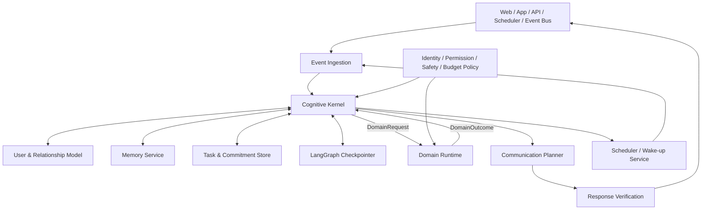
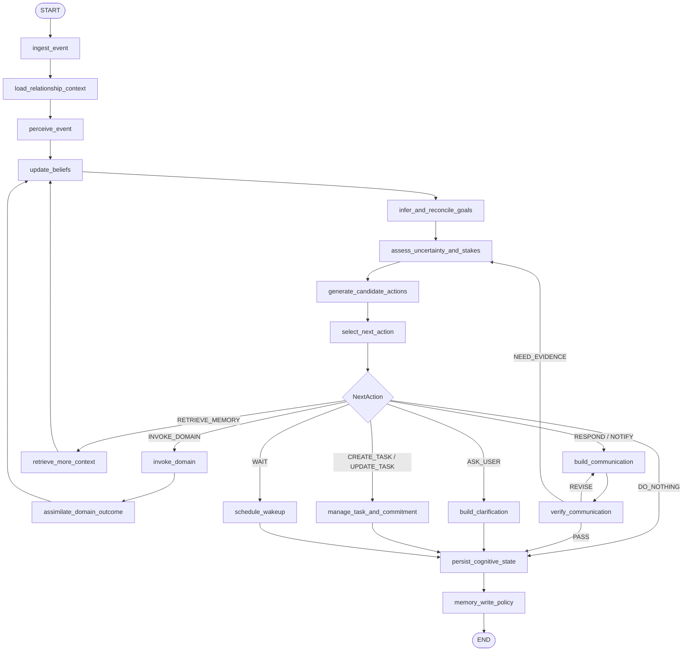

# StockWise 深层认知模型：架构与处理逻辑

> 文档状态：架构评审稿
>
> 适用范围：StockWise 通用助手内核
>
> 目标读者：产品、架构、后端、Agent/LLM 工程人员
>
> 关联文档：[29-个人金融业务模型-架构与处理逻辑.md](./29-个人金融业务模型-架构与处理逻辑.md)
>
> 重要说明：本文描述目标架构，不代表当前代码已经全部实现。

## 1. 文档目的

本文只描述与金融业务无关的“深层认知内核”。它回答以下问题：

1. 系统收到用户消息或外部事件后，内部如何形成对当前情境的理解；
2. 如何区分事实、推断、未知和冲突；
3. 如何识别用户目标、约束和未完成承诺；
4. 如何选择下一步行动，而不是直接生成回答；
5. 如何调用领域业务模型并吸收领域结果；
6. 如何形成回复、持续任务、主动提醒和长期关系。

本文不定义股票指标、估值方法、组合风险公式或金融数据源。这些属于个人金融业务模型。

## 2. 核心结论

StockWise 的深层内核不应是传统的：

```text
用户问题 → 选择工具 → 生成回答
```

而应是一个持续维护情境、信念、目标和承诺的事件驱动系统：

```text
事件进入
→ 更新情境与信念
→ 识别目标、约束和不确定性
→ 选择下一最佳行动
→ 获取新的观察或领域结果
→ 更新判断
→ 回答、追问、创建任务、等待或主动通知
```

用户的一句话首先是一次状态更新，回复只是系统可能选择的行动之一。

## 3. 设计原则

### 3.1 事件优先，而不是聊天优先

系统入口统一为事件。事件可以来自：

- 用户消息；
- 用户确认；
- 定时任务；
- 市场变化；
- 账户变化；
- 目标到期；
- 等待中的任务恢复。

### 3.2 内部决策与外部表达分离

系统必须先形成结构化的内部判断，再由沟通模块把判断表达给用户。不得让模型直接从原始用户消息或原始工具响应生成最终结论。

### 3.3 显式事实与系统推断分离

用户明确表达、外部数据确认、系统推断和未知项必须有不同状态。推断不能静默升级为事实。

### 3.4 下一行动不等于回答

下一行动可以是：回答、追问、取数、运行领域任务、创建持续任务、等待、通知或不打扰。

### 3.5 持续性来自任务和承诺

LangGraph 每次运行都可以结束。助手的持续性由持久化任务、承诺、记忆和 Scheduler 保证，不依赖一个永不停止的 Graph 循环。

### 3.6 LLM 提建议，运行时掌握控制权

LLM 可以理解、推断目标、生成候选行动和起草表达；身份、权限、预算、白名单、持久化和行动执行必须由确定性运行时控制。

### 3.7 不持久化隐藏思维过程

系统保存事实、证据、决策、理由、限制和行动结果，不保存或展示模型隐藏思维链。审计对象是结构化决策轨迹。

## 4. 总体架构



深层认知内核只理解通用对象：事件、情境、信念、目标、约束、不确定性、任务、行动、观察和承诺。

## 5. 核心对象模型

### 5.1 输入事件

```python
class InputEvent(BaseModel):
    event_id: str
    event_type: Literal[
        "USER_MESSAGE",
        "USER_APPROVAL",
        "SCHEDULED_WAKEUP",
        "MARKET_EVENT",
        "ACCOUNT_CHANGED",
        "GOAL_DEADLINE",
        "TASK_RESUMED",
    ]

    authenticated_user_id: str
    occurred_at: datetime
    source: str
    payload: dict

    conversation_id: str | None = None
    task_id: str | None = None
    correlation_id: str | None = None
```

身份必须来自认证上下文，不信任客户端请求体中的 `user_id`。

### 5.2 情境模型

```python
class SituationModel(BaseModel):
    explicit_request: str | None
    speech_act: str
    conversation_context: dict
    relevant_user_context: dict
    relevant_world_context: dict

    inferred_purposes: list[str]
    assumptions: list[str]
    unknowns: list[str]
    conflicts: list[str]
    stakes: Literal["LOW", "MEDIUM", "HIGH", "CRITICAL"]
```

`speech_act` 用于区分用户是在询问、请求执行、表达担忧、纠正系统、确认选择还是延续旧任务。

### 5.3 信念

```python
class Belief(BaseModel):
    belief_id: str
    statement: str
    status: Literal[
        "CONFIRMED",
        "SUPPORTED",
        "INFERRED",
        "DISPUTED",
        "UNKNOWN",
    ]
    confidence: Literal["HIGH", "MEDIUM", "LOW"]
    sources: list[str]
    valid_at: datetime | None
    invalidation_conditions: list[str] = []
```

信念状态只能依据新证据和明确规则更新，不能因为模型在多轮对话中重复某个推断而自动提升可信度。

### 5.4 目标

```python
class Goal(BaseModel):
    goal_id: str
    description: str
    source: Literal[
        "USER_EXPLICIT",
        "USER_INFERRED",
        "SYSTEM_TASK",
        "EXISTING_COMMITMENT",
    ]
    priority: Literal["LOW", "NORMAL", "HIGH", "CRITICAL"]
    status: Literal["ACTIVE", "WAITING", "COMPLETED", "CANCELLED"]
    success_criteria: list[str]
    constraints: list[str]
    conflicts_with: list[str]
```

显式目标和推断目标必须分开。对会实质改变结果的推断目标，系统应向用户确认。

### 5.5 不确定性

```python
class Uncertainty(BaseModel):
    uncertainty_id: str
    kind: Literal[
        "FACTUAL",
        "INTENT",
        "PREFERENCE",
        "DATA",
        "MODEL",
        "ACTION_CONSEQUENCE",
    ]
    description: str
    materiality: Literal["LOW", "MEDIUM", "HIGH"]
    resolution_strategy: Literal[
        "ASK_USER",
        "RETRIEVE",
        "CALL_DOMAIN",
        "WAIT_FOR_EVENT",
        "DISCLOSE_AND_CONTINUE",
    ]
```

### 5.6 承诺

```python
class Commitment(BaseModel):
    commitment_id: str
    user_id: str
    description: str
    owner: Literal["ASSISTANT", "USER", "EXTERNAL"]
    status: Literal["OPEN", "WAITING", "FULFILLED", "CANCELLED", "FAILED"]
    due_at: datetime | None
    completion_condition: dict | None
    related_task_id: str | None
```

承诺用于记录“系统答应继续处理什么”，不是普通聊天摘要。

### 5.7 下一行动

```python
class NextAction(BaseModel):
    action_type: Literal[
        "RESPOND",
        "ASK_USER",
        "INVOKE_DOMAIN",
        "RETRIEVE_MEMORY",
        "CREATE_TASK",
        "UPDATE_TASK",
        "WAIT",
        "NOTIFY",
        "DO_NOTHING",
    ]
    reason: str
    related_goal_ids: list[str]
    expected_information_gain: Literal["NONE", "LOW", "MEDIUM", "HIGH"]
    domain: str | None = None
    payload: dict = {}
```

## 6. CognitiveState

```python
class CognitiveState(TypedDict, total=False):
    run_id: str
    conversation_id: str | None
    task_id: str | None
    authenticated_user_id: str

    input_event: dict
    situation: dict
    beliefs: list[dict]
    assumptions: list[dict]
    user_model: dict
    goals: list[dict]
    constraints: list[dict]
    uncertainties: list[dict]

    active_commitments: list[dict]
    active_tasks: list[dict]
    recalled_memories: list[dict]

    candidate_actions: list[dict]
    selected_action: dict | None

    domain_request: dict | None
    domain_outcome: dict | None

    communication_plan: dict | None
    final_response: dict | None

    budget: dict
    status: str
    events: list[dict]
    errors: list[dict]
```

State 只保存本次运行需要的快照和引用。完整用户档案、完整任务历史、完整领域数据和原始工具响应不常驻 State。

## 7. 深层认知 StateGraph



## 8. 节点职责

| 节点 | 主要职责 | 推荐实现 | 禁止事项 |
|---|---|---|---|
| `ingest_event` | 校验、去重、标准化事件 | 确定性代码 | 不做业务推理 |
| `load_relationship_context` | 加载用户、任务、承诺和相关记忆 | 数据访问层 | 不加载无关全量数据 |
| `perceive_event` | 识别显式请求、言语行为和上下文引用 | 结构化 LLM | 不选择原始工具 |
| `update_beliefs` | 合并事实、推断、冲突和时效 | 确定性代码 | 不将推断静默升级为事实 |
| `infer_and_reconcile_goals` | 识别目标、约束和目标冲突 | LLM + 规则 | 不执行领域计算 |
| `assess_uncertainty_and_stakes` | 判断未知项是否影响结果 | 规则 + LLM | 不伪造缺失信息 |
| `generate_candidate_actions` | 生成多个可行下一行动 | 结构化 LLM | 不直接执行动作 |
| `select_next_action` | 按策略选择允许且价值最高的行动 | Policy + LLM 建议 | 不绕过权限、预算和白名单 |
| `invoke_domain` | 调用指定领域运行时 | 确定性路由 | 不把领域内部工具暴露给核心 |
| `assimilate_domain_outcome` | 将领域结果更新为信念、限制和后续目标 | 确定性代码 | 不直接拼接最终回复 |
| `build_communication` | 生成适合当前用户的表达方案 | LLM | 不添加领域结果中不存在的事实 |
| `verify_communication` | 检查事实、证据、风险和一致性 | 规则 + Critic | 不只做语言润色 |
| `memory_write_policy` | 决定什么可以成为长期记忆 | 确定性策略 | 不写临时数据和未确认推断 |

## 9. 下一最佳行动选择

下一行动不使用单一“模型直觉”，而是综合：

```text
行动价值
= 目标推进程度
+ 新信息价值
+ 用户体验价值
+ 承诺履行价值
- 执行成本
- 错误风险
- 打扰成本
- 权限与安全风险
```

建议使用结构化评分辅助 Policy 选择：

```python
class ActionEvaluation(BaseModel):
    action: NextAction
    goal_progress: float
    information_gain: float
    user_value: float
    execution_cost: float
    error_risk: float
    interruption_cost: float
    policy_allowed: bool
```

高风险场景中，Policy 可以覆盖 LLM 推荐并改为 `ASK_USER`、`WAIT` 或 `DO_NOTHING`。

## 10. 领域调用契约

核心通过通用领域契约调用金融或未来其他领域：

```python
class DomainRequest(BaseModel):
    request_id: str
    domain: str
    user_id: str
    objective: str
    goals: list[dict]
    constraints: list[dict]
    success_criteria: list[str]
    context_refs: list[str]
    allowed_actions: set[str]
    budget: dict


class DomainOutcome(BaseModel):
    request_id: str
    domain: str
    status: Literal["COMPLETE", "PARTIAL", "LIMITED", "FAILED", "WAITING_USER"]
    established_facts: list[dict]
    findings: list[dict]
    risks: list[dict]
    conflicts: list[dict]
    confidence: dict
    limitations: list[str]
    required_user_decisions: list[dict]
    suggested_followups: list[dict]
```

领域模型返回结构化结果，不直接向用户发送消息、不直接写长期记忆、不直接创建跨领域任务。

## 11. 沟通处理

内部决策和外部表达之间增加 `CommunicationPlan`：

```python
class CommunicationPlan(BaseModel):
    communication_type: Literal["ANSWER", "QUESTION", "NOTIFICATION", "STATUS"]
    primary_message: str
    supporting_points: list[str]
    uncertainty_disclosures: list[str]
    user_choices: list[dict]
    proposed_next_step: str | None
    tone: str
    detail_level: str
```

复核至少覆盖：

1. 是否基于已确认事实或明确标注的推断；
2. 是否遗漏重大限制和冲突；
3. 是否与用户目标和已有承诺一致；
4. 是否提出了系统不具备的能力；
5. 是否进行了不必要的打扰；
6. 是否需要用户确认才能继续。

## 12. 状态、记忆、历史和任务边界

| 数据类型 | 作用 | 推荐存储 |
|---|---|---|
| Cognitive State | 本次运行的工作状态 | LangGraph Checkpointer |
| Conversation History | 对话展示与短期连续性 | 会话存储 |
| User Model | 用户稳定画像和已确认偏好 | 结构化数据库 |
| Semantic Memory | 相关稳定事实的语义召回 | Mem0/向量存储 |
| Task | 持续任务生命周期 | 任务数据库 |
| Commitment | 系统和用户未完成承诺 | 任务/承诺数据库 |
| Decision History | 决策、证据、限制和结果审计 | 历史存储 |
| Domain State | 金融账户、持仓、目标等业务事实 | 领域数据库 |

不得用 Mem0 替代结构化用户档案、任务库或金融账本。

## 13. 中断与恢复

需要用户输入时，Graph 写入：

```text
status = WAITING_USER
pending_question
pending_decision
task_id
resume_token/checkpoint_id
```

恢复事件必须携带 `task_id` 或 `conversation_id`，并关联原有 Checkpoint。新输入先作为事件进入，不直接修改旧 State 内部字段。

## 14. 可观测性

建议事件类型：

```text
cognition.event.ingested
cognition.situation.updated
cognition.belief.updated
cognition.goal.inferred
cognition.uncertainty.detected
cognition.action.proposed
cognition.action.selected
cognition.domain.requested
cognition.domain.completed
cognition.communication.drafted
cognition.communication.blocked
cognition.task.created
cognition.commitment.updated
cognition.memory.accepted
cognition.memory.rejected
```

每个关键事件至少包含 `run_id`、`task_id`、`user_id`、节点、时间、状态和公开理由，不记录模型隐藏思维链。

## 15. 安全边界

1. 核心不能直接访问 MCP、账户数据库或领域内部函数；
2. 领域调用必须通过注册表和允许的 `DomainRequest`；
3. 用户身份只来自认证上下文；
4. 写操作、通知和长期任务必须经过对应 Policy；
5. 领域高风险动作必须要求明确授权；
6. 推断出的用户偏好不能自动写入长期画像；
7. 失败和不确定性不能被回复层隐藏。

## 16. 建议代码结构

```text
stockwise_analysis/
├── cognitive/
│   ├── graph.py
│   ├── state.py
│   ├── contracts.py
│   ├── perception.py
│   ├── belief_manager.py
│   ├── goal_manager.py
│   ├── uncertainty.py
│   ├── deliberation.py
│   ├── action_selector.py
│   └── communication.py
├── relationship/
│   ├── user_model.py
│   ├── commitments.py
│   └── communication_policy.py
├── tasks/
│   ├── models.py
│   ├── repository.py
│   ├── lifecycle.py
│   └── scheduler.py
├── domains/
│   ├── contracts.py
│   ├── registry.py
│   └── finance/
├── policy/
│   ├── action_policy.py
│   ├── memory_policy.py
│   ├── notification_policy.py
│   └── response_policy.py
└── memory/
```

## 17. 验收场景

### 17.1 简单知识问题

输入：“什么叫复利？”

预期：形成低风险情境，选择 `RESPOND`，不调用领域工具，不创建任务。

### 17.2 隐含目标不确定

输入：“最近跌得有点多。”

预期：识别为情境表达而非完整任务；结合上下文判断是追问、调用金融领域还是仅作回应，不直接假设具体标的。

### 17.3 持续承诺

输入：“条件合适的时候再提醒我。”

预期：识别持续目标；缺少触发条件时询问；确认后创建任务和承诺，而不是只回复“好的”。

### 17.4 外部事件

输入：Scheduler 唤醒一个风险观察任务。

预期：无需用户消息即可恢复任务、调用领域模型、判断是否通知；未达到阈值时可以 `DO_NOTHING` 或继续等待。

### 17.5 证据不足

领域返回 `LIMITED`。

预期：内核吸收限制，选择披露限制、追问或等待，不允许回复层包装成确定结论。

## 18. 实施顺序

1. 定义 `InputEvent`、`CognitiveState`、`Belief`、`Goal`、`NextAction`；
2. 建立最小 Cognitive Graph，只支持 `RESPOND / ASK_USER / INVOKE_DOMAIN`；
3. 建立 `DomainRegistry` 和通用请求/结果契约；
4. 接入金融业务模型；
5. 增加 Task、Commitment 和恢复；
6. 增加 Scheduler 与主动事件；
7. 增加通知和记忆写入策略；
8. 最后再增加多领域和隔离委派。

## 19. 本轮待评审决策

1. 深层认知模型是否作为唯一顶层 Root Graph；
2. `Belief` 是否需要持久化，还是仅持久化重要决策事实；
3. Goal 和 Task 是否分库存储；
4. 哪些事件允许主动通知用户；
5. 用户模型中哪些字段必须经过明确确认；
6. 第一阶段是否只开放 `RESPOND / ASK_USER / INVOKE_DOMAIN / CREATE_TASK / WAIT`；
7. 是否先保持所有领域能力只读。
