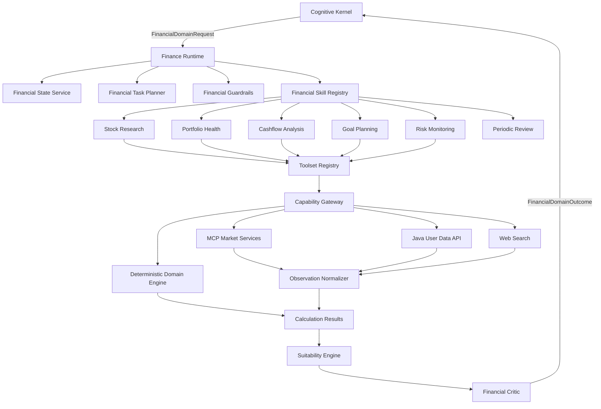
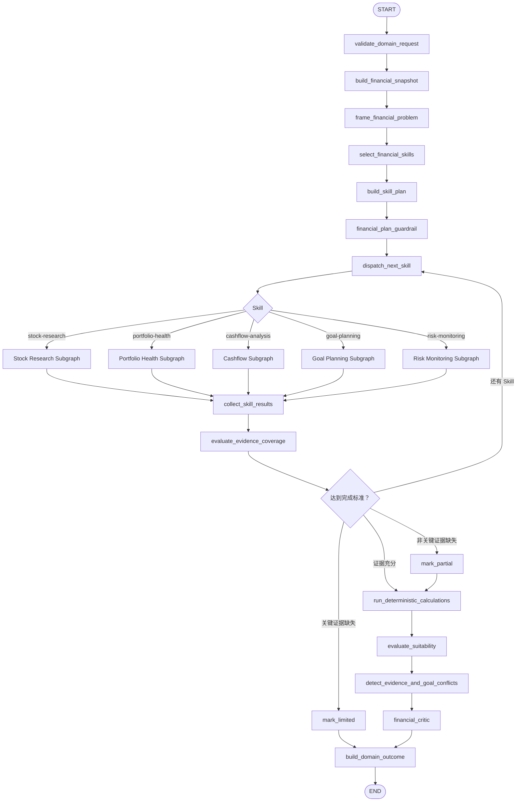
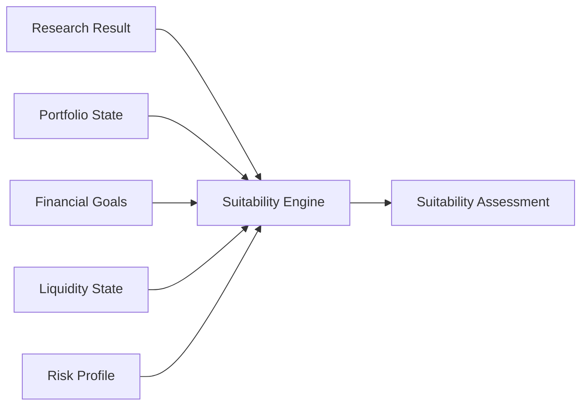

# StockWise 个人金融业务模型：架构与处理逻辑

> 文档状态：架构评审稿
>
> 适用范围：StockWise 个人金融领域运行时
>
> 目标读者：产品、架构、金融分析、后端、Agent/LLM 工程人员
>
> 上层依赖：[28-深层认知模型-架构与处理逻辑.md](./28-深层认知模型-架构与处理逻辑.md)
>
> 重要说明：本文描述目标架构，并标明与当前 `stockwise-analysis` 的迁移关系。

## 1. 文档目的

本文定义个人金融业务模型如何接收深层认知内核提出的明确金融目标，并完成：

- 用户金融状态读取；
- 金融任务分解；
- Skill 和 Toolset 选择；
- 统一能力调用；
- 证据标准化；
- 确定性金融计算；
- 用户适配性判断；
- 风险、冲突和数据完整性复核；
- 结构化领域结果返回。

金融业务模型不负责通用对话理解、不直接向用户发送消息、不直接决定长期记忆内容。

## 2. 产品定位

个人金融助手不是“股票问答工具增加几个功能”，而是围绕个人财务状态和长期目标提供持续服务的领域系统。

```text
个人金融助手
├── 现金与收支
├── 资产与负债
├── 应急资金
├── 财务目标
├── 投资组合
├── 股票和基金研究
├── 风险监控
├── 事件影响
└── 定期复盘
```

股票分析继续保留，但成为 `Stock Research Skill`，不是顶层系统本身。

## 3. 职责边界

### 3.1 金融业务模型负责

- 判断完成一个金融目标需要哪些专业步骤；
- 根据用户授权读取必要的金融状态；
- 选择已注册的金融 Skill；
- 根据 Skill 和任务动态收敛 Toolset；
- 生成确定性数据需求；
- 调用统一 Capability；
- 标准化 Observation、覆盖率和数据质量；
- 执行确定性金融计算；
- 判断对当前用户的适配性；
- 返回结构化结果、限制和后续建议。

### 3.2 金融业务模型不负责

- 猜测用户的通用交流意图；
- 自行修改用户长期画像；
- 直接给用户发送聊天消息；
- 绕过权限访问账户数据；
- 让 LLM 直接调用原始 MCP Tool；
- 隐藏关键数据缺失；
- 第一阶段执行下单、调仓、资金划转或账户修改。

## 4. 总体架构



## 5. 输入契约

深层认知模型向金融业务模型发送明确的领域请求：

```python
class FinancialDomainRequest(BaseModel):
    request_id: str
    user_id: str
    objective: str
    business_intent: str

    entities: list[dict]
    goals: list[dict]
    success_criteria: list[str]
    constraints: list[dict]

    requires_financial_state: bool
    context_refs: list[str]
    allowed_actions: set[str]
    budget: dict
```

示例：

```json
{
  "request_id": "req-001",
  "user_id": "authenticated-user",
  "objective": "判断贵州茅台是否适合当前用户新增配置",
  "business_intent": "stock_suitability",
  "entities": [
    {"type": "security", "value": "贵州茅台"}
  ],
  "success_criteria": [
    "完成股票客观研究",
    "检查白酒行业集中度",
    "评估流动性和风险预算影响"
  ],
  "constraints": [
    {"type": "READ_ONLY"}
  ],
  "requires_financial_state": true,
  "allowed_actions": [
    "READ_MARKET_DATA",
    "READ_PORTFOLIO",
    "RUN_ANALYSIS"
  ],
  "budget": {
    "tool_call_limit": 10,
    "runtime_seconds": 180
  }
}
```

## 6. Financial State

### 6.1 结构化业务事实

```python
class FinancialState(BaseModel):
    user_id: str
    as_of: datetime

    profile: UserFinancialProfile
    accounts: list[Account]
    assets: list[Asset]
    liabilities: list[Liability]
    positions: list[Position]
    cashflows: list[Cashflow]
    goals: list[FinancialGoal]
    risk_profile: RiskProfile
```

### 6.2 用户画像

```python
class UserFinancialProfile(BaseModel):
    life_stage: str | None
    household_context: dict | None
    investment_horizon: str | None
    experience_level: str | None
    liquidity_preferences: dict
    confirmed_preferences: list[str]
```

### 6.3 财务目标

```python
class FinancialGoal(BaseModel):
    goal_id: str
    goal_type: str
    target_amount: Decimal | None
    target_date: date | None
    current_amount: Decimal | None
    priority: str
    status: str
    constraints: list[str]
```

### 6.4 风险画像

风险画像不只是一个“保守/稳健/激进”标签，应至少包括：

- 风险承受能力；
- 主观风险偏好；
- 最大可接受损失；
- 流动性需求；
- 投资期限；
- 收入稳定性；
- 应急资金覆盖；
- 组合集中度限制；
- 明确禁止项。

风险承受能力和风险偏好不一致时，取更保守边界并明确冲突。

### 6.5 Snapshot 原则

业务 Graph 使用本次任务所需的 `FinancialSnapshot`，而不是把完整金融账本写入 LangGraph State：

```python
class FinancialSnapshot(BaseModel):
    snapshot_id: str
    user_id: str
    as_of: datetime
    included_domains: set[str]
    data: dict
    provenance: list[dict]
    data_quality: dict
```

## 7. 金融业务状态

```python
class FinancialBusinessState(TypedDict, total=False):
    domain_request: dict
    financial_snapshot: dict | None
    business_context: dict

    selected_skills: list[str]
    skill_plan: dict
    current_skill: str | None

    capability_candidates: list[dict]
    data_requirements: list[dict]
    observations: list[dict]
    coverage: dict

    calculations: list[dict]
    skill_results: list[dict]
    portfolio_impact: dict | None
    goal_impact: dict | None
    liquidity_impact: dict | None
    suitability: dict | None

    evidence_conflicts: list[dict]
    confidence: dict
    limitations: list[str]
    domain_outcome: dict | None

    budget: dict
    status: str
    events: list[dict]
    errors: list[dict]
```

## 8. 金融业务 StateGraph



## 9. 节点职责

| 节点 | 主要职责 | 推荐实现 |
|---|---|---|
| `validate_domain_request` | 校验领域、身份、权限、只读边界和预算 | 确定性代码 |
| `build_financial_snapshot` | 按目标加载最小必要用户数据 | 数据服务 |
| `frame_financial_problem` | 将上层目标转换为金融问题框架 | 规则 + 结构化 LLM |
| `select_financial_skills` | 选择已注册 Skill | Registry + Policy |
| `build_skill_plan` | 建立 Skill 依赖和完成标准 | Planner |
| `financial_plan_guardrail` | 检查权限、预算、数据需求和动作边界 | 确定性策略 |
| `dispatch_next_skill` | 选择依赖已完成的下一 Skill | 确定性调度 |
| `evaluate_evidence_coverage` | 判断必需证据是否满足 | 确定性代码 |
| `run_deterministic_calculations` | 指标、风险、回测和规划计算 | `domain/` |
| `evaluate_suitability` | 将业务结果映射到当前用户状态 | 规则引擎 + 解释模型 |
| `detect_evidence_and_goal_conflicts` | 识别证据冲突、目标冲突和用户约束冲突 | 规则 + Critic |
| `build_domain_outcome` | 生成统一领域结果 | 确定性组装 |

## 10. Skill 模型

```python
class FinancialSkillSpec(BaseModel):
    name: str
    version: str
    supported_intents: set[str]
    required_inputs: set[str]
    optional_inputs: set[str]
    allowed_toolsets: set[str]
    output_schema: str
    max_tool_calls: int
    read_only: bool
    requires_financial_snapshot: bool
```

第一阶段建议注册：

| Skill | 主要职责 | 是否读取用户状态 |
|---|---|---:|
| `stock-research` | 客观研究单只股票 | 否 |
| `portfolio-health` | 组合集中度、波动、相关暴露 | 是 |
| `cashflow-analysis` | 收支、储蓄率、现金缺口 | 是 |
| `goal-planning` | 目标金额、期限和资金路径 | 是 |
| `risk-monitoring` | 持续检查风险条件 | 是 |
| `periodic-review` | 周/月/年度复盘 | 是 |

Skill 输出统一契约：

```python
class SkillResult(BaseModel):
    skill_name: str
    status: Literal["COMPLETE", "PARTIAL", "LIMITED", "FAILED"]
    findings: list[dict]
    evidence: list[dict]
    calculations: list[dict]
    risks: list[dict]
    conflicts: list[dict]
    scenarios: list[dict]
    confidence: dict
    limitations: list[str]
    suggested_followups: list[dict]
```

## 11. Toolset、Capability 与原始 Tool

层级必须保持：

```text
Financial Skill
→ Toolset
→ Unified Capability
→ Gateway Routing
→ MCP / Java / Web / Local Tool
```

建议 Toolset：

```text
market_read
fundamental_read
news_read
portfolio_read
financial_profile_read
planning_compute
notification_request
```

示例：

```text
stock-research
├── market_read
│   ├── market.resolve_instrument
│   ├── market.get_realtime_quote
│   └── market.get_historical_prices
├── fundamental_read
│   ├── market.get_financial_statements
│   ├── market.get_valuation
│   └── market.get_industry_context
└── news_read
    ├── market.get_news
    └── research.web_search
```

LLM 只看到本轮允许的统一能力，不看到 MCP 服务名、供应商参数和全部原始 Tools。

## 12. Stock Research Subgraph

现有股票分析链应迁移为金融业务模型中的专业子图：


股票研究输出只回答股票本身：

```python
class StockResearchResult(BaseModel):
    symbol: str
    company: dict
    fundamentals: dict
    valuation: dict
    technicals: dict
    money_flow: dict | None
    industry: dict | None
    events: list[dict]
    scenarios: list[dict]
    risks: list[dict]
    evidence: list[dict]
    confidence: dict
    coverage: dict
    limitations: list[str]
```

它不直接给出“适不适合当前用户”的最终判断。

## 13. Suitability Engine

适配性引擎连接客观研究结果和个人金融状态：



```python
class SuitabilityAssessment(BaseModel):
    subject: dict
    result: Literal[
        "SUITABLE",
        "CONDITIONALLY_SUITABLE",
        "CURRENTLY_NOT_SUITABLE",
        "INSUFFICIENT_INFORMATION",
    ]
    portfolio_impact: dict
    goal_impact: dict
    liquidity_impact: dict
    risk_budget_impact: dict
    concentration_conflicts: list[dict]
    required_conditions: list[dict]
    reasons: list[str]
    limitations: list[str]
```

必须区分：

```text
这是不是一个质量较好的资产？
这是不是当前适合这个用户的资产？
```

## 14. 证据与可信度

### 14.1 证据事实

```python
class EvidenceFact(BaseModel):
    fact_id: str
    statement: str
    value: object | None
    source: str
    source_time: datetime | None
    retrieved_at: datetime
    quality: str
    directness: Literal["DIRECT", "DERIVED", "INFERRED"]
```

### 14.2 分析结论

```python
class Finding(BaseModel):
    finding_id: str
    statement: str
    evidence_ids: list[str]
    calculation_ids: list[str]
    confidence: Literal["HIGH", "MEDIUM", "LOW"]
    invalidation_conditions: list[str]
```

### 14.3 可信度来源

可信度由策略计算，不由 LLM 随意生成百分比。至少考虑：

- 必需数据覆盖；
- 数据新鲜度；
- 数据源质量；
- 是否存在来源冲突；
- 结论是直接事实、确定性计算还是模型推断；
- 当前结论对缺失数据是否敏感。

第一阶段建议只使用 `HIGH / MEDIUM / LOW`，不输出伪精确概率。

## 15. Financial Critic

复核分为四类：

### 15.1 数据复核

- 是否缺少必需数据；
- 是否使用过期数据；
- 是否将 `PARTIAL` 当作 `COMPLETE`；
- 是否存在同一字段的来源冲突。

### 15.2 计算复核

- 是否由确定性引擎生成；
- 单位、币种和复权方式是否一致；
- 是否使用未来数据；
- 投资组合权重和费用是否正确。

### 15.3 适配性复核

- 是否忽略流动性需求；
- 是否突破集中度限制；
- 是否超过风险预算；
- 是否与已有财务目标冲突；
- 是否把优质资产等同于适合买入。

### 15.4 输出复核

- 所有 Finding 是否有 Evidence 或 Calculation 支持；
- 是否隐藏重大限制；
- 是否把推断写成事实；
- 是否提出领域模型无权执行的操作。

## 16. 输出契约

```python
class FinancialDomainOutcome(BaseModel):
    request_id: str
    status: Literal[
        "COMPLETE",
        "PARTIAL",
        "LIMITED",
        "FAILED",
        "WAITING_USER",
    ]
    objective: str

    established_facts: list[dict]
    findings: list[dict]
    calculations: list[dict]
    scenarios: list[dict]

    portfolio_impact: dict | None
    goal_impact: dict | None
    liquidity_impact: dict | None
    suitability: dict | None

    conflicts: list[dict]
    risks: list[dict]
    confidence: dict
    limitations: list[str]

    required_user_decisions: list[dict]
    suggested_followups: list[dict]
```

该结果返回深层认知模型，由上层决定如何表达、是否追问、是否创建任务和是否通知用户。

## 17. 持续任务与主动服务

金融业务模型可以建议后续任务，但由深层认知模型和 Task Policy 决定是否创建。

建议任务类型：

```text
STOCK_MONITORING
VALUATION_MONITORING
PORTFOLIO_RISK_SCAN
CASHFLOW_REVIEW
GOAL_PROGRESS_REVIEW
MARKET_EVENT_FOLLOWUP
MONTHLY_FINANCIAL_REVIEW
ANNUAL_FINANCIAL_REVIEW
```

示例任务：

```python
class FinancialTaskSpec(BaseModel):
    task_type: str
    objective: str
    trigger: dict
    required_skill: str
    required_toolsets: set[str]
    notification_policy: dict
    expires_at: datetime | None
```

Scheduler 只负责唤醒任务，不负责生成金融结论。每次唤醒重新进入深层认知模型和金融业务模型。

## 18. 完整处理示例

用户输入：

```text
茅台现在能买吗？我白酒好像已经不少了，如果贵的话先帮我看着。
```

深层认知模型生成：

```text
目标一：研究贵州茅台
目标二：检查用户白酒行业集中度
目标三：评估当前是否适合买入
目标四：不满足条件时建立观察任务
```

金融业务模型执行：

```text
stock-research
→ portfolio-health
→ suitability-evaluation
```

领域结果示例：

```json
{
  "status": "COMPLETE",
  "findings": [
    {"statement": "公司质量较高，但当前估值安全边际有限"}
  ],
  "suitability": {
    "result": "CURRENTLY_NOT_SUITABLE",
    "reasons": [
      "用户白酒行业暴露已经较高",
      "新增配置会进一步扩大集中风险"
    ]
  },
  "suggested_followups": [
    {
      "type": "VALUATION_MONITORING",
      "condition": "估值进入目标区间且组合集中度允许时重新评估"
    }
  ]
}
```

金融业务模型到此结束。是否创建观察任务以及如何向用户表达，由深层认知模型决定。

## 19. 与当前代码的迁移关系

| 当前组件 | 目标位置 | 处理方式 |
|---|---|---|
| `root_graph.py` | 深层认知 Root Graph + Finance Subgraph | 拆分，不直接删除 |
| `query_graph.py` | Cognitive Perception/Goal | 重构通用理解部分 |
| `market_data_graph.py` | `stock-research` 内部子图 | 保留并下沉 |
| `RootState` | `CognitiveState` + `FinancialBusinessState` | 拆分职责 |
| `CapabilityRegistry` | 通用 Capability Runtime | 保留 |
| `CapabilityRequirementPlanner` | Finance/Stock Planner | 保留并按 Skill 扩展 |
| MCP Adapter | Capability Gateway | 保留 |
| Java Data Adapter | Financial State/Portfolio Adapter | 保留 |
| Web Search Adapter | Research Toolset | 保留 |
| Observation Normalizer | 通用 Observation 层 | 保留 |
| Analysis Engine | 确定性金融 Domain Engine | 保留并增强 |
| Analysis History | Decision/Domain History | 扩展 |
| Mem0 | 深层认知 Memory Service | 保留但限制写入 |
| `stock-analysis-skill` | `stock-research` Skill | 重构和校准 |
| `compose_response` | Cognitive Communication | 上移到深层模型 |

## 20. 建议代码结构

```text
stockwise_analysis/
├── domains/
│   └── finance/
│       ├── graph.py
│       ├── state.py
│       ├── contracts.py
│       ├── planner.py
│       ├── guardrails.py
│       ├── suitability.py
│       ├── confidence.py
│       └── critic.py
├── financial_state/
│   ├── models.py
│   ├── service.py
│   ├── snapshots.py
│   └── repository.py
├── skills/
│   ├── registry.py
│   ├── stock_research/
│   ├── portfolio_health/
│   ├── cashflow_analysis/
│   ├── goal_planning/
│   └── risk_monitoring/
├── capabilities/
│   ├── registry.py
│   ├── toolsets.py
│   └── gateway.py
├── observations/
├── domain/
└── integrations/
```

## 21. 分阶段实施

### 阶段一：建立领域边界

1. 定义 `FinancialDomainRequest` 和 `FinancialDomainOutcome`；
2. 新建 `FinancialBusinessState`；
3. 用适配器包裹当前股票 Root Graph；
4. 不改变现有 MCP 和 Analysis Engine。

### 阶段二：股票研究下沉

1. 将股票处理链提取为 `stock-research` 子图；
2. 输出 `StockResearchResult`；
3. 移除股票子图直接生成用户回复的职责；
4. 增加证据、冲突、情景和可信度结构。

### 阶段三：个人金融状态和适配性

1. 建立 `FinancialStateService`；
2. 加入持仓、账户、风险画像和目标快照；
3. 实现 `portfolio-health`；
4. 实现 `SuitabilityEngine`。

### 阶段四：持续任务

1. 增加估值观察和组合风险扫描；
2. 增加 Scheduler 唤醒；
3. 增加通知策略；
4. 建立周报和月度复盘。

### 阶段五：扩展个人金融能力

1. 现金流分析；
2. 目标规划；
3. 应急资金评估；
4. 保险缺口和养老规划；
5. 基金研究和资产配置。

## 22. 验收场景

### 22.1 股票客观研究

输入目标：只分析股票本身。

预期：不读取用户账户；返回 StockResearchResult；不输出用户适配性结论。

### 22.2 股票适配性

输入目标：判断股票是否适合当前用户。

预期：读取最小必要金融快照；完成股票研究、组合影响和适配性判断。

### 22.3 数据不足

必需财报不可用。

预期：结果为 `LIMITED`；不将新闻或价格走势伪装成完整基本面分析。

### 22.4 目标冲突

用户半年内需要购房资金，同时请求提高高波动股票仓位。

预期：明确流动性目标冲突；不能只基于股票质量给出配置建议。

### 22.5 主动监控

估值监控任务到期但没有达到触发条件。

预期：返回“不需要通知”的领域建议；不强制向用户发送无价值消息。

### 22.6 权限边界

任务尝试请求下单或账户修改。

预期：第一阶段被 Financial Guardrail 阻止并记录审计事件。

## 23. 本轮待评审决策

1. 第一阶段优先实现哪些 Financial Skills；
2. `FinancialState` 的真实来源由 Java 服务还是独立数据库统一提供；
3. Suitability 规则的首版阈值如何定义和校准；
4. 股票研究是否完全迁移到 Python，还是继续保留 Node Skill 作为离线工具；
5. Toolset 是否作为独立 Registry，还是 CapabilitySpec 的分组字段；
6. 主动监控第一阶段支持价格、估值还是组合风险；
7. 哪些结果允许自动创建任务，哪些必须经用户确认；
8. 第一阶段继续维持全系统只读边界。
