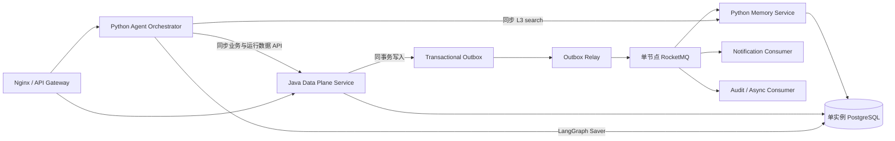

# ADR-017：Data Plane、RocketMQ 与 Memory Service 部署边界

> **状态：APPROVED**  
> **批准人：项目 owner**  
> **批准日期：2026-08-15**  
> **适用范围：** `bdlh-runtime-data`、`bdlh-runtime-orchestrator`、新增 `bdlh-memory-service`、PostgreSQL、RocketMQ 与部署配置  
> **配套规则：** ADR-011（Memory 分层）、ADR-014（Pause/Resume）、ADR-015（Context 与 Mem0 读写收敛）

## 1. 决策目标

冻结 BDLH Agent Runtime 的长期数据平面和消息基础设施边界，同时适配当前单台云服务器的资源约束：

- 结构化数据、事务和消息可靠性由 Java 数据平面承担；
- Agent 认知编排继续由 Python/LangGraph 承担；
- Mem0 从 Orchestrator 进程中抽离为独立 Python Memory Service；
- RocketMQ 作为正式异步消息基础设施部署；
- PostgreSQL 当前只部署单实例，不建设主从、Patroni、etcd 或其他 HA 集群；
- 服务在逻辑上独立，数据库在物理上允许共享单一 PostgreSQL 实例；
- 以后增加数据库或 Broker 副本时，不改变应用层契约。

本 ADR 决定的是稳定边界和迁移方向，不声明相关代码已经完成。

## 2. 背景与约束

当前仓库存在以下事实：

1. Python Orchestrator 直接维护 Checkpoint、Chat、Run、History、Task、Outbox 和 Registry 等 PostgreSQL Store；
2. 多个 Python Store 使用同步 `psycopg.connect()`，连接池、统一事务与 migration 责任不集中；
3. Task 完成与 Notification Outbox 当前跨两个 Store，无法共享同一数据库事务；
4. Java `bdlh-runtime-data` 已具备 Spring Boot、JDBC/MyBatis、事务、认证和用户金融事实能力；
5. Mem0 当前以 Python 进程内 SDK 形式装配，内部还会调用 LLM、Embedding 与向量存储；
6. 当前服务器资源不足以同时建设 PostgreSQL HA 集群和完整服务栈，但 owner 明确要求 RocketMQ 等基础设施先落地。

## 3. 总体决策



### 3.1 Python Agent Orchestrator

Orchestrator 负责：

- FastAPI / SSE；
- LangGraph Cognitive Orchestrator；
- Domain Dispatcher、Capability Gateway、Observation 与 Guardrails；
- Context Service 与 Communication；
- 通过内部 API 调用 Data Plane 和 Memory Service；
- 通过 LangGraph 官方 Checkpointer 直连专属 PostgreSQL schema。

除 Checkpointer 外，目标态 Orchestrator 不直接读写业务表、运行记录表、Outbox、Memory 向量表或 Registry 表。

### 3.2 Java Data Plane Service

现有 `bdlh-runtime-data` 演进为唯一结构化数据平面，当前为了节省资源保持一个 Spring Boot 进程，但代码按模块化单体组织：

```text
identity
finance
conversation
agent_run
history
task
notification
registry
outbox
messaging
```

该服务提供用例级 API，不提供 `executeSql`、任意表 CRUD 或数据库代理接口。它负责：

- L4 用户、账户、持仓、风险画像和确认记录；
- L1 会话与消息；
- Run Registry、Analysis History、Capability Audit；
- Financial Task、Notification Outbox 和消费幂等 Inbox；
- Capability / Skill / Policy Registry 的持久化与快照查询；
- 所有上述数据的手工全量建库脚本；
- Outbox Relay 和 RocketMQ Java Producer/Consumer 适配。

现有身份数据若仍在 MySQL，继续由该服务封装；本 ADR 不授权无迁移方案地强行合并 MySQL。PostgreSQL 单实例约束适用于 runtime、finance、checkpoint、memory 和 registry 数据。

### 3.3 Python Memory Service

新增 `bdlh-memory-service`，使用 Python + FastAPI + Mem0 SDK，负责：

- L3 长期语义记忆的 `search / get / delete`；
- 消费经过治理的记忆候选事件并执行 Mem0 `add`；
- 调用批准的 LLM 和 Embedding Provider；
- 向量数据生命周期、用户删除与可重建策略；
- Memory 指标、超时、熔断和 degraded 状态。

Memory Service 不负责 L4 结构化用户画像。当前 `MemoryStore.get_profile()` 的职责必须迁往 Java User Data API / Context Service 的 L4 读取路径；Memory Port 最终只保留 L3 语义能力。

### 3.4 Checkpointer 例外

LangGraph Checkpointer 不经过 Java Data Plane 或 Memory Service。原因是它具有高频、低时延、Pause/Resume 和 Saver 协议强绑定特征。

要求：

- 使用专属 `checkpoint` schema 和最小权限账号；
- Key 至少隔离 `user_id + thread_id + namespace`；
- 禁止存 Token、完整账户数据和原始大载荷；
- Orchestrator 的该数据库账号不得访问其他 schema。

## 4. 单实例 PostgreSQL 边界

当前只部署一个 PostgreSQL 实例，不做数据库 HA 集群。逻辑上固定以下 schema：

| Schema | 所有者 | 数据 |
|---|---|---|
| `business` | Java Data Plane | finance 业务事实与确认审计 |
| `runtime` | Java Data Plane | 会话、Run、History、Task、Outbox、Inbox |
| `registry` | Java Data Plane | Capability、Skill、Policy 与目录快照 |
| `checkpoint` | Python Orchestrator | LangGraph Checkpoint |
| `memory` | Python Memory Service | Mem0 元数据与 pgvector 向量 |

约束：

- 每个服务使用独立数据库 Role；
- 默认拒绝跨 schema 权限；
- 数据库 migration 必须由所属服务显式执行，应用业务代码不得在启动时临时建表；
- `vector` 等扩展按数据库级运维步骤安装，Memory Service 只验证，不自行提权安装；
- 配置连接池、查询超时、锁超时、慢查询和连接泄漏指标；
- 单实例是已接受的可用性风险，必须以持久卷、异机备份、恢复演练和磁盘监控补偿；
- 当前不引入分布式事务。

未来拆分物理数据库时，以 schema 所有权为搬迁单元，服务 API 和事件契约保持不变。

## 5. RocketMQ 部署与可靠性

当前部署最小 RocketMQ 单元：

- 一个 NameServer；
- 一个 Broker + Proxy，优先 Local Mode；
- Broker Store 与日志挂载持久卷；
- 仅内网访问，不暴露公网；
- Dashboard 不作为常驻生产依赖；
- 当前不部署 Broker 副本。

单节点 RocketMQ 不具备 HA。为避免 Broker 故障导致业务事件丢失，所有由数据库状态变化产生的消息必须使用 Transactional Outbox：

```text
同一 PostgreSQL 本地事务：
  更新聚合状态
  + 插入 runtime.outbox_event

Outbox Relay：
  claim PENDING
  → publish RocketMQ
  → Broker ACK
  → 标记 PUBLISHED
```

禁止“先提交数据库，再直接发送 MQ”的双写。RocketMQ Transaction Message 不替代本 ADR 的数据库 Outbox；若以后采用，必须另立 ADR 说明与本地事务检查策略。

消费者按至少一次语义设计：

- 以 `event_id + consumer_group` 写入 `runtime.consumer_inbox` 去重；
- 业务处理与 Inbox 成功记录在同一消费者本地事务中；
- 处理成功后才 ACK；
- 使用 RocketMQ Retry 与 DLQ；
- 提供 DLQ 查看、补偿、重放和审计流程；
- 消费者不得假设全局恰好一次。

## 6. 同步与异步边界

### 6.1 同步调用

以下操作需要即时结果，走内网 HTTP 或未来的 gRPC，不经过 MQ：

- 查询用户持仓、账户和风险画像；
- 创建、读取和追加 Chat Session；
- 创建、查询和更新 Run；
- 查询 Task 和 Notification；
- 读取 Registry Snapshot；
- Memory `search`；
- LangGraph Checkpoint save/load。

### 6.2 异步消息

以下副作用通过 Outbox + RocketMQ：

- 用户金融资料或持仓发生变更后的订阅通知；
- Run / Analysis 完成事件；
- Task Triggered 与 Notification Requested；
- 经出口治理后的 Memory Candidate；
- 审计归档、统计和缓存刷新。

持续任务的权威计划、取消和状态仍保存在 PostgreSQL Task Store。RocketMQ 只负责投递，不作为任务真源。

## 7. 事件契约

所有事件必须使用版本化 Envelope：

```text
event_id
event_type
schema_version
aggregate_type
aggregate_id
aggregate_version
occurred_at
producer
trace_id
correlation_id
authenticated_user_id（需要时）
payload
```

首批 Topic：

```text
bdlh.user.events
bdlh.runtime.events
bdlh.notification.commands
bdlh.memory.commands
```

首批事件类型：

```text
FINANCIAL_PROFILE_CHANGED
PORTFOLIO_CHANGED
RUN_COMPLETED
ANALYSIS_COMPLETED
TASK_TRIGGERED
NOTIFICATION_REQUESTED
MEMORY_CANDIDATE_CREATED
USER_MEMORY_DELETE_REQUESTED
```

约束：

- Topic 中只使用已登记的消息类型；
- 事件 payload 最小化，敏感金融数据优先传 ID、版本和引用，不复制完整账本；
- Schema 演进默认向后兼容；破坏性变更必须新增 `schema_version` 或 Topic；
- `trace_id / correlation_id` 必须贯穿 HTTP、Outbox、RocketMQ 与消费者日志。

## 8. Memory 读写治理

本 ADR 不改变 ADR-011/015 的语义：

```text
读：Context Service → RemoteMemoryPort.search(user_id, query, top_k)
写：Run 出口 MemoryWriter.filter → Outbox → RocketMQ → Memory Service → Mem0.add
```

允许写入：长期兴趣、表达习惯、经确认的低影响软偏好。

禁止写入：

- 完整会话；
- Checkpoint、Pause/Resume 和 Task 进度；
- 持仓、账户、风险等级等 L4 权威值；
- 临时行情和原始 Observation；
- 未确认推断；
- Secret、Token 和内部错误诊断。

Memory Service 不可用时，读取返回空语义记忆并标记 degraded；异步写事件留在 RocketMQ Retry/DLQ 或 Outbox 中，不阻断主回答。

## 9. 技术选择

| 范围 | 技术选择 |
|---|---|
| Agent Orchestrator | Python 3.11+ / FastAPI / LangGraph |
| Data Plane | Java 17+ / Spring Boot 3 / Spring Transaction |
| 普通 CRUD | 现有 MyBatis-Plus |
| 复杂 SQL、锁与 Outbox | MyBatis SQL 或 Spring JDBC/JdbcClient，显式 SQL |
| 数据库建库 | 根目录 `db/` 的 SQL 全量建库脚本；禁止运行时 DDL |
| 连接池 | Java HikariCP；Python Memory Service 使用受控连接池 |
| Memory Service | Python / FastAPI / Mem0 |
| 语义存储 | 同一 PostgreSQL 实例的 `memory` schema + pgvector |
| 消息 | RocketMQ 5.x 客户端协议；Java 优先使用 Apache 官方客户端/Spring 集成 |
| 可观测性 | Actuator/Micrometer + Python 结构化指标，统一 trace/correlation 字段 |

本 ADR 不要求为了“主流”改用 JPA/Hibernate，也不引入 Go。现有 Java 17 可以继续使用；JDK 或 Spring Boot 升级作为独立兼容性任务处理。

## 10. 迁移原则

开发环境按新项目全量建库执行，不保留增量迁移或兼容切换：

1. 清空并重建开发数据库；
2. 手工执行 `db/postgresql/bootstrap.sql`；
3. 手工执行 `db/postgresql/schema/` 下当前领域的全量建表脚本；
4. 手工执行 `db/postgresql/seed/registry.sql`；
5. 启动服务后仅允许业务读写，不允许服务自行建表、补表或写入种子；
6. 每个数据集只允许一个写入真源，禁止双写和影子读取。
9. 未通过故障注入、幂等、恢复和回滚测试，不得删除旧读路径。

详细执行阶段和验收门禁见生产实施 Prompt 的 `PLATFORM-P0`～`PLATFORM-P7`。

## 11. 明确不做

- PostgreSQL 主从、Patroni、etcd 或数据库 HA 集群；
- RocketMQ Broker 多副本；
- Kubernetes、Service Mesh 或分布式事务协调器；
- 通用 SQL/CRUD 数据库代理服务；
- 用 RocketMQ 替代 Checkpoint、Task Store 或业务真源；
- 用 Mem0 替代 Chat、Run、Task、审计或 L4 用户事实；
- 为 Runtime Data 再启动第二个 Java JVM（当前阶段保持模块化单体）；
- 无迁移方案地合并或删除现有 MySQL 身份数据。

## 12. 后果

正面：

- AI 编排与确定性事务边界清晰；
- MQ、Memory 和数据库都可独立演进；
- 单机资源约束下仍保留未来横向扩展路径；
- Broker 暂时不可用时，Outbox 仍能保证业务事件不丢；
- Mem0 故障与慢调用不拖垮主回答；
- 以后拆分物理数据库或 Java 服务不改变契约。

代价与风险：

- 单 PostgreSQL 和单 Broker 都是单点故障；
- Orchestrator 到 Data Plane / Memory Service 增加内网调用；
- 数据迁移和切换期需要严格处理唯一写源；
- 需要新增 Outbox/Inbox、DLQ 补偿和跨服务契约测试；
- 一个 Java 进程承载多个数据模块，必须依靠包边界和架构测试防止重新耦合。
